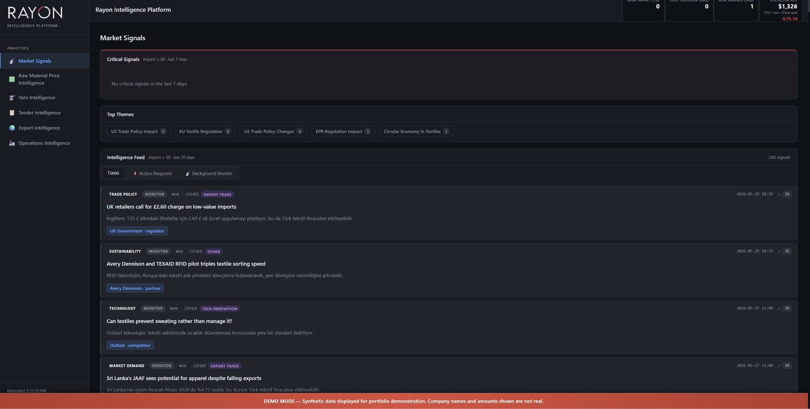
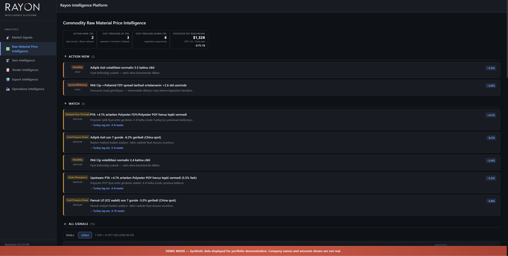
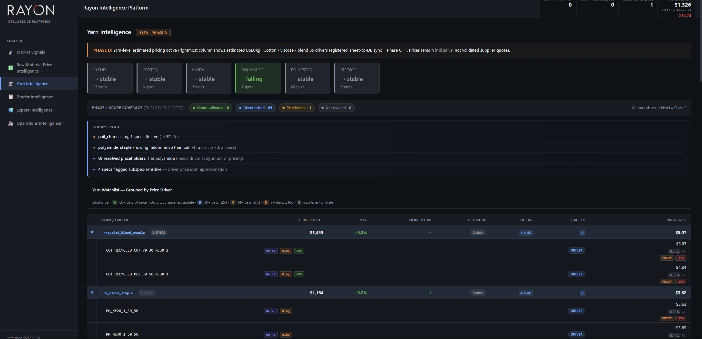
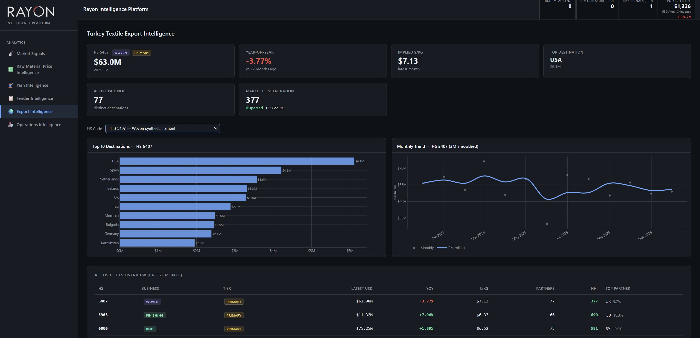
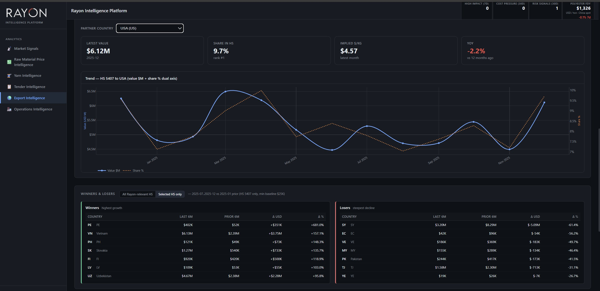
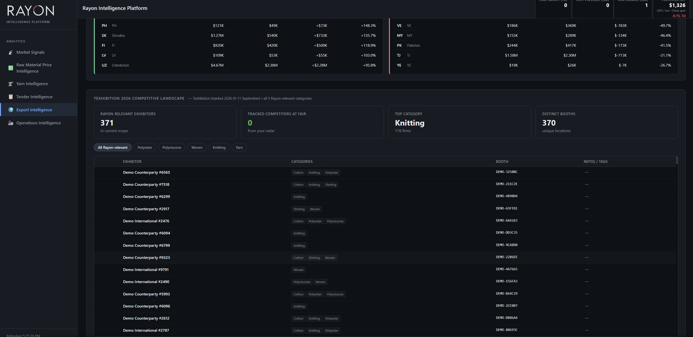
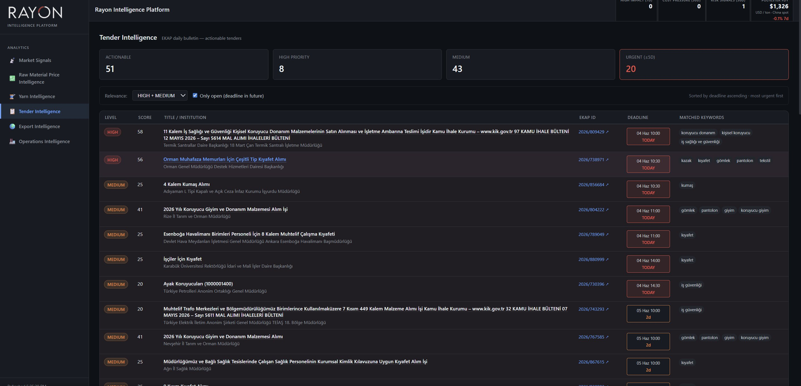

> **Designed, built, and maintained by [Mert Övet](https://www.linkedin.com/in/mertovet/).** The platform concept, architecture, data engineering, classification logic, analytical surface, and every line of code in this repository are original work of mine, built for my family's textile manufacturing business.
---

# Rayon Intelligence Platform

**A production-grade operational analytics platform for a mid-sized Turkish textile manufacturer. Six integrated modules running against a unified PostgreSQL warehouse: ERP-sourced operations, commodity price intelligence, yarn-grade price pressure, competitor news monitoring, public-sector tender pipeline, and export flow analytics. All fed by daily automated scrapers and a custom 29-bucket classification engine.**

What used to take our finance team 3–5 days every month now updates in real time on a dashboard. What used to require manual reading of trade publications and manual market-checking now arrives as filtered Telegram digests every morning. What used to be a post-hoc month-end discovery of contra revenue anomalies is now a real-time card with median-based severity detection. This README walks through why I built it, what it does, what it automates, and why I think this kind of work is the actual opportunity in Turkish manufacturing right now.

---

## Why I built this

I work at Rayon Tekstil, our family textile manufacturing business. We've been making technical knit and woven fabrics since 1989, with two divisions: integrated yarn-to-knit production on one side, Far East greige fabric import + dyeing/coating/lamination finishing on the other. Rayon is one of the larger fabric manufacturers in its category in Turkey, substantial in scale, with real operational complexity (200+ active suppliers, 300+ customers, five distinct cost categories, significant FX exposure on both sides of the balance sheet, exports to dozens of countries).

But scale doesn't automatically translate into analytical sophistication, and this is where the sector context matters. Turkish textile manufacturing remains a relatively traditional industry. Modern data tooling, automated analytics infrastructure, real-time operational dashboards, and ERP-integrated decision support are all uncommon across the sector regardless of company size. The default operational stack across most Turkish manufacturers, from mid-market workshops to enterprise-scale integrated producers, is still ERP screens plus monthly Excel reports plus the institutional knowledge of the people running the business. Enterprise BI deployments (Tableau, Power BI consulting practices) tend to be slow to implement, generic by design, and disconnected from the specific chart-of-accounts realities and workflow patterns of a textile manufacturer. They demo impressively and deliver mediocre value in production.

Our own reporting reality reflected that sector default:

- **Monthly Excel reports.** Our finance team would spend 3–5 days every month compiling the same set of reports by hand: supplier concentration, cost-to-revenue ratios, customer top-10 lists, FX exposure breakdowns. Same work, every month, same person, same Excel files copied forward.
- **Stale data.** By the time the monthly reports landed on the executive desk, the operational signals inside them were 30–45 days old. A supplier concentration shift that crossed the watch threshold in mid-March would surface in late April reporting, a month after the fact.
- **Hidden anomalies.** Contra revenue elevations (returns + discounts) were noticed only when someone happened to look at the right number. There was no baseline, no threshold, no statistical context, no alert.
- **Manual market-checking.** Procurement decisions on yarn, chemicals, and greige imports required someone to manually check commodity prices on SunSirs, ICE Cotton, IndexMundi, FRED, typically once a week, if at all, and only when someone remembered.
- **Competitor blind spot.** Industry news from four or five Turkish and international textile trade publications had to be read manually by someone with enough industry context to filter signal from noise. In practice this meant we read very little of it.
- **Government tender pipeline.** Turkey's EKAP system publishes thousands of public-sector tenders. Finding the ones actually relevant to us (defense fabric, hospital linen, police uniform, firefighter) meant manually browsing a clunky search interface, or missing them entirely.

Each of these felt like a separate problem. After living with them long enough, I realized they were one problem: **everything operational at our company, and across most of the sector, was running on human attention rather than automation.** And human attention is the most expensive, most scarce, most error-prone resource in any business that has it as the bottleneck.

My own background coming into this was somewhat different from the typical operational role at a family business. My master's is in a technology field, my prior professional experiences has been in the SaaS industry, and I'd been actively building hands-on capability with SQL, Python, and modern BI tooling alongside the day job for several years. At some point, the question of whether I could combine that technical foundation with my operational understanding of Rayon, and build something that delivered real value to the company while becoming the case study for the consulting practice I want to build, stopped feeling hypothetical. Two outcomes from one effort: deliver something to Rayon that materially improves how we operate, and produce a portfolio piece that demonstrates the consulting thesis in production against real data, real complexity, and a real operational team using it daily.

This platform is what came out of that decision. About 18 months of design, build, and iteration. It is in daily use at Rayon. It has changed how we run the operational side of the business.

---

## What the platform is

Six integrated analytical modules, each addressing a specific operational question, all running against the same PostgreSQL warehouse, all wired together so the modules read from each other where it makes analytical sense:

| Module | What it answers | Data source |
| --- | --- | --- |
| **[Operations Intelligence](./OPERATIONS_INTELLIGENCE.md)** | Where is our procurement concentration drifting? Which cost lines are moving? Is contra revenue elevated against the 24-month baseline? Who are the top 50 counterparties on each side? | Nebim V3 ERP: 5 years of invoice-line data, 60K purchase rows + 50K sales rows, classified into 29 buckets |
| **[Price Intelligence](./PRICE_INTELLIGENCE.md)** | What are raw material prices doing this week? Where is the cost pressure pointing? Should we accelerate or defer procurement? | 13 commodity feeds from SunSirs, ICE, IndexMundi, FRED (daily-scraped) |
| **[Yarn Intelligence](./YARN_INTELLIGENCE.md)** | For our 70 active yarn grades, what is the price pressure direction, and which suppliers are quoting against the market? | Internal yarn catalog × supplier quotes × upstream commodity feeds |
| **[Market Signals](./MARKET_SIGNALS.md)** | What are our competitors doing? Where is the sector moving? Which signals are high-impact for us specifically? | 4 textile trade publications + 32 competitor websites, LLM-classified for sector exposure |
| **[Tender Intelligence](./TENDER_INTELLIGENCE.md)** | Which Turkish public-sector tenders match our capabilities? Which institutions are buying what we make? | EKAP daily scrape, 79-keyword filter, institution priority taxonomy |
| **[Export Intelligence](./EXPORT_INTELLIGENCE.md)** | For our HS codes, which countries are importing, from whom, and at what volumes? Where could we sell next? | UN Comtrade trade flows, 7 HS codes, 83 partner countries |

The modules don't just sit next to each other. They cross-reference. Price Intelligence cost-pressure signals contextualize Operations Intelligence margin compression. Market Signals competitor activity informs Tender Intelligence priority scoring. Yarn Intelligence cross-references the `raw_material_yarn` bucket spend in Operations. The result is one operational view of the business, not six disconnected dashboards.

---

## What "automation" actually means in this platform

I want to be very specific about what this platform replaces and what it does without anyone telling it to, because vague "automation" claims are noise and the textile sector has heard plenty of them.

### Daily, with zero human involvement

- **13 commodity prices** scraped from 4 sources at 11:00 Istanbul time, every day, via GitHub Actions cron
- **4 textile trade publications** crawled for new articles, deduplicated against a Google Sheets memory ledger
- **32 competitor companies** monitored for press releases, news, and product announcements
- **EKAP government tender feed** scraped and filtered against 79 textile-relevant keywords
- **Anomaly detection** runs across every operational metric: contra revenue ratio, supplier concentration delta, cost-mover thresholds, customer churn signals
- **Telegram alerts** fire automatically when anything crosses a defined threshold
- **LLM classification** (GPT-4o-mini, direct HTTP API calls) runs over fresh articles to assign sector-exposure scores

### Monthly, with no manual classification work

- Nebim V3 ERP exports are ingested into Bronze raw tables (non-destructive, every row preserved)
- The Classification Engine v3 assigns each of 110K+ invoice lines to one of 29 business buckets, with 99.9% high-confidence classification rate (only 0.1% review-flagged for manual operator review)
- Counterparty deduplication runs. Tax-id-based merging across name variants reduces 3,355 raw entity strings into canonical entities
- 19 Gold-layer SQL views regenerate, feeding the entire dashboard with no human touch

### What used to be human work now is not

| Workflow | Before | After |
| --- | --- | --- |
| Monthly supplier concentration reports | 3–5 days of finance-team work | Real-time on dashboard, 0 hours |
| Reading textile trade publications | 10+ hours/week of senior attention | Daily filtered digest, ~10 min review |
| Manual commodity price checks | ~3 hours/week, weekly cadence | Automated daily, surfaced as cost-pressure signals |
| EKAP tender search | Manual browsing, often missed | Daily filtered active-tenders view |
| Contra revenue anomaly discovery | Post-hoc month-end review | Real-time card with severity flag |
| Competitor news monitoring | Sporadic, manual | 32 companies tracked daily, LLM-classified |
| Counterparty deduplication | Manual cleanup in Excel | Automatic via tax-id canonical-key resolution |
| Top-N supplier/customer reports | Manual SUMIF + sort | One SQL view, refreshed on every load |

The point isn't that automation is novel. The point is that **most Turkish textile manufacturers don't have it.** The sector still runs on Excel and human attention, and that gap is what this platform addresses for Rayon and what I'm now building toward addressing for other manufacturers as well.

---

## What each module solves, and the time it gives back

**[Operations Intelligence](./OPERATIONS_INTELLIGENCE.md): the operational backbone.** Five tabs covering executive overview, procurement, cost structure, revenue reality, and a counterparty explorer. The classification engine alone replaces what would otherwise be hours of monthly account-coding work by the finance team. The 4-slot signals strip on the Overview tab surfaces the four most analytically important operational signals (customer concentration shift, procurement concentration, contra revenue elevation, margin trend direction) without anyone having to dig for them. The Counterparty Explorer solves the entity deduplication problem every accounting team in Turkey eventually runs into, where the same supplier appears under 2–5 name variants. It uses `vergi_numarasi` (tax ID) as the canonical key with a name-grouping fallback for unverified entities.

**[Price Intelligence](./PRICE_INTELLIGENCE.md): daily market awareness without anyone watching the market.** Polyester, nylon, cotton, viscose, PTA, PA6, PA66 and other relevant commodities tracked daily across SunSirs (China spot, daily), ICE Cotton (US futures), IndexMundi (monthly), FRED (PPI series). Cost-pressure signals fire automatically when prices cross volatility thresholds or change direction sharply. Replaces the weekly manual market-check workflow with an automated daily one.

**[Yarn Intelligence](./YARN_INTELLIGENCE.md): yarn-grade-specific price pressure.** Our 70 active yarn grades each have a "driver price" composed of upstream commodity inputs (polyester chip → POY → FDY → finished yarn, with denier and luster premiums). The platform tracks the per-yarn-grade pressure direction, lets us see which suppliers are quoting against the market, and gives the procurement team a defensible negotiation baseline for every yarn purchase. Replaces the implicit-in-someone's-head pricing model with an explicit, auditable one.

**[Market Signals](./MARKET_SIGNALS.md): sector intelligence without reading every publication.** Four trade publications and 32 competitor websites monitored daily. Articles are LLM-classified by sector exposure (cotton volatility, polyester trends, regional competitor activity, downstream demand shifts). High-impact items surface in a daily Telegram digest. Replaces the "someone should read the trades" workflow that nobody actually does consistently.

**[Tender Intelligence](./TENDER_INTELLIGENCE.md): public-sector pipeline visibility.** EKAP scraped daily, filtered through a 79-keyword textile-relevance vocabulary, scored by institution priority (defense, police, firefighter, hospital), surfaced as an active-tenders view. Replaces the manual EKAP search workflow that misses more than it catches.

**[Export Intelligence](./EXPORT_INTELLIGENCE.md): where in the world is buying what we make.** UN Comtrade trade flows for the 7 HS codes Rayon ships, 83 partner countries, winners/losers analysis showing year-over-year shifts. Answers the strategic question that traditional reporting doesn't even pose: *where could we be selling next, based on where the market is growing?*

---

## Why I think this matters for the Turkish textile sector

Turkey's textile manufacturing sector is large, fragmented, and analytically underserved. The sector spans small specialty workshops through enterprise-scale integrated producers, and across that full range the default analytical stack is the same: ERP screens, monthly Excel reports, the operational experience of the people running the business. Enterprise BI deployments are typically too slow to implement, too generic, and too disconnected from the specific operational reality of a textile manufacturer to deliver real value, regardless of company size. The result is that an enormous amount of operational decision-making in one of Turkey's largest industrial sectors happens without the analytical infrastructure that would make it materially better.

What this platform demonstrates, and what I think the next several years of opportunity in this space look like, is that a **domain-aware, automation-first analytics layer**, built directly against a specific manufacturer's operational reality, can deliver 10x–50x productivity gains on workflows that are currently manual. The engineering is not exotic: PostgreSQL, FastAPI, vanilla JavaScript on the frontend, daily Python scrapers, a rules-based classification engine designed against the actual chart of accounts. What makes it valuable is that someone has to want to build it for a specific company, in that company's language, against that company's actual data. And right now in Turkish textile manufacturing, almost no one is doing that work.

I built this for Rayon. I'm now building toward doing the same for other manufacturers: yarn, fabric, garment, technical textile, leather, and adjacent sectors. The thesis is straightforward and I want to state it clearly: **most of the practical value of "AI for manufacturing" right now is captured by domain-aware automation of well-defined operational workflows, not by deploying frontier ML models.** The infrastructure to do that work exists. The bottleneck is people who can apply it to specific sectors with domain understanding. That bottleneck is where I am positioning the practice.

---

## Technical architecture, in one block

- **PostgreSQL** on Railway (US-West): 30 tables, 24 views, 47 numbered SQL migrations
- **FastAPI** + uvicorn: 33 API endpoints, connection pooling with `@with_shared_conn` decorator for multi-query endpoints (3.5× latency improvement on the Counterparty detail panel)
- **Vanilla JavaScript** frontend (no React, no build step): single-page dashboard, ~5,000 lines, Plotly charts, `data-sub` attribute routing for tab switches
- **Daily scrapers**: Python on GitHub Actions cron, scheduled for 11:00 Istanbul UTC+3
- **Medallion architecture**: Bronze (raw ingest, immutable) → Silver (cleaned + classified facts) → Gold (aggregated views feeding the API)
- **Classification Engine v3**: rule-based SQL, 29 buckets across 7 categories, 99.9% high-confidence rate on 110K+ invoice lines
- **OpenAI integration**: GPT-4o-mini for Market Signals article classification, via direct HTTP API (no SDK dependency)
- **Telegram integration**: automated alert delivery for anomalies and high-priority signals

The repository is structured for transparency. Every analytical metric is traceable to a Gold-layer view; every view is traceable to a numbered SQL migration; every endpoint reads from exactly one view (with two exceptions where multi-query assembly is cleaner in Python). There is no analytical "magic"; the full data flow from web scraper or ERP export to dashboard card is auditable in the codebase.

---

## Module documentation

Each of the six modules has its own README with the full engineering and analytical detail:

- **[Operations Intelligence](./OPERATIONS_INTELLIGENCE.md)**: ERP-sourced operational analytics · 5-tab dashboard · 18 endpoints · 29-bucket classification engine · contra revenue anomaly detection · counterparty deduplication
- **[Price Intelligence](./PRICE_INTELLIGENCE.md)**: 13 commodity feeds · cost-pressure signal engine · phased roadmap (PI-0 through PI-5B)
- **[Yarn Intelligence](./YARN_INTELLIGENCE.md)**: 70 active yarn grades · per-grade driver price model · supplier quote pressure analysis
- **[Market Signals](./MARKET_SIGNALS.md)**: 4 trade publications + 32 competitors · LLM exposure classification · Phase E roadmap
- **[Tender Intelligence](./TENDER_INTELLIGENCE.md)**: EKAP daily scrape · 79-keyword filter · institution priority scoring
- **[Export Intelligence](./EXPORT_INTELLIGENCE.md)**: UN Comtrade flows · 7 HS codes · 83 partner countries · winners/losers analysis

---

## Where this is heading

The platform is in active development. The current production target is **direct REST API integration with Nebim V3 ERP**, transforming the current monthly batch-export model into real-time event-driven automation, where an invoice landing in Nebim triggers a webhook to the platform, runs through classification and anomaly detection, and updates the dashboard within 30 seconds end-to-end. Integration is held pending IT security clearance (audit logging, RBAC, network isolation, retention policy review), which is the appropriate constraint for an ERP holding five years of commercially sensitive transactional data.

Beyond that, the active workstreams are:
- Expansion of the yarn-grade price-pressure model to capture the long tail of specialty yarns
- More sophisticated LLM-based classification for the Market Signals exposure layer (current keyword + sector taxonomy will be supplemented by entity-resolution and impact-scoring)
- Translation of the classification engine to support other manufacturer chart-of-accounts structures, which is the technical core of the consulting thesis
- A buyer-facing decision support layer using the Price + Yarn + Operations stack to recommend procurement timing (the obvious next analytical surface once enough price history is accumulated)

---

**Built and maintained by [Mert Övet](https://www.linkedin.com/in/mertovet/) ·  Based in Istanbul, Turkey.**

---

# Market Signals

> A sector news intelligence pipeline that ingests Turkish and English-language textile news, classifies each article through an LLM into seventeen structured fields, surfaces high-impact signals in the UI, and pushes critical events to a Telegram bot.



This module is one of five analytical tabs in the [Rayon Intelligence Platform](../README.md). Companion docs:
- [Export Intelligence](./EXPORT_INTELLIGENCE.md)
- [Tender Intelligence](./TENDER_INTELLIGENCE.md)

---

## What it does in one paragraph

The Market Signals tab reads the global textile sector news stream (four article sources plus a thirty-two-firm competitor web-page monitor), and runs every captured article through an LLM classifier that outputs seventeen structured fields per signal: category, severity, impact score, action tag, priority profile, time horizon, theme, commercial exposure type, affected business line, affected material family, an explicit "why it matters to Rayon" note, and ten more. The classified signals feed a three-section dashboard (Critical Signals, Top Themes, Intelligence Feed) with three feed filters (All / Action Required / Background Monitor), and the highest-impact items are pushed to a Telegram bot daily. The classification cost per article is tracked in dollars; the daily LLM spend is visible in a billing summary view.

---

## The problem we set out to solve

In a textile manufacturing business, sector news is not optional. A new EU regulation on extended producer responsibility, a US tariff change on synthetic fiber, an emerging competitor's capacity announcement, a major retailer's sustainability commitment: any of these can shift our business assumptions within weeks. The people who notice these signals early get to plan. The people who notice them late respond under pressure.

Until this module existed, that scanning happened manually. Someone would read Just-Style and Fibre2Fashion in the morning. Texhibition newsletters. Telegram channels. Industry association bulletins. The two structural problems with that approach were:

1. **Coverage was inconsistent.** No single person sees every article in every source every day. Important items slip through.
2. **There was no triage layer.** A ten-paragraph article about a Bangladesh garment factory fire and a one-paragraph notice about a new EU chemical restriction look identical in a news feed. Both demand a reading. Most of them don't demand a response. We were spending equal attention on items of unequal importance.

This module is built to fix both. It ingests every published article from a curated source list, scores each one for relevance and impact, classifies it into a structured taxonomy, and surfaces only the items that warrant attention, in three priority tiers. The reading load drops from "scan everything daily" to "review eight to fifteen items per week, all pre-classified."

The strategic question this module was built around:

> *Which sector signals, in the last 7 to 30 days, have meaningful exposure to Rayon's product lines, supply chain, or competitive arena, and which of those require an action versus a watch?*

---

## Architecture

```
┌──────────────────┐   ┌──────────────────┐   ┌──────────────────┐
│   Data sources   │   │  Classification  │   │   Presentation   │
├──────────────────┤   ├──────────────────┤   ├──────────────────┤
│ 4 article        │──▶│  news_items      │──▶│ FastAPI / uvicorn│
│ scrapers         │   │  (763 raw rows)  │   │ 3 endpoints      │
│ + WP REST API    │   │                  │   │                  │
│                  │   │  ▼ LLM analyzer  │   │ Vanilla JS +     │
│ competitor       │   │  (GPT-4o-mini)   │   │ chip filters     │
│ monitor          │   │                  │   │                  │
│ (32 firms)       │   │  market_signals  │──▶│ Telegram bot     │
│                  │   │  (285 classified)│   │ daily bulletin   │
│                  │   │  31 columns      │   │                  │
│                  │   │  per signal      │   │                  │
└──────────────────┘   └──────────────────┘   └──────────────────┘
```

**Stack choices:**

| Layer | Choice | Why |
|---|---|---|
| Database | PostgreSQL (Railway-hosted) | Shared with other modules, supports arrays + JSONB for multi-value classifications |
| Backend | FastAPI + psycopg2 | Same stack as other modules, simple JSON contract |
| Scrapers | httpx + BeautifulSoup, one source per scraper file | Each source has distinct HTML quirks; isolating them keeps the failure mode local |
| LLM | OpenAI GPT-4o-mini via direct HTTP (no SDK) | SDK removed in early 2026 to remove dependency drift; direct HTTP also simplifies cost tracking |
| Notification | python-telegram-bot via async send | Bot pushes daily summary at 08:00 UTC after the daily scraper finishes |
| Frontend | Vanilla JS + custom dark theme | No framework, fast iteration, chip-based filters |

**The data flow in detail:**

The four article scrapers (`fibre2fashion.py`, `just_style.py`, `tekstil_teknik.py`, `textilegence.py`) and the `competitor_monitor.py` each write into `news_items` with raw body content, source attribution, publication timestamp, and a relevance_score computed at ingestion time. The `textilegence.py` scraper is special: it talks to the WordPress REST API rather than scraping HTML, which is faster and more reliable, and has accumulated 2,397 articles in its archive.

The `llm_analyzer.py` script then picks up unclassified articles, sends them to GPT-4o-mini with a structured prompt, and parses the response into the `market_signals` table. Cost per call is tracked in `llm_cost_usd` so we can see the analytics bill grow per day.

The `telegram_reporter.py` script reads the highest-impact signals from the last 24 hours and pushes them as a formatted Telegram message. Separate channels can be configured per audience (e.g. management vs operational team).

---

## Repository structure

The platform is a single repository spanning all six modules. The block below lists Market Signals files in detail (this is the module you're reading about), then groups the other modules' scrapers and endpoints by name so you can see how Market Signals sits inside the broader platform.

```
rayon-intelligence/
├── dashboard/
│   ├── server.py                          # 33 endpoints total across all 6 modules
│   │   │
│   │   # Market Signals endpoints (this module)
│   │   ├── L212  GET /api/stats                      # global platform KPIs
│   │   ├── L281  GET /api/signals                    # intelligence feed
│   │   ├── L359  GET /api/signal_stats               # aggregations for KPI cards
│   │   │
│   │   # Price Intelligence
│   │   ├── L425  GET /api/prices
│   │   ├── L518  GET /api/price_intelligence_signals
│   │   ├── L556  GET /api/price_signals
│   │   ├── L2361 GET /api/price_intelligence_stats
│   │   │
│   │   # Export Intelligence
│   │   ├── L655  GET /api/exports
│   │   ├── L826  GET /api/exports/drilldown
│   │   ├── L879  GET /api/exports/winners_losers
│   │   ├── L986  GET /api/exports/texhibition_landscape
│   │   │
│   │   # Internal / operational
│   │   ├── L1072 GET /api/lescon
│   │   │
│   │   # Yarn Intelligence
│   │   ├── L1144 GET /api/yarn_master
│   │   ├── L1193 GET /api/yarn_pressure
│   │   │
│   │   # Operations Intelligence (18 endpoints, /api/internal/* namespace)
│   │   ├── L1435–L2093  Overview · Procurement · Cost Structure
│   │   ├──               Revenue Reality · Counterparty Explorer
│   │   │
│   │   # Tender Intelligence
│   │   └── L2437 GET /api/tenders
│   │
│   └── static/
│       ├── index.html                     # tab markup (5 dashboard tabs)
│       ├── app.v6.js                      # rendering logic (~5,000 lines)
│       └── style.v6.css                   # platform CSS
│
├── scrapers/
│   │
│   # Market Signals (this module)
│   ├── fibre2fashion.py                   # article scraper
│   ├── just_style.py                      # article scraper
│   ├── tekstil_teknik.py                  # article scraper
│   ├── textilegence.py                    # article scraper (WP REST API, ~2,400 archived)
│   ├── competitor_monitor.py              # 32 competitor websites, weekly snapshot
│   ├── llm_analyzer.py                    # GPT-4o-mini classifier, signal extractor
│   ├── telegram_reporter.py               # daily bot bulletin
│   ├── euratex.py                         # planned (Phase E P2)
│   ├── ihkib.py                           # planned (Phase E P2)
│   ├── tim.py                             # planned (Phase E P2)
│   │
│   # Price Intelligence
│   ├── price_signals.py                   # IndexMundi (cotton, wool)
│   ├── sunsirs_prices.py                  # 13 commodity feeds (China spot)
│   ├── ice_cotton.py                      # ICE Cotton No.2 futures (Yahoo Finance CT=F)
│   ├── build_price_metrics.py             # frequency-aware metric aggregation
│   ├── build_price_signals.py             # 8-rule signal engine
│   │
│   # Yarn Intelligence
│   ├── seed_yarn_master.py                # yarn taxonomy seeding (70 grades)
│   ├── yarn_audit.py                      # data quality audit
│   ├── yarn_consolidate.py                # canonicalization
│   │
│   # Export Intelligence
│   ├── trade_flows.py                     # UN Comtrade ingest (7 HS codes, 83 partners)
│   └── texhibition_scraper.py             # Texhibition exhibitor scrape (500 exhibitors)
│
├── migrations/                            # 47 numbered SQL migrations across all modules
├── .github/workflows/
│   └── daily_scraper.yml                  # cron: 07:23 UTC = 10:23 Istanbul
└── docs/
    ├── README.md                          # platform overview (main)
    ├── MARKET_SIGNALS.md                  # ← you are here
    ├── OPERATIONS_INTELLIGENCE.md         # 5 sub-tabs: Overview · Procurement · Cost Structure · Revenue Reality · Counterparty
    ├── PRICE_INTELLIGENCE.md
    ├── YARN_INTELLIGENCE.md
    ├── TENDER_INTELLIGENCE.md
    ├── EXPORT_INTELLIGENCE.md
    └── PHASE_E_MARKET_SIGNALS_ROADMAP.md   # full P0–P4 implementation plan (543 lines)
```

---

## Data foundation

Four tables form the Market Signals data layer:

**`news_items`** (763 rows). Raw articles from the article scrapers plus competitor monitor snapshots. Columns include `url`, `url_hash` (for deduplication), `source`, `language`, `title`, `body_raw`, `body_summary`, `published_at`, `scraped_at`, `relevance_score`, plus per-row LLM cost columns (`llm_tokens_in`, `llm_tokens_out`, `llm_cost_usd`). The `url_hash` index makes duplicate detection trivial: the same article URL won't be inserted twice even when re-scraped.

**`market_signals`** (285 rows). The structured output of the LLM classifier. This is the table the UI reads. It carries **31 columns per signal**:

| Field group | Columns |
|---|---|
| Identity | `id`, `source_table`, `source_id`, `entity_id`, `entity_name`, `entity_role` |
| Lifecycle | `detected_at`, `notified_at`, `signal_type` |
| Display content | `title`, `body`, `source_url` |
| LLM trail | `llm_model`, `llm_tokens_in`, `llm_tokens_out`, `llm_cost_usd` |
| Classification | `signal_category`, `severity`, `impact_score`, `theme`, `time_horizon`, `action_tag`, `signal_priority_profile`, `commercial_exposure_type` |
| Material / product context | `material_form`, `affected_products` (array), `affected_business_line` (jsonb), `affected_material_family` (jsonb), `tags` (array) |
| Rayon-specific | `rayon_relevance`, `rayon_why_it_matters` |

The split between `news_items` and `market_signals` is intentional: not every article becomes a signal. The LLM filters out items with relevance score below 0.25, which means roughly 63% of raw articles never reach the signal table. The 37% conversion rate is by design: most sector news is noise, and the cost of looking at noise is real.

**`companies`** (71 rows). The tracked entity list. Each company has `name`, `country`, `category` (USER-DEFINED enum: `competitor`, `customer`, `supplier`, `partner`, `regulator`, `other`), `website`, `tags`, `notes`, and a derived `entity_type` + `geography`. This is the table the LLM classifier joins against when it identifies a company in an article. A match populates `entity_id` and `entity_name` in the signal, letting the UI render an entity badge on the card.

**`competitor_snapshots`** (18 rows). Periodic content hashes of competitor websites, written by `competitor_monitor.py`. A change in hash on a tracked page indicates the competitor updated their site, a soft signal that something happened (a new product launch, a leadership change, a press release) and warrants reading the linked URL.

---

## The classification pipeline, how a signal is born

The flow from raw article to a row in `market_signals` runs through five stages:

**Stage 1. Ingestion.** Each scraper hits its source on the daily cron, pulls the latest articles, computes `url_hash`, and inserts into `news_items` if the hash isn't already present. Article body is stored raw; a body summary is computed during the LLM stage. `relevance_score` is set to NULL at this stage. It gets filled in stage 2.

**Stage 2. Relevance gate.** The `llm_analyzer.py` script reads the unclassified articles. For each one, it sends the title and body summary to GPT-4o-mini with a prompt that asks: *"On a scale of 0 to 1, how relevant is this article to a Turkish textile fabric manufacturer producing knit and woven synthetic and viscose products for export?"* The score writes back to `news_items.relevance_score`. Articles below 0.25 are marked classified-but-dropped and never reach `market_signals`.

**Stage 3. Structured extraction.** Articles above the relevance threshold are sent to the LLM again, this time with a longer prompt that asks for **seventeen structured fields** in JSON. The model returns a category (e.g. `TRADE POLICY`, `SUSTAINABILITY`, `TECHNOLOGY`, `MARKET DEMAND`, `REGULATION`), a severity enum, an impact score 0–100, a priority profile (`LOW` / `MID` / `HIGH`), an action tag (`MONITOR` / `ACTION REQUIRED`), a time horizon (`SHORT` / `MID` / `LONG`), a theme cluster label, a commercial exposure type (`EXPORT TRADE`, `TECH INNOVATION`, `OTHER`, etc.), arrays of affected products and business lines, and an explicit one-sentence "why it matters to Rayon" note. The model also identifies any company mentioned in the article and tries to match it against the `companies` table by name.

**Stage 4. Insertion.** The structured response is validated, the matched entity (if any) is joined in, and the full record is inserted into `market_signals`. The token usage and dollar cost are recorded, so we know each classified signal cost roughly $0.001 to produce.

**Stage 5. Notification.** The `telegram_reporter.py` script reads signals with `impact_score >= 80` from the last 24 hours that haven't been notified yet, formats them as a multi-line message with emoji prefixes per severity, and pushes to the configured Telegram channel. After the push, `notified_at` is updated so the same signal won't be sent twice.

The full pipeline runs once daily through GitHub Actions, cron-scheduled at `07:23 UTC` (10:23 Istanbul), an off-hour to reduce GitHub Actions queue delay.

---

## How the four sources differ

The four article scrapers are not interchangeable. Each has a distinct editorial slant:

- **`just_style.com`**: English-language industry magazine, retailer and brand commentary, EU/US regulatory coverage. Heavy on policy and macro.
- **`fibre2fashion.com`**: English-language Indian-published B2B news, strong on supply chain and raw materials, Asia-centric. Useful for capacity announcements and price moves.
- **`textilegence.com`**: Bilingual (Turkish + English) Turkey-focused B2B portal. Uses the WordPress REST API for clean structured pulls, ~2,400 articles archived. Highest coverage of Turkish domestic developments.
- **`tekstil_teknik.com`**: Turkish-language industry journal. Covers technical/equipment news, fair announcements, association statements.

The mix is deliberate: combining global (Just-Style), supply-side (Fibre2Fashion), local (Textilegence, Tekstil-Teknik) gives a wider net than any single source. The competitor monitor adds an entirely different signal type: not third-party news, but first-party page changes on tracked websites.

**Phase E P2 will expand the source list** with three additional regulatory scrapers (`euratex.py` for the European apparel industry federation, `ihkib.py` for the Istanbul ready-made garment exporters association, `tim.py` for the Turkish exporters assembly). These scrapers exist as stubs in the repo but are not yet wired into the daily workflow.

---

## UI walkthrough

The Market Signals tab is structured top-down in three sections, plus a global header KPI strip that appears on every tab.

### Global header KPI strip

Top-right of every tab, not specific to Market Signals but populated by Market Signals data plus Price Intelligence:

- **HIGH IMPACT (7D)**: count of signals with `impact_score >= 80` in the last 7 days. Currently 0 in the snapshot, typical, since high-impact events are rare.
- **COST PRESSURE (30D)**: count of signals tagged as cost-related (input price moves, supply disruptions, tariff changes) in the last 30 days.
- **RISK SIGNALS (30D)**: count of signals tagged with downside risk (regulatory, geopolitical, customer-side) in the last 30 days.
- **POLYESTER FDY**: latest spot price from Price Intelligence (China spot, China yuan-derived USD).

These are the four numbers a manager glances at when they open the platform.

### Critical Signals section

Top of the tab, full-width red-bordered block. Shows signals with `impact_score >= 80` from the last 7 days.

Currently empty in the snapshot: *"No critical signals in the last 7 days."* This is itself useful information. An empty critical signals block means the sector hasn't moved meaningfully in our risk frame this week. If it filled up with three or four items, that's an instant alert.

The threshold of 80 is deliberately high. Almost nothing should hit this section. When something does, it should warrant a meeting.

### Top Themes section

A row of theme chips, each with a count. In the current snapshot:

- US Trade Policy Impact (6)
- EU Textile Regulation (6)
- US Trade Policy Changes (4)
- EPR Regulation Impact (3)
- Circular Economy in Textiles (3)

Themes are LLM-generated cluster labels: when multiple articles share a thematic pattern (US tariffs, EU EPR rules, etc.), the analyzer groups them under a theme. The chip count shows how many active signals belong to that theme in the current window.

Clicking a chip filters the Intelligence Feed below to just signals belonging to that theme. This is the fastest way to read into a developing story: instead of scrolling chronologically, you read the cluster.

### Intelligence Feed section

The main read surface. Signals with `impact_score >= 50` from the last 30 days, displayed as cards in reverse chronological order. The snapshot shows 200 signals available.

Three tab filters at the top:

- **Tümü (All)**: every signal above the impact threshold
- **Action Required**: signals with `action_tag = 'ACTION REQUIRED'` (LLM judged this as needing follow-up, not just monitoring)
- **Background Monitor**: signals with `action_tag = 'MONITOR'` (read and absorb, no action needed)

The Action Required / Background Monitor split is deliberate. Most signals belong in the watch pile; they shape mental models, don't trigger meetings. A small fraction need an actual conversation. Separating them at the filter level prevents the "everything is important" trap.

### Individual signal card anatomy

Each signal renders as a card with the following structure:

```
┌────────────────────────────────────────────────────────────┐
│ [CATEGORY]  [ACTION TAG]  [PRIORITY] · [SEVERITY]  [EXPOSURE]│           date · impact
│                                                              │
│ Headline of the article (truncated if long)                  │
│                                                              │
│ Body summary or "why it matters to Rayon" text in Turkish    │
│                                                              │
│ [Entity name · Role badge]                                   │
└────────────────────────────────────────────────────────────┘
```

The badges across the top map directly to schema fields:
- **Category** (purple), `signal_category`: TRADE POLICY, SUSTAINABILITY, TECHNOLOGY, MARKET DEMAND, REGULATION
- **Action tag** (slate), `action_tag`: MONITOR / ACTION REQUIRED
- **Priority** (color-coded), `signal_priority_profile`: LOW / MID / HIGH
- **Severity** (USER-DEFINED enum, color-coded)
- **Exposure** (purple), `commercial_exposure_type`: EXPORT TRADE, TECH INNOVATION, OTHER, etc.

Right-aligned at the top of the card: `published_at` timestamp (or `detected_at` if pub date is missing) and the `impact_score` numeric.

Below the headline, the body summary is rendered in Turkish (translated by the LLM during classification; even articles from English sources show a Turkish summary, which is the language Rayon's operational team works in). The "why it matters to Rayon" sentence is the LLM's explicit framing of how the article relates to Rayon's business. This is the single most valuable field on the card.

Below the summary, the entity badge (if any) shows the company name with a role label (`competitor`, `customer`, `regulator`, `partner`).

The full card body and `source_url` open in a side panel on click.

---

## API reference

| Endpoint | Method | Params | Returns |
|---|---|---|---|
| `/api/stats` | GET | none | Global platform KPIs across all modules (counts per tab, total signal volume, billing summary) |
| `/api/signals` | GET | `min_impact` (default 50), `days` (default 30), `action_tag` (optional), `theme` (optional), `limit` | Intelligence feed: list of signal cards with all 31 fields |
| `/api/signal_stats` | GET | `days` (default 7 or 30 per card) | Aggregations for the KPI strip and Top Themes section: counts per theme, counts per impact band, counts per exposure type |

All endpoints return JSON. Error responses are HTTP 5xx with a JSON body containing an error message.

---

## Strategic findings this module has surfaced

> *Article specifics below are paraphrased from the LLM's classified signals. Original publishers retain copyright on the source articles. Numbers describe the platform's processing outputs, not any single firm's volume.*

**1. The sector is genuinely quiet, not the pipeline is broken.**
Phase E forensic review confirmed that in a 13-day stretch only 1 article passed the 0.25 LLM relevance threshold (out of 290 candidates, 88% noise rate). The first instinct was "the pipeline is broken." The actual finding was structural: the sector itself isn't moving meaningfully in Rayon's risk frame right now. The high noise rate is correct behavior, not a bug. The threshold filters working as designed.

**2. Regulatory exposure clusters around EU EPR and US trade policy.**
Across the recent month, the Top Themes panel consistently shows EU Textile Regulation and US Trade Policy Impact as the top two clusters by count. This is meaningful: the LLM is detecting a coherent story arc, not random noise. Both clusters point toward downstream cost pressure (EPR fees for textile waste, tariff uncertainty for US-bound exports), which informs Rayon's pricing conversations with EU and US-facing customers.

**3. Technology coverage is dominated by sustainability-adjacent innovations.**
Signals tagged TECHNOLOGY in the current window cluster around thermal regulation, recycled fiber processing, and RFID/traceability, not around equipment or process tech. This tracks with broader sector direction: the next investment cycle in textile is sustainability-driven, not capacity-driven.

**4. Competitor-monitor snapshots produce signals at a different cadence than article scrapers.**
Article scrapers run daily and surface news on the day of publication. Competitor monitor runs weekly and surfaces signals only when a tracked website changes. The result: when a competitor announces something on their own site (before a sector publication picks it up), the competitor monitor catches it first, often by days. The 18 snapshots accumulated to date have flagged several competitor changes that didn't reach the article scrapers.

**5. LLM cost per signal is roughly $0.001, affordable at current volume.**
The 285 classified signals to date have cost approximately $0.30 in total LLM API spend. The per-signal cost is low enough that we can afford to process every relevant article without filtering at the relevance stage: the cost-benefit of skipping a marginal article is negligible compared to the cost of missing one.

---

## Limitations and what this module does not do

Honest engineering deserves honest scope statements.

- **Source list is curated, not exhaustive.** Four article sources plus 32 monitored websites is a wider net than any single person can scan, but it isn't every source. Specifically missing today: regulator primary feeds (EURATEX, IHKIB, TIM), chemical-substance databases (ECHA), trade-statistics announcements (Ministry of Trade press releases). These are planned in Phase E P2; the scraper stubs exist, the wiring doesn't.

- **`published_at` is sometimes NULL.** Some scrapers don't reliably extract the article's actual publication date; they fall back to scrape time. Phase E P0 includes a fix to backfill missing publication dates from the article body. Until that's complete, "last 7 days" filters use a fallback to `detected_at`, which slightly inflates recent counts.

- **LLM prompt and category enum need a revision pass.** The current category enum was set in an early iteration and has accumulated ambiguity: some signals get tagged with overlapping categories (`TECHNOLOGY` vs `SUSTAINABILITY` for the same RFID-textile article, e.g.). Phase E P0 includes a prompt rewrite and a category reclassification of existing rows.

- **Telegram bot has no read receipts.** When the bot sends a daily bulletin, we don't know whether anyone read it. There's no engagement loop. A future improvement would be to track which signals the user clicks through to and use that as a re-training signal for relevance scoring.

- **No multi-language summary.** The Turkish summary is generated correctly, but the original-language body is also stored. If a user wants the English original of a Just-Style article, they can read it, but the UI doesn't surface the original alongside the translation. Adding a toggle is a small UI improvement that hasn't been done.

- **No dedup across sources.** When the same story is covered by both Fibre2Fashion and Just-Style, both end up as separate signals (different URLs, different `url_hash`). The current UI shows both. Phase E P3 includes a deduplication pass at the signal level using LLM-based content similarity.

---

## Engineering notes

**Why GPT-4o-mini over GPT-4o or Claude:**
At the relevance + classification volume of this pipeline (~250–400 articles per day at full Phase E scope), the per-article cost matters. GPT-4o-mini at ~$0.15/1M input tokens lets us process every article without rationing. Classification quality at this task (structured JSON extraction with a fixed schema) is sufficient at this tier. A future upgrade would route a small subset (signals scoring `impact >= 80`) through GPT-4o for a second-pass quality check.

**Why direct HTTP instead of the OpenAI SDK:**
Early 2026 the SDK was removed from the analyzer in favor of direct `httpx` calls. Reason: the SDK kept introducing breaking changes on point releases, and our use case is narrow enough (one endpoint, JSON in, JSON out) that the SDK overhead wasn't earning its keep. Direct HTTP also makes cost tracking explicit: I measure tokens-in and tokens-out from the response payload directly, rather than relying on SDK side-channels.

**Cost tracking columns on every LLM-touched row:**
Both `news_items` and `market_signals` carry `llm_model`, `llm_tokens_in`, `llm_tokens_out`, `llm_cost_usd`. The view `llm_cost_summary` aggregates these across all modules into a per-day billing snapshot. Total platform LLM cost to date is visible at a single query, a small but important guard against runaway spend.

**JSONB for multi-value classification fields:**
The `affected_business_line` and `affected_material_family` fields are JSONB (not arrays) because the LLM sometimes returns weighted classifications, e.g. `{"knit": 0.7, "woven": 0.3}` when an article spans both. JSONB preserves the weight; an array would lose it. The UI currently displays the dominant category only, but the underlying data supports more nuanced filtering.

**Telegram message formatting:**
The `telegram_reporter.py` script formats each signal as a four-line block with emoji prefix per severity: 🔴 critical, 🟠 high, 🟡 mid, 🟢 low. Headline, source attribution, link. The bot uses HTML parse mode rather than Markdown to avoid escaping issues with characters like `_` in URLs.

**Cron schedule choice:**
The daily workflow runs at `23 7 * * *` (07:23 UTC). The off-hour minutes-23 timing is deliberate: GitHub Actions sees less queue pressure on odd minute boundaries than on top-of-hour, and the scrapers finish faster. The 07:23 UTC = 10:23 Istanbul timing gives the morning team a fresh signal feed by mid-morning.

---

## What's next, Phase E roadmap

The full plan is committed at [`docs/PHASE_E_MARKET_SIGNALS_ROADMAP.md`](./PHASE_E_MARKET_SIGNALS_ROADMAP.md) (543 lines, v1.0). The phased structure:

- **P0: Data quality fixes.** Backfill missing `published_at`, rewrite the LLM classification prompt to reduce category ambiguity, reclassify existing rows under the updated enum.
- **P1: Entity refactor + exposure layer.** Expand the `companies` table from 71 to ~150 entries with priority entities (top 15 strategic exposures explicitly defined). Add an "exposure layer" view that maps each signal to specific Rayon business lines via the JSONB classifications.
- **P2: Source expansion.** Wire `euratex.py`, `ihkib.py`, `tim.py` into the daily workflow. Add ECHA chemical-restriction feed.
- **P3: UI improvements.** Action feed view (only ACTION REQUIRED signals, chronological). Exposure chips on each card showing which Rayon business line is touched. LLM-based deduplication for same-story-different-source signals.
- **P4: Productization.** Notification preferences per user (signal type, frequency). Saved searches. Export to email digest.

---

## Stack summary

```yaml
backend:
  framework: FastAPI
  driver: psycopg2 (ThreadedConnectionPool)
  endpoints:
    - GET /api/stats          # global platform KPIs
    - GET /api/signals        # intelligence feed
    - GET /api/signal_stats   # KPI strip + Top Themes aggregations

database:
  engine: PostgreSQL (Railway-hosted)
  tables:
    - news_items            (763 rows, raw articles)
    - market_signals        (285 rows, classified, 31 columns each)
    - companies             (71 rows, tracked entities)
    - competitor_snapshots  (18 rows, monitored web pages)
  view:
    - llm_cost_summary      (per-day LLM spend aggregation)

scrapers:
  article_sources:
    - fibre2fashion.py
    - just_style.py
    - tekstil_teknik.py
    - textilegence.py       (WordPress REST API, ~2,400 archived)
  competitor_monitor:
    - competitor_monitor.py (32 tracked firms, weekly snapshot)
  classifier:
    - llm_analyzer.py       (GPT-4o-mini, structured 17-field output)
  notification:
    - telegram_reporter.py  (daily bulletin)
  planned (Phase E P2):
    - euratex.py, ihkib.py, tim.py

llm:
  provider: OpenAI
  model: gpt-4o-mini
  integration: direct HTTP (no SDK)


frontend:
  language: Vanilla JavaScript (no framework)
  rendering: Signal cards + chip filters + KPI strip
  styling: Custom dark theme (CSS variables)
  panels: 3 (Critical Signals, Top Themes, Intelligence Feed with 3 tab filters)

automation:
  scheduler: GitHub Actions
  cron: 23 7 * * *  (07:23 UTC = 10:23 Istanbul, off-hour to reduce queue delay)
  notification: Telegram bot
```

---

## Related modules

- [Export Intelligence](./EXPORT_INTELLIGENCE.md): Turkey-wide trade flow radar with country drilldown, Winners/Losers, Texhibition landscape
- [Tender Intelligence](./TENDER_INTELLIGENCE.md): EKAP daily tender feed with relevance scoring
- [Platform overview (main README)](../README.md): full architecture across all five tabs

---

# Raw Material Price Intelligence

> Seventeen textile raw materials tracked daily across spot, futures, and proxy sources, feeding chain-spread analytics, divergence detection, volatility signals, and Turkey-lag estimates that translate global commodity moves into early signal for procurement planning and customer-facing pricing decisions.



This module is one of five analytical tabs in the [Rayon Intelligence Platform](../README.md). Companion docs:
- [Market Signals](./MARKET_SIGNALS.md)
- [Yarn Intelligence](./YARN_INTELLIGENCE.md)
- [Export Intelligence](./EXPORT_INTELLIGENCE.md)
- [Operations Intelligence](./OPERATIONS_INTELLIGENCE.md)
- [Tender Intelligence](./TENDER_INTELLIGENCE.md)

---

## What it does in one paragraph

The Raw Material Price Intelligence tab ingests daily commodity price feeds across four families that matter to Rayon (polyester, cotton, nylon, viscose), plus auxiliary blend and modal references, surfacing fourteen of seventeen tracked materials in the UI. Every observation flows through a metrics engine that computes date-based 1d / 7d / 30d percentage changes, 7- and 30-period moving averages, volatility (population standard deviation), a normalized index, trend direction, momentum, and a precomputed divergence score against each material's upstream chain reference. Two parallel signal engines then evaluate these metrics: a persisted eight-rule system (writes to `price_intelligence_signals`) and a lighter on-the-fly four-rule auto-signal computer (serves directly from `/api/price_signals`). The UI organizes everything in four reading layers: a four-card KPI strip backed by signal counts and a polyester FDY benchmark, three priority-tiered signal sections (`ACTION NOW`, `WATCH`, `ALL SIGNALS`), a hand-drawn Polyester Chain visualization at current prices, dual-axis charts for cotton spot-vs-futures and the nylon family, and a master All Materials Summary table with four classification filter tabs (Direct / Benchmark / Proxy / Estimate). Currency switching between USD/t and the source-native unit is supported through pre-loaded fields in every response.

---

## The problem we set out to solve

Rayon Tekstil sits in the middle of a value chain, buying raw materials (yarn, chemical, dye, greige fabric) from upstream suppliers and selling finished knit and woven fabric to downstream customers (apparel brands, garment converters, technical-textile manufacturers). Both sides of that position are exposed to commodity price moves, but in opposite directions and on different time horizons.

This module was *not* built to win the next supplier negotiation. That problem requires per-supplier quote history, an ERP integration, and a basis-trading view: different data, different tooling, different module (see [Operations Intelligence](#) for that side of the business).

This module was built for a different question: **what is the broader commodity market doing, and when will those moves reach Turkey?**

Concretely, the question Rayon's leadership wanted answered:

> *Where is global commodity pricing heading across the materials that flow into our fabrics (polyester, cotton, nylon, viscose), and how soon should we expect each upstream move to reach Turkey domestic quotes?*

The strategic decisions this module informs are bigger and slower than weekly supplier negotiations:

- **Annual procurement planning**: what does our raw-material budget look like next quarter given current PTA and PSF trajectories?
- **Customer-facing fabric pricing**: if global PA66 chip is falling, when do we adjust our nylon fabric quotes for the next sales cycle?
- **Inventory commitment timing**: is the current low cotton price a buying window, or the early phase of a longer downtrend where waiting pays?
- **Margin risk awareness**: if upstream input costs rise sharply but downstream prices haven't moved yet, that's a margin compression event 4–8 weeks out unless we plan for it.

Two specific information needs follow from that:

**1. Sector cost direction awareness.** Knowing whether the global commodity environment for each fiber family is currently rising, falling, or sideways, and how forcefully. This is independent of any specific supplier; it's the macro backdrop.

**2. Lead-lag intelligence.** A move in Chinese spot polyester or global cotton futures does not become a Turkey-domestic price overnight. The lag is real, varies by material, and is the difference between *acting early on tomorrow's environment* and *reacting late to last month's environment*.

Both needs are served by tracking globally observable benchmarks (China spot, ICE futures, World Bank Pink Sheet, IndexMundi) and overlaying a calibrated Turkey-lag estimate on each. The strategic outcome is not better negotiation, it's earlier visibility into where the cost environment is heading and a defensible time-horizon estimate for when those changes will land locally.

---

## A textile primer: what these materials are and why they matter

The seventeen tracked materials don't sit at the same level of abstraction. Some are upstream petrochemicals (commodities). Some are intermediate processed fibers. Some are downstream yarns that go directly into our looms. Understanding the chain matters because price moves at one level take time and momentum to reach the next.

### The polyester chain: six visible materials, one petrochemical root

Polyester is the single most important fiber family for Rayon. Both knit and woven divisions consume it in volume. The chain runs:

```
PTA (petrochemical) ──┬──▶ PSF (staple fiber) ──▶ staple yarn ──▶ ring-spun knit fabric
                      │
                      └──▶ POY (filament precursor) ──▶ DTY (texturized) ──▶ sport / intimate apparel
                                                    └──▶ FDY (full-draw)  ──▶ lining, automotive, technical woven
```

- **PTA (Purified Terephthalic Acid)**: the upstream petrochemical input, produced from para-xylene (a petroleum derivative). Combined with MEG (monoethylene glycol), PTA polymerizes into polyethylene terephthalate, the polymer behind every polyester product. PTA price tracks crude oil with a refinery margin layered on top. Tracked because it's the *earliest* signal in the chain, when PTA moves, every downstream polyester price moves with a Turkey-lag of typically 2–4 weeks (the tightest lag in the dataset, since PTA is closest to global price discovery). Slug: `pta`. Rayon relevance score: 3.

- **PSF (Polyester Staple Fiber, *Polyester Elyaf* in Turkish)**, the staple side of the chain. PSF is short-length fiber (typically 38 mm cut length) ring-spun into staple yarn for use in cotton-blend knit fabrics, denim, and home textiles. Tracked as a sector benchmark, the closest commodity-grade reference to what Turkey's knit-side yarn spinners are paying for raw input. Slug: `polyester_staple_fiber`. Rayon relevance score: 4.

- **POY (Partially Oriented Yarn)**: the filament side, intermediate stage. POY is extruded from polymer but not fully drawn; it's the precursor that gets further processed into DTY or FDY. POY price is the technical benchmark for filament-yarn cost dynamics. Slug: `polyester_poy`. Rayon relevance score: 5 (one of four highest-relevance materials).

- **DTY (Drawn Textured Yarn)**: POY that's been through a texturing process (heat + twist) to give the filament a fluffy, stretchy character. DTY is the dominant filament yarn for sportswear, intimate apparel, and stretchy knit fabrics. Rayon consumes DTY in significant volume. Slug: `polyester_dty`. Rayon relevance score: 5.

- **FDY (Fully Drawn Yarn)**: POY drawn fully in a single step, producing a smooth, high-tenacity filament. FDY is the primary input for woven polyester fabric, automotive textiles, lining, technical fabrics. **FDY is the platform-wide benchmark price** displayed in the global KPI strip header (`POLYESTER FDY: $1,327`) because it's the single most representative polyester price for Rayon's woven business. Slug: `polyester_fdy`. Rayon relevance score: 5.

- **Polyester Yarn (generic / blend)**: captures composite polyester-yarn pricing where the sub-type isn't fully identified at observation time. Marked `Estimate` in the type system because the value is driver-based rather than a direct quote. Slug: `polyester_yarn`. Rayon relevance score: 3.

The chain logic also drives the **Polyester Chain visualization panel** in the UI, PTA at the top as the root commodity, branching down to staple (PSF) on the left and filament (POY → DTY) on the right, with FDY pinned as the reference benchmark. Arrows show flow direction; current prices show on each node.

### Cotton: three visible materials, two markets that should not be summed

Cotton is the second material family, with a deliberately *split* monitoring strategy. Two benchmarks, two different markets, intentionally not summed:

- **Cotton, SunSirs China Spot** ($2,606/t in current snapshot, orange line in the chart), domestic Chinese spot price for raw cotton lint, sourced from SunSirs (a Chinese commodity-data aggregator). Quoted natively in CNY/ton. This is the price a Chinese yarn spinner pays for cotton lint *today, delivered, in China*. It includes Chinese domestic tax structure, transport, and local supply-demand pressure. Slug: `cotton_lint`. Confidence tier B (slightly lower than ICE because SunSirs has occasional gap days). Rayon relevance score: 2.

- **Cotton, ICE Futures (Cotton No. 2)** ($1,688/t in current snapshot, blue line in the chart), the global cotton commodity futures contract traded on the Intercontinental Exchange (the NYBOT legacy contract). Quoted natively in US cents per pound, converted to USD/ton at the standard 2,204.62 lb/t factor. Reflects USD-denominated global supply-demand, US harvest, weather, Brazilian production. Slug: `cotton_lint_futures`. Confidence tier A (153 data points, deeper history than China spot). Rayon relevance score: 2.

- **Cotton Yarn (Pamuk İplik)**: Turkey domestic finished-yarn pricing, the *downstream* of the cotton chain. Tracked because cotton yarn shows up in some of Rayon's knit constructions and certain woven blends. Slug: `cotton_yarn`. Rayon relevance score: 3.

The two cotton benchmarks typically differ by 30–60% in absolute terms, never directly comparable in level, but **highly comparable in direction**. When China spot diverges from ICE futures, the divergence itself is the signal: it indicates Chinese domestic supply-demand pressure deviating from global market conditions. A widening gap (China spot moving up while ICE moves down, or vice versa) often precedes Chinese policy adjustment (export restriction, stockpile release) or trade-flow disruption.

The UI panel intentionally stacks the two as separate sub-charts with a footnote *"Different markets, not directly comparable."* The footnote exists because the most common analytical mistake is to interpret the absolute level difference as an arbitrage signal rather than the *direction* difference.

### The nylon family: four materials with a leading-indicator structure

Nylon is Rayon's third major fiber family, smaller in volume than polyester but with higher unit prices and more specialized applications (performance fabrics, technical woven).

- **PA6 Chip (Caprolactam-based polymer pellets)**: the raw chip form of nylon 6. Lower-melting, softer, more dyeable variant. Goes into apparel-grade nylon fabrics, hosiery, soft technical textiles. Slug: `pa6_chip`. Lag: 3–6 weeks. Rayon relevance score: 3.

- **PA66 Chip (Adipic acid + HMDA polymer)**: nylon 66 chip. Higher-melting, more heat-resistant, more dimensionally stable. Goes into automotive textile, industrial applications, performance gear. Slug: `pa66_chip`. Lag: 3–6 weeks. Rayon relevance score: 2.

- **Nylon FDY (PA6 filament)**: the downstream filament product, smooth high-tenacity nylon yarn used in finished fabrics. Slug: `polyamide_fdy` (note: codebase uses `polyamide_*` naming convention, not `nylon_*`). Lag: 4–8 weeks. Rayon relevance score: 5.

- **Adipic Acid**: the *upstream raw input* for PA66 polymerization. Adipic Acid is broadly used in industrial chemistry, so its price moves can be driven by non-textile demand. Critically, **Adipic Acid is treated as a leading indicator**, its price moves typically precede PA66 chip prices by 3–6 weeks (the polymerization production lead time + commercial buffer). When Adipic Acid drops, PA66 chip is likely to follow; when it spikes, PA66 chip pricing is likely to be re-quoted higher in the next cycle. Slug: `adipic_acid`. Lag: 3–6 weeks. Rayon relevance score: 3.

The Nylon Family chart panel renders all four as superimposed time series on a single axis, so the lead-lag relationships between Adipic Acid (green line, leading) and PA66 Chip (orange line) can be eyeballed directly. The PA6 / Nylon FDY relationship, chip to filament, appears as roughly parallel lines, since PA6 production is closely coupled to chip supply.

### Viscose / Rayon: one visible material

- **Viscose Yarn**: the only viscose-family entry currently surfaced in the UI. Viscose is the canonical man-made cellulosic fibre (MMCF), produced from wood pulp via a chemical regeneration process. Used in particular knit constructions and woven blends where the soft hand-feel of cellulose with the price stability of synthetic is desirable. **Naming note:** the UI label is "Viscose Yarn" but the underlying slug is `rayon_yarn`, viscose and rayon are interchangeable industry terms for the same regenerated-cellulose fiber (viscose is the continental European designation, rayon is the US designation). The slug reflects the original taxonomy decision in `dim_material`. Lag: 4–8 weeks. Rayon relevance score: 4. Source: SunSirs China.

---

## Architecture

```
┌──────────────────┐   ┌──────────────────┐   ┌──────────────────┐
│   Data sources   │   │  Metrics + Signal│   │   Presentation   │
├──────────────────┤   ├──────────────────┤   ├──────────────────┤
│ sunsirs          │──▶│  price_signals   │──▶│ FastAPI / uvicorn│
│ (China, daily)   │   │  (1,278 rows,    │   │                  │
│                  │   │   raw obs)       │   │ 4 endpoints:     │
│ ice_cotton       │   │                  │   │ /api/prices      │
│ (global, daily)  │   │  ▼ build_price_  │   │ /api/price_      │
│                  │   │   metrics.py     │   │   intelligence_  │
│ indexmundi       │   │  (frequency-     │   │   signals        │
│ (global, monthly)│   │   aware)         │   │ /api/price_      │
│                  │   │                  │   │   signals        │
│ fred_cotton      │   │  price_metrics_  │   │ /api/price_      │
│ (global, monthly)│   │  daily           │   │   intelligence_  │
│                  │   │  (1,278 × 19)    │   │   stats          │
│                  │   │                  │   │                  │
│                  │   │  price_chain_    │   │ Vanilla JS +     │
│                  │   │  spreads (539)   │   │ Plotly + custom  │
│                  │   │                  │   │ chain SVG        │
│                  │   │  ▼ build_price_  │   │                  │
│                  │   │   signals.py     │   │ 5 panels:        │
│                  │   │  (8 rules,       │   │ - KPI strip      │
│                  │   │   persisted)     │   │ - 3-tier signals │
│                  │   │                  │   │ - chain viz      │
│                  │   │  price_          │   │ - cotton dual    │
│                  │   │  intelligence_   │   │ - nylon family   │
│                  │   │  signals (197)   │   │ - summary table  │
│                  │   │                  │   │                  │
│                  │   │  ▼ /api/price_   │   │                  │
│                  │   │    signals       │   │                  │
│                  │   │   (4 rules,      │   │                  │
│                  │   │    on-the-fly)   │   │                  │
└──────────────────┘   └──────────────────┘   └──────────────────┘
```

**Stack choices:**

| Layer | Choice | Why |
|---|---|---|
| Database | PostgreSQL (Railway-hosted) | Shared with platform, supports window functions for rolling metrics + z-score calculations |
| Backend | FastAPI + psycopg2 | Same stack as other modules |
| Scrapers | Per-source Python modules | SunSirs needs cookie bypass, ICE needs Yahoo Finance API access, distinct failure modes warrant per-source isolation |
| Metrics engine | `build_price_metrics.py` (frequency-aware) | Different sources publish at different cadences; the engine adapts |
| Signal engines | Two parallel: `build_price_signals.py` (8-rule persisted) + `/api/price_signals` (4-rule on-the-fly) | Persisted audit trail + lightweight quick-check, see Engineering Notes |
| Frontend | Vanilla JS + Plotly.js + inline SVG | Charts via Plotly, Polyester Chain visualization via hand-crafted SVG |

---

## Repository structure

The platform is a single repository spanning all six modules. The block below lists Price Intelligence files in detail (this is the module you're reading about), then groups the other modules' scrapers and endpoints by name so you can see how Price Intelligence sits inside the broader platform.

```
rayon-intelligence/
├── dashboard/
│   ├── server.py                          # 33 endpoints total across all 6 modules
│   │   │
│   │   # Market Signals
│   │   ├── L212  GET /api/stats                      # global platform KPIs
│   │   ├── L281  GET /api/signals                    # intelligence feed
│   │   ├── L359  GET /api/signal_stats               # aggregations for KPI cards
│   │   │
│   │   # Price Intelligence endpoints (this module)
│   │   ├── L425  GET /api/prices                     # main feed: materials + metrics + chain
│   │   ├── L518  GET /api/price_intelligence_signals # Etap 1D persisted signals
│   │   ├── L556  GET /api/price_signals              # Etap 1A on-the-fly signals
│   │   ├── L2361 GET /api/price_intelligence_stats   # KPI strip aggregates
│   │   │
│   │   # Export Intelligence
│   │   ├── L655  GET /api/exports
│   │   ├── L826  GET /api/exports/drilldown
│   │   ├── L879  GET /api/exports/winners_losers
│   │   ├── L986  GET /api/exports/texhibition_landscape
│   │   │
│   │   # Internal / operational
│   │   ├── L1072 GET /api/lescon
│   │   │
│   │   # Yarn Intelligence
│   │   ├── L1144 GET /api/yarn_master
│   │   ├── L1193 GET /api/yarn_pressure
│   │   │
│   │   # Operations Intelligence (18 endpoints, /api/internal/* namespace)
│   │   ├── L1435–L2093  Overview · Procurement · Cost Structure
│   │   ├──               Revenue Reality · Counterparty Explorer
│   │   │
│   │   # Tender Intelligence
│   │   └── L2437 GET /api/tenders
│   │
│   └── static/
│       ├── index.html                                # tab markup (5 dashboard tabs)
│       ├── app.v6.js                                 # rendering logic (~5,000 lines)
│       │   │  # Price Intelligence anchors (this module)
│       │   ├── L575   loadPriceDashboard
│       │   ├── L714   _renderPriceDashboard
│       │   ├── L1153  _renderPriceSummaryTable
│       │   └── L4551  _loadPriceIntelStats
│       └── style.v6.css                              # dark theme + chain visualization CSS
│
├── scrapers/
│   │
│   # Price Intelligence (this module)
│   ├── sunsirs_prices.py                  # SunSirs China spot, HW_CHECK cookie bypass
│   ├── ice_cotton.py                      # ICE Cotton No.2 via Yahoo Finance CT=F
│   ├── price_signals.py                   # IndexMundi + FRED Cotton monthly feeds
│   ├── build_price_metrics.py             # frequency-aware metrics engine
│   ├── build_price_signals.py             # 8-rule signal engine (persisted Etap 1D)
│   │
│   # Market Signals
│   ├── fibre2fashion.py                   # article scraper
│   ├── just_style.py                      # article scraper
│   ├── tekstil_teknik.py                  # article scraper
│   ├── textilegence.py                    # article scraper (WP REST API, ~2,400 archived)
│   ├── competitor_monitor.py              # 32 competitor websites, weekly snapshot
│   ├── llm_analyzer.py                    # GPT-4o-mini classifier, signal extractor
│   ├── telegram_reporter.py               # daily bot bulletin
│   │
│   # Yarn Intelligence
│   ├── seed_yarn_master.py                # yarn taxonomy seeding (70 grades)
│   ├── yarn_audit.py                      # data quality audit
│   ├── yarn_consolidate.py                # canonicalization
│   │
│   # Export Intelligence
│   ├── trade_flows.py                     # UN Comtrade ingest (7 HS codes, 83 partners)
│   └── texhibition_scraper.py             # Texhibition exhibitor scrape (500 exhibitors)
│
├── migrations/                            # 47 numbered SQL migrations across all modules
├── .github/workflows/
│   └── daily_scraper.yml                  # cron: 07:23 UTC = 10:23 Istanbul
└── docs/
    ├── README.md                          # platform overview (main)
    ├── PRICE_INTELLIGENCE.md              # ← you are here
    ├── MARKET_SIGNALS.md
    ├── OPERATIONS_INTELLIGENCE.md         # 5 sub-tabs: Overview · Procurement · Cost Structure · Revenue Reality · Counterparty
    ├── YARN_INTELLIGENCE.md
    ├── TENDER_INTELLIGENCE.md
    └── EXPORT_INTELLIGENCE.md
```

---

## Data foundation

Six tables underpin the Price Intelligence tab:

**`dim_material`** (26 rows, 15 columns). The full material taxonomy, broader than what surfaces in the UI. Each row carries:

| Field | Purpose |
|---|---|
| `material_id`, `slug` | Identity (e.g. `polyester_fdy`, `pa6_chip`, `cotton_lint_futures`) |
| `family` | Top-level grouping, one of eight values: `polyester`, `cotton`, `nylon`, `polyamide`, `viscose`, `rayon`, `modal`, `blend` |
| `commodity_name`, `subtype` | Display name + sub-classification |
| `application` (text) + `applications` (array) | Where the material is used (knit/woven/both) |
| `unit_standard` | Canonical reporting unit |
| `material_form` | Physical form (e.g. `filament`, `staple`, `lint`, `chip_upstream`, `upstream_chemical`, `texturized_filament`, `futures_contract`, `blend`) |
| `rayon_relevance_score` | Integer 2–5; 5 = directly purchased by Rayon, 2 = far upstream / commodity reference |
| `lag_min_weeks`, `lag_max_weeks` | Turkey-lag estimate range (drives TR LAG column in UI) |
| `lag_model_version` | Tracks recalibration history of the lag estimate |
| `upstream_benchmark_slug` | FK pointer to this material's primary upstream driver, populated for derived/blend materials, NULL for raw commodities |

**26 materials, 8 families:** the platform tracks more than it displays. The full breakdown:

| Family | Count | Materials |
|---|---|---|
| polyester | 8 | polyester_dty, polyester_fdy, polyester_poy, polyester_staple_fiber, polyester_staple, polyester_yarn, pta, recycled_polyester_staple |
| nylon | 4 | polyamide_fdy, adipic_acid, pa6_chip, pa66_chip |
| cotton | 4 | cotton_staple, cotton_yarn, cotton_lint, cotton_lint_futures |
| blend | 6 | cotton_blend_staple, pv_blend_staple, corespun_staple, pm_blend_staple, recycled_blend_staple, three_component_staple |
| modal | 1 | modal_staple |
| polyamide | 1 | polyamide_staple |
| rayon | 1 | rayon_yarn |
| viscose | 1 | viscose_staple |

Of these 26, only 14 surface in the UI's All Materials Summary. The 12 hidden entries are mostly *blend yarns and derived staples*, output product categories Rayon could potentially produce or purchase, tracked in the taxonomy with upstream-driver references but without their own price feed. They exist so future price feeds can be wired in without a schema change.

**`dim_price_source`** (4 rows, 11 columns). Source attribution table. Each row carries `source_name`, `source_type`, `frequency`, `unit`, `region`, `methodology`, `semantic_level`, and a `reliability` integer rating. The four sources are:

| source_name | source_type | frequency | region | methodology | semantic_level | reliability |
|---|---|---|---|---|---|---|
| `sunsirs` | spot | daily | China | spot_market | commodity | 4 |
| `ice_cotton` | futures | daily | Global | futures_settlement | commodity | 4 |
| `indexmundi` | benchmark | monthly | Global | world_bank_index | commodity | 3 |
| `fred_cotton` | benchmark | monthly | Global | world_bank_pink_sheet | commodity | 4 |

(The ICE Cotton scraper accesses Yahoo Finance's `CT=F` ticker as the *technical delivery channel*, but the source-of-record in the taxonomy is `ice_cotton`, Yahoo is the API host, not the data origin.)

**`price_signals`** (1,278 rows). Raw price observations. Each row is `(material_id, source_id, period, price_usd, unit, frequency, semantic_level)` plus timestamps. This is the lowest level of data, the literal price points the scrapers wrote.

**`price_metrics_daily`** (1,278 rows × 19 columns). The derived-metrics table. One row per `(material, metric_date)`. Carries:

| Field group | Columns |
|---|---|
| Price (dual representation) | `price` (native unit), `price_usd` (USD-normalized), `normalized_idx` (rebased to 100) |
| Changes | `change_1d`, `change_7d`, `change_30d` (percentage, date-based lookback) |
| Smoothing | `ma7`, `ma30` (simple moving averages, native-unit) |
| Volatility | `volatility_7d`, `volatility_30d` (population standard deviation over window, native-unit) |
| Direction | `trend_direction` (text: `up` / `down` / `flat`) |
| Metadata | `frequency`, `data_points`, `confidence_level`, `confidence_tier` |
| Derived signals | `momentum_score`, `divergence_score` |

⚠️ **Currency layering note.** The platform handles three currency contexts and they don't all use the same column the same way:

- `price_signals.price_usd` (input table), *misleadingly named*. Actually stores the source-native unit: RMB/ton for SunSirs China spot, US cents/lb for ICE futures, USD/ton for IndexMundi. The name is legacy from an earlier scraper design where only SunSirs existed.
- `price_metrics_daily.price` (output table), native source unit, preserved from input.
- `price_metrics_daily.price_usd` (output table), properly USD-normalized at metrics-build time using the runtime-fetched `rmb_usd_rate` for SunSirs sources and the 2,204.62 conversion factor for ICE.
- `price_metrics_daily.ma7`, `ma30`, `volatility_7d`, `volatility_30d`, computed on the native price series, so they live in the same unit as `price` (not `price_usd`).

The frontend receives both `price` and `price_usd` in every response and toggles between them client-side based on the USD/RMB switch state. The exchange rate is supplied in `meta.rmb_usd_rate` for reference, not used for arithmetic at display time.

**`price_chain_spreads`** (539 rows × 11 columns). Inter-material spread analytics. A "chain" is a defined upstream→downstream pair where the downstream depends on the upstream. The table currently carries three named chains:

| chain | upstream | downstream | latest spread | spread_pct | zscore_30d | signal |
|---|---|---|---|---|---|---|
| cotton | cotton_lint | cotton_yarn | $844.69 | 32.38% | 0.96 | stable |
| nylon | pa66_chip | polyamide_fdy | -$556.64 | -18.14% | 1.40 | stable |
| polyester | pta | polyester_fdy | $393.86 | 42.22% | 0.74 | stable |

(The nylon chain spread is negative because polyamide_fdy currently trades *below* PA66 Chip, these are different production routes and the FDY here is PA6-based, hence the apparent inversion. The z-score still measures distance from this chain's own historical normal.)

For each chain on each `calc_date`, the engine computes:
- `spread_usd` = downstream_price − upstream_price (in source currency)
- `spread_pct` = spread relative to upstream (percentage)
- `spread_7d_delta` = change in spread over last 7 days
- `zscore_30d` = (current spread − 30-day mean) / 30-day standard deviation
- `signal` = textual label (`stable` / `spread_widening` / `spread_tightening`)

Z-score normalization is the key analytical move. Absolute spread values are difficult to interpret, *"Polyester FDY is $394 above PTA"* doesn't tell you whether that's normal or anomalous. The z-score reframes the question as *how far is current spread from its own historical normal*. Z-score above +2.0 is a meaningful widening signal; below −2.0 is meaningful tightening.

**`price_intelligence_signals`** (197 rows × 17 columns). The actionable signal table, output of `build_price_signals.py` (the persisted 8-rule engine). Each row carries:

| Field group | Columns |
|---|---|
| Identity | `signal_date`, `signal_type`, `chain`, `material_slug`, `upstream_slug`, `downstream_slug` |
| Severity | `severity` (text: critical / high / medium / low), `confidence_tier`, `time_horizon` |
| Quantitative | `value_pct` (the magnitude) |
| Reasoning | `explanation` (Turkish, what happened), `business_implication` (Turkish, what to do) |
| Turkey lag | `turkey_lag_min`, `turkey_lag_max` (weeks until expected Turkey impact) |
| Lifecycle | `suppressed` (boolean, for manual review filtering) |

The UI reads this table (via a view, see below) for the WATCH and ACTION NOW sections.

**`v_active_signals`**: view layer above `price_intelligence_signals`. Filters for `suppressed = FALSE` and a recent time window. The `/api/price_intelligence_signals` endpoint reads from this view, not from the raw table directly. This means signals manually suppressed by an operator disappear from the UI without being deleted, the historical record is preserved.

---

## The material classification: Direct, Benchmark, Proxy, Estimate

This is the four-letter typing visible as the TYPE column in the All Materials Summary, with filter tabs `All 14 / Direct 5 / Benchmark 3 / Proxy 5 / Estimate 1`. The classification is **not** a `dim_material` column, it lives in `app.v6.js` as a hardcoded slug→type mapping. The frontend looks up each material's type at render time.

The definitions, taken verbatim from `app.v6.js`:

```javascript
//   Direct    = bought and used directly
//   Benchmark = tracked for market awareness only
//   Proxy     = upstream / leading driver of an input we use
//   Estimate  = driver-based estimated price
// Override rule: if item-level Nebim data later shows direct purchase,
// flip Benchmark/Proxy to Direct.
```

The override rule matters: it's a forward-looking declaration that as Rayon's ERP integration matures and per-item supplier data becomes available, the classification can promote a Benchmark or Proxy to Direct (because we've confirmed it's actually bought and used). The classification isn't fixed taxonomy, it's an evolving operational view.

The current mapping (14 materials):

| Slug | Type | Family | Role in Rayon's view |
|---|---|---|---|
| `polyester_fdy` | Direct | polyester | Bought as woven-fabric input |
| `polyester_dty` | Direct | polyester | Bought as knit-fabric input |
| `polyester_staple_fiber` (PSF) | Benchmark | polyester | Tracked as sector reference, not directly purchased |
| `polyester_poy` | Proxy | polyester | Upstream driver for DTY/FDY |
| `polyester_yarn` | Estimate | polyester | Composite reference, driver-based |
| `pta` | Proxy | polyester | Far-upstream chemical driver |
| `cotton_yarn` | Direct | cotton | Bought for knit blends |
| `cotton_lint` | Benchmark | cotton | Domestic China spot reference |
| `cotton_lint_futures` | Benchmark | cotton | Global commodity benchmark |
| `polyamide_fdy` | Direct | nylon | Bought as woven and knit input |
| `pa6_chip` | Proxy | nylon | Upstream driver for Nylon FDY |
| `pa66_chip` | Proxy | nylon | Upstream driver, technical-textile applications |
| `adipic_acid` | Proxy | nylon | Far-upstream driver for PA66 (leading indicator) |
| `rayon_yarn` | Direct | rayon (UI: viscose) | Bought as knit-blend input |

Direct = 5 materials, Benchmark = 3, Proxy = 5, Estimate = 1. Total = 14.

---

## How the metrics are computed: calculation methodology

`build_price_metrics.py` is the single source of truth for every derived metric. The design has several deliberate choices worth explaining for anyone reading the code.

### Date-based lookback, not index-based

For change calculations (1d / 7d / 30d), the engine doesn't compare *the previous row* with *the current row*, that would produce spurious "7-day" changes when the underlying data has gaps. Instead, it uses `_price_at_offset(prev_dates, prev_prices, dt, days_back, window_days)`, which finds the price closest to *the actual date* `days_back` ago, within a ±`window_days` tolerance. For 1-day lookback the tolerance is 2 days; for 30-day, 3 days.

This is the right design when the underlying data has occasional gaps (which SunSirs does, especially around Chinese national holidays). A naive index-based approach would treat a 4-row gap as a "7-day change" even if those four observations spanned a calendar month.

### MIN_POINTS thresholds: explicit NULLs for under-supported metrics

The engine defines minimum data-point requirements per metric:

```python
MIN_POINTS_MA7        = 7
MIN_POINTS_MA30       = 30
MIN_POINTS_CHANGE_1D  = ...   # similar pattern
MIN_POINTS_CHANGE_7D  = ...
MIN_POINTS_CHANGE_30D = ...
MIN_POINTS_VOLATILITY = ...
MIN_POINTS_TREND      = ...
```

When the data point count for a material is below the required minimum, the metric is set to NULL, not zero, not a placeholder, NULL. This propagates to the UI as a dash (—) rather than a misleading numeric value. The distinction matters: NULL means *we don't have enough data to compute this*; 0 means *the metric was computed and the answer is zero*.

### Moving averages, volatility, trend

- `_ma(prices, window)` returns the simple moving average over the last `window` values
- `_stddev(prices, window)` returns the population standard deviation
- `_trend(prices, window=3)` returns a directional label based on the last 3-period slope

All three operate on the native price series, the same units stored in `price_metrics_daily.price`.

### Confidence tier: A, B, None

The `calculate_confidence_tier(data_points, days_since_last, has_gaps)` function returns one of three values:

- **A** (green), high confidence. Sufficient data points, recent observation, no major gaps. 11 materials currently A-tier.
- **B** (amber), medium confidence. Fewer data points or recent gaps. 3 materials currently B-tier (Polyester Staple Fiber, Cotton SunSirs China, Cotton Yarn).
- **None**: applied to monthly-cadence sources where the daily-tier scoring doesn't apply. Used by `cotton`, `coarse_wool`, `fine_wool` (the three monthly-only materials that are tracked but not surfaced in the UI).

A `C` tier exists conceptually but is not currently produced under operating conditions.

### Momentum score

`calculate_momentum(change_1d, change_7d, prev_7d)` returns a composite directional intensity. The exact formula combines the recent rate of change against the prior-period rate to detect acceleration / deceleration. Surfaced in the UI as the MOMENTUM column (single arrow = mild, double arrow = strong).

### Divergence score: precomputed for rule 3

`compute_divergence_scores(conn)` runs after the per-material metrics finish. For each downstream-upstream pair defined in the chain pairs map (see Rule 3 below), it computes how much the downstream's 7-day change diverges from the upstream's 7-day change. This divergence is what rule 3 reads when deciding whether to fire an UPSTREAM_DOWNSTREAM_DIVG signal.

### Chain spreads: separately written

`build_chain_spreads(conn)` writes to `price_chain_spreads` (the 3-named-chain table) as a separate step. Spread, percentage, 7-day delta, and z-score-30d are all written together. Rules 4 and 5 read this table.

---

## The eight rules: what fires and when (persisted engine)

`build_price_signals.py` defines eight rule functions, each producing a list of signal dicts that get upserted into `price_intelligence_signals`. This is the **persisted Etap 1D signal engine**. The function names map directly to signal types:

### Rule 1: `rule1_cost_pressure_up` → `COST_PRESSURE_UP`
Triggered when a Rayon-relevant material shows a meaningful positive 7-day change. Severity scales with magnitude.

### Rule 2: `rule2_cost_pressure_down` → `COST_PRESSURE_DOWN`
Triggered when a Rayon-relevant material shows a meaningful negative 7-day change. Interpreted as a *favorable cost environment for forward planning*, input costs heading down means margin protection if customer-facing fabric prices were locked at the previous cycle.

Sample (real, from inspection):
> *Poliamid FDY son 7 günde -3.3% geriledi (China spot). Naylon maliyet baskısı azalıyor. Yakın vadede fiyat düşüşü mümkün.*, Turkey lag est. 4–8 weeks.

### Rule 3: `rule3_divergence` → `UPSTREAM_DOWNSTREAM_DIVG`
Triggered when `divergence_score >= 3.0` on a chain pair with confidence A or B. The rule maintains its own chain-pairs map (six downstream→upstream relationships):

```python
CHAIN_PAIRS = {
    "polyester_fdy":   "pta",
    "polyester_poy":   "pta",
    "polyester_dty":   "polyester_poy",
    "polyester_yarn":  "polyester_dty",
    "polyamide_fdy":   "pa6_chip",
    "cotton_yarn":     "cotton_lint",
}
```

Severity ladder: high if divergence ≥ 7, medium if ≥ 5, low if ≥ 3. Output explanation reads *"Upstream X +Y% artarken Z henüz tepki vermedi (W% fark)"*.

Sample (real, from inspection):
> *Upstream PTA +2.0% artarken Polyester POY henüz tepki vermedi (3.6% fark). Polyester POY fiyat artışı gecikmiş olabilir. 4–8 hafta içinde yansıma beklenir.*

### Rule 4: `rule4_spread_widening` → `SPREAD_WIDENING`
Triggered when a `price_chain_spreads` row shows `zscore_30d >= +2.0`. Indicates that downstream prices are pulling away from upstream input costs, either the processor is expanding margin, or processing capacity is tight, or downstream demand is strong relative to supply.

Sample (real, from inspection):
> *PA66 Çip→Poliamid FDY spread tarihsel ortalamanın +1.6 std üzerinde. Dönüşüm marjı genişliyor, hammadde sıkışıyor veya işleme kapasitesi daralıyor.*

### Rule 5: `rule5_spread_tightening` → `SPREAD_TIGHTENING`
Triggered when a `price_chain_spreads` row shows `zscore_30d <= -2.0`. The processor's margin is compressed, they have less room to lower price further. From a planning perspective, a signal that price floors are near.

Sample (real, from inspection):
> *Polyester POY→Polyester DTY spread tarihsel ortalamanın -1.6 std altında. Dönüşüm marjı daralıyor.*

### Rule 6: `rule6_volatility_spike` → `VOLATILITY_SPIKE`
Triggered when 7-day volatility exceeds a multiple (typically 2.0×) of the 30-day volatility baseline for the same material. Indicates that price discovery is unstable, the market is in disagreement about value. A signal to avoid large forward commitments while this is firing.

### Rule 7: `rule7_delayed_pass_through` → `DELAYED_PASS_THROUGH_RISK`
A **PTA-specific** rule, more pragmatic than statistical. Triggered when:
- `pta.change_7d >= 3.0%` (PTA has risen at least 3% in the last week), AND
- `polyester_fdy.change_7d < 1.0%` OR `polyester_poy.change_7d < 1.0%` (one or both downstream filaments haven't responded)

Severity: high if PTA rise ≥ 5%, medium otherwise. Hardcoded `turkey_lag_min=4, turkey_lag_max=8` (the platform's standard polyester filament lag). Output text: *"PTA +X.X% artarken {laggard list} henüz tepki vermedi"* with implication *"Polyester iplik fiyat artışı gecikmiş. 4–8 hafta içinde Türkiye'ye yansıması bekleniyor."*

Rule 7 is intentionally narrower than rule 3, it watches only the single most important chain (PTA → polyester filament) and uses raw percentage thresholds rather than a precomputed divergence score. Both rules can fire on the same setup, with rule 3 catching divergence in any of the 6 mapped pairs and rule 7 raising the specific PTA-to-filament pass-through warning.

### Rule 8: `rule8_data_quality_warning` → `DATA_QUALITY_WARNING`
Triggered when a Rayon-relevant material's confidence tier degrades or recent data has gaps. This is a meta-signal, not about a price move, but about the *reliability of the underlying data*. The dashboard reader knows when to trust the numbers and when to add extra verification.

### How the rules compose

A single material on a single day can fire multiple rules. PTA rising +6% with Polyester FDY flat can fire rule 1 (cost pressure up on PTA), rule 3 (divergence on polyester_fdy→pta), and rule 7 (delayed pass-through on polyester). The UI doesn't deduplicate them, each rule's perspective is shown separately, because they encode different reasoning.

Every signal carries a `time_horizon` (short / mid / long) and a Turkey-lag estimate read from `dim_material.lag_min_weeks` / `lag_max_weeks` for the affected material. Rule 7 is the exception, it hardcodes 4–8 weeks since that's the well-established lag for the PTA→filament chain.

---

## The Turkey lag estimation system

A China spot price move today does not become a Turkey domestic quote tomorrow. The lag is real, structural, and varies by material. Values from `dim_material.lag_min_weeks` / `lag_max_weeks`:

| Material category | Lag window |
|---|---|
| PTA (most upstream) | 2–4 weeks |
| Adipic Acid, PA6 Chip, PA66 Chip, PSF | 3–6 weeks |
| Polyester DTY/FDY/POY/staple/yarn, blends, Polyamide FDY, Modal/Viscose/Rayon staples | 4–8 weeks |
| Cotton Lint Futures (global futures) | 4–10 weeks |
| Cotton Lint (China spot), Cotton Yarn | 6–12 weeks |

The pattern: lag widens with downstream distance (PTA is fastest to propagate, blend yarn is slowest) and with regional-supply-chain depth (Chinese cotton spot has a longer Turkey-lag than ICE futures because Chinese exports go through more intermediary trade flows before reaching Turkish mills).

Lag windows are derived empirically, by lagged-correlation analysis between China-spot price moves and Turkey-quote response, refined through manual operator feedback. The `lag_model_version` column tracks recalibration history; today's snapshot uses v1. Every WATCH signal shows the relevant lag inline as a chip: *"→ Turkey lag est.: 4–10 weeks"*.

---

## UI walkthrough: every element

The Raw Material Price Intelligence tab is built top-down with four reading layers and one global header KPI strip.

### Global header KPI strip (top right, shared across all tabs)

The right edge of the platform header carries four small KPI cards visible from every tab. Three of them are populated by the Price Intelligence module via `/api/price_intelligence_stats`:

- **HIGH IMPACT (7D)**: from Market Signals.
- **COST PRESSURE (30D)**: from this module, counts signals tagged as cost-related in the last 30 days.
- **RISK SIGNALS (30D)**: from this module, counts high-severity signals in the last 30 days.
- **POLYESTER FDY**: the canonical Rayon-benchmark polyester filament price, China spot (USD-normalized), with 7-day delta in red/green.

The POLYESTER FDY card is the single most-glanced price on the platform. It's the headline number that informs whether to read further.

### Tab-level KPI strip: four cards at the top of the tab

- **ACTION NOW (7D)**: count of high-severity signals in the last 7 days that require immediate attention. Subtitle: *"high severity · Rayon-relevant"*. In current snapshot: 0.
- **COST PRESSURE UP (7D)**: count of distinct (chain, material) clusters with rising-cost signals in the last 7 days. Subtitle: *"upstream / mismatch / delayed"*. Aggregates three signal types: `COST_PRESSURE_UP`, `UPSTREAM_DOWNSTREAM_DIVG`, `DELAYED_PASS_THROUGH_RISK`, all three represent "upstream cost is pushing higher" in different ways. In current snapshot: 1.
- **COST PRESSURE DOWN (7D)**: count of distinct (chain, material) clusters with `COST_PRESSURE_DOWN` signals in the last 7 days. Subtitle: *"buyer-favorable cost direction"*. Narrower scope by design, only direct cost drops, not derivative signals. In current snapshot: 6.
- **POLYESTER FDY BENCHMARK**: $1,327 USD/ton, China spot, with 7-day percentage change (-0.4% 7d). The same number that appears in the global header strip, repeated here for in-context reading.

The COST PRESSURE UP vs DOWN counters are the most operationally useful numbers on the screen, a 6:1 ratio of downward-pressure events to upward indicates the current global commodity environment is broadly favorable from a buyer-side cost-direction perspective.

### ACTION NOW section (collapsible)

Top section of the signal feed. Shows only high-severity signals from the last 7 days. When empty, displays *"No critical / high-severity signals require action right now."*, the empty state is itself useful, confirming the engine is running and nothing critical was missed.

### WATCH section (collapsible, default expanded)

The main signal-reading surface. Shows medium- and low-severity signals from the last 7 days. Each signal renders as a horizontal banner with a colored left border (color matches signal type, orange for cost pressure, purple for spread, amber for volatility) and the following anatomy:

```
┌──────────────────────────────────────────────────────────────────────┐
│ [SIGNAL TYPE]  [SEVERITY]                                  [VALUE %] │
│                                                                       │
│ Headline, Turkish, one sentence summarizing the signal              │
│ Body, Turkish, business implication                                  │
│                                                                       │
│ → Turkey lag est.: N–M weeks  (chip, when applicable)                 │
└──────────────────────────────────────────────────────────────────────┘
```

Signal-type prefixes (visible in the colored chip on the left):
- **Cost Pressure Down**: rule 2
- **Cost Pressure Up**: rule 1
- **Spread Widening**: rule 4
- **Spread Tightening**: rule 5
- **Volatility**: rule 6
- **Divergence**: rule 3
- **Delayed Pass-Through**: rule 7
- **Data Quality**: rule 8

Each banner is a complete decision unit: what happened, what it means commercially, when to expect Turkey impact. A reader can scroll through four banners in 20 seconds and have a complete read of the week's pricing environment.

### ALL SIGNALS section (collapsed by default, expandable)

Shows the full signal history including lower-severity items, suppressed signals, and historical entries beyond the 7-day window. In the current snapshot: 11 total signals across all sections.

### Currency toggle: RMB/t ↔ USD/t

Below the signal sections, before the chain visualization, a two-button toggle: `RMB/t` and `USD/t`. Defaults to USD/t. The current exchange rate is displayed alongside the toggle (e.g. *"1 CNY = 0.1478 USD (2026-05-29)"*).

The toggle is client-side selection, every `/api/prices` response carries both `price` (native unit) and `price_usd` (USD-normalized) for every material, and the toggle selects which field to display. The exchange rate in `meta.rmb_usd_rate` is shown for reference, not used for live conversion at display time.

The toggle matters because Turkey-domestic procurement conversations often reference RMB-denominated spot quotes. Having the same price visible in RMB removes mental arithmetic.

### Polyester Chain visualization panel

A hand-crafted SVG panel rendering the polyester chain at current prices. Layout:

```
                           [PTA]
                          $925
                          -1.4%
                       A → σ 58.9
                            ↓
              ┌─────────────┴─────────────┐
            STAPLE                    FILAMENT
          ┌────────┐                ┌────────┐ ┌────────┐
          │  PSF   │                │  POY   │ │  DTY   │
          │ $1,157 │                │ $1,252 │ │ $1,420 │
          └────────┘                └────────┘ └────────┘
                                   FDY REFERENCE
                                    ┌────────┐
                                    │  FDY   │
                                    │ $1,327 │
                                    └────────┘
```

Each node shows the current USD/ton price, the recent percentage change, the confidence tier (A/B), and the 30-day volatility sigma. Arrows connect PTA down to staple/filament; FDY is pinned as the reference benchmark with a distinct border color.

The visualization is unusual in commodity dashboards because most show only line charts. Showing the chain as a topology lets the reader instantly see *which node is moving and where it will propagate*, a chain-aware view that supports lead-lag reasoning at a glance.

The panel also has three view-mode buttons in its title row: `Price` (USD prices, default), `Normalize (baz=100)` (rebases all nodes to a common 100 starting point for cross-material direction comparison), and `Spread` (replaces absolute prices with chain spread values).

### Cotton: Spot vs Futures dual chart

Two sub-panels side by side:

- **Top sub-panel: SunSirs China Spot** ($2,606/t headline). Single orange line tracking ~7 weeks of daily Chinese spot quotes for raw cotton lint. Y-axis in USD/ton (converted from RMB), X-axis dated daily.
- **Bottom sub-panel: ICE Futures (Global)** ($1,688/t headline). Single blue line tracking ~12 weeks of ICE Cotton No. 2 futures front-month prices.

A footer note reads: *"Different markets, not directly comparable."* This is the critical UX guardrail.

### Nylon Family + Adipic Acid chart

A single multi-line chart showing four superimposed time series over ~7 weeks:

- **PA6 Chip** (blue line), the polyamide 6 raw input
- **PA66 Chip** (orange line), the polyamide 66 raw input
- **Nylon FDY** (purple line), the downstream filament
- **Adipic Acid** (green line), the leading-indicator upstream for PA66

All four on a shared y-axis (USD/ton). The visual point of the panel is *lead-lag*: Adipic Acid (green) tends to move first; PA66 Chip (orange) follows; Nylon FDY (purple) follows further. Watching the four lines together gives a 4-week forward read on nylon pricing. The legend in the top right is interactive; clicking a legend entry hides/shows the corresponding line.

### All Materials Summary table

The master reference table at the bottom of the tab. 14 materials, 10 columns. Filter tabs above:

- **All 14** (default)
- **Direct 5**: materials with direct-price coverage
- **Benchmark 3**: global benchmark references
- **Proxy 5**: substitute / upstream references
- **Estimate 1**: modeled composite

Column inventory:

| Column | Content |
|---|---|
| `MATERIAL` | Material name, with family-group separator rows (POLYESTER 6, COTTON 3, NYLON 4, VISCOSE 1) |
| `TYPE` | Direct / Benchmark / Proxy / Estimate chip (from app.v6.js mapping) |
| `PRICE (USD/T)` | Current USD per ton, right-aligned |
| `1D%` | 24-hour change, color-coded |
| `7D%` | 7-day change, color-coded |
| `30D%` | 30-day change, color-coded (defaults to the sort column) |
| `TREND` | Arrow glyph, → flat, ↑ up, ↓ down (direction over last 30 days) |
| `MOMENTUM` | Composite directional intensity, single arrow for mild, double arrow (↓↓ / ↑↑) for strong moves |
| `QUALITY` | A / B confidence tier badge |
| `TR LAG` | Turkey-lag estimate range (e.g. `4–8 wk`, `6–12 wk`) |

Rows are sortable by any column (default sort is 30D% descending). A glance at any row gives current price, three time-window deltas, direction, intensity, data quality, and expected Turkey impact lag, without leaving the row.

---

## API reference

The Price Intelligence module exposes four endpoints. All are FastAPI `GET` handlers in `dashboard/server.py`, all return JSON, none take query parameters in their current form. Each section below documents the function signature, what it queries, the response shape, and which UI panel it feeds.

### `/api/prices` (server.py L425)

**Function signature**
```python
@app.get("/api/prices")
def prices():
    ...
```

No query parameters.

**Purpose**
The main feed for every materials-related UI element. Returns the latest snapshot and a 90-day history series for every daily-frequency material in `price_metrics_daily`, joined with `dim_material` metadata. The single most-called endpoint on this tab, the chain visualization, the summary table, the cotton and nylon charts, and most of the other panels all consume this response.

**Backend logic**

Two queries run sequentially:

1. **Metadata fetch**, pulls `slug, family, material_form, lag_min_weeks, lag_max_weeks` from `dim_material` for every material in the taxonomy. Result keyed by slug into a Python dict `dim_mat` for fast lookup.

2. **Metrics fetch**, pulls 17 fields from `price_metrics_daily` for daily-frequency materials in a 90-day window:
   ```sql
   SELECT material,
          to_char(metric_date, 'YYYY-MM-DD') AS metric_date,
          price::float, price_usd::float,
          change_1d::float, change_7d::float, change_30d::float,
          ma7::float, ma30::float,
          volatility_7d::float, normalized_idx::float,
          trend_direction, data_points,
          confidence_level, confidence_tier,
          momentum_score::float, divergence_score::float
   FROM price_metrics_daily
   WHERE frequency = 'daily'
     AND metric_date >= NOW() - INTERVAL '90 days'
   ORDER BY material, metric_date
   ```

The handler then iterates over the rows, grouping by material slug. The result builds a hierarchical structure with one block per material.

**Response shape**

```json
{
  "meta": {
    "rmb_usd_rate": 0.1478,
    "rate_date": "2026-05-29"
  },
  "polyester_fdy": {
    "meta": {
      "family": "polyester",
      "material_form": "filament",
      "lag_min_weeks": 4,
      "lag_max_weeks": 8
    },
    "latest": {
      "price": 8975.21,
      "price_usd": 1326.82,
      "change_1d": -0.1,
      "change_7d": -0.4,
      "change_30d": -2.3,
      "volatility_7d": 5.83,
      "trend_direction": "down",
      "data_points": 81,
      "confidence_level": "high",
      "confidence_tier": "A",
      "momentum_score": -1.2,
      "divergence_score": 0.4
    },
    "series": [
      {"date": "2026-03-02", "price": 9120.5,  "price_usd": 1348.0, "ma7": 9088.2, "ma30": 9105.6, "normalized_idx": 100.0},
      {"date": "2026-03-03", "price": 9105.1,  "price_usd": 1345.7, "ma7": 9092.3, "ma30": 9106.1, "normalized_idx": 99.83},
      "... 78 more daily points ..."
    ]
  },
  "polyester_dty": {"...": "..."},
  "cotton_lint":   {"...": "..."},
  "// ... 11 more materials"
}
```

**Frontend consumer**

`loadPriceDashboard()` (`app.v6.js:575`) calls this endpoint on tab load. The response feeds:
- The All Materials Summary table (every material's `latest` block becomes one row).
- The Polyester Chain visualization (PTA / PSF / POY / DTY / FDY nodes each render from their respective `latest.price_usd`).
- The Cotton Spot-vs-Futures dual chart (`cotton_lint.series` and `cotton_lint_futures.series`).
- The Nylon Family chart (`pa6_chip.series`, `pa66_chip.series`, `polyamide_fdy.series`, `adipic_acid.series`).
- The Polyester Chain `Normalize (baz=100)` view (uses `series[i].normalized_idx`).

**Why no parameters**

The endpoint returns the full snapshot for a fixed 90-day window. Filtering by material or date happens client-side. This keeps the cache story simple (one URL, one response per scrape cycle) and lets the frontend do the slicing it needs without round-trips.

### `/api/price_intelligence_signals` (server.py L518)

**Function signature**
```python
@app.get("/api/price_intelligence_signals")
def price_intelligence_signals_endpoint():
    ...
```

No query parameters.

**Purpose**
Feed the WATCH, ACTION NOW, and ALL SIGNALS sections of the UI with the **persisted Etap 1D signals**, the output of `build_price_signals.py`. These are the eight-rule, fully-reasoned, Turkish-language signals with Turkey-lag estimates and business implications.

**Backend logic**

Single query against the `v_active_signals` view (not the raw `price_intelligence_signals` table). The view applies the `suppressed = FALSE` filter plus a recent-window filter, so operator-suppressed signals disappear from this endpoint while remaining in the historical record:

```sql
SELECT id, signal_date::text AS signal_date,
       signal_type, chain, material_slug,
       upstream_slug, downstream_slug,
       severity, time_horizon, confidence_tier,
       value_pct::float AS value_pct,
       explanation, business_implication,
       turkey_lag_min, turkey_lag_max,
       suppressed
FROM v_active_signals
ORDER BY
    CASE severity
        WHEN 'critical' THEN 1
        WHEN 'high'     THEN 2
        WHEN 'medium'   THEN 3
        ELSE 4
    END,
    signal_date DESC
```

Severity-priority sorting puts the most urgent signals first; within a severity tier, newer signals come before older ones.

**Response shape**

A flat array of signal objects:

```json
[
  {
    "id": 197,
    "signal_date": "2026-05-29",
    "signal_type": "UPSTREAM_DOWNSTREAM_DIVG",
    "chain": "polyester",
    "material_slug": "polyester_poy",
    "upstream_slug": "pta",
    "downstream_slug": null,
    "severity": "medium",
    "time_horizon": "mid",
    "confidence_tier": "A",
    "value_pct": 3.6,
    "explanation": "Upstream PTA +2.0% artarken Polyester POY henuz tepki vermedi (3.6% fark)",
    "business_implication": "Polyester POY fiyat artisi gecikmis olabilir. 4-8 hafta icinde yansima beklenir.",
    "turkey_lag_min": 4,
    "turkey_lag_max": 8,
    "suppressed": false
  },
  {"...next signal...": "..."}
]
```

**Frontend consumer**

`loadPriceDashboard()` calls this endpoint as part of its parallel-fetch group. The response is partitioned client-side into three buckets:
- `ACTION NOW`, `severity === "critical" || severity === "high"`, signal_date within last 7 days
- `WATCH`, `severity === "medium" || severity === "low"`, signal_date within last 7 days
- `ALL SIGNALS`, everything else (older than 7 days or in the long tail)

Each bucket renders as its own collapsible UI section with the banner anatomy described in the UI Walkthrough.

**Why a view, not the raw table**

`v_active_signals` exists so operator-driven suppression (marking a signal as no-longer-actionable) doesn't require deleting the historical record. The raw `price_intelligence_signals` table keeps every signal ever fired; the view filters to what the UI should display. Future work could extend the view to also filter by `confidence_tier` or by Rayon-relevance threshold.

### `/api/price_signals` (server.py L556)

**Function signature**
```python
@app.get("/api/price_signals")
def price_signals_auto():
    ...
```

No query parameters.

**Purpose**
A **lightweight on-the-fly signal computer**, distinct from the persisted Etap 1D system above. Returns auto-computed signals using four inline rules over the latest `price_metrics_daily` row per material. No database write; no audit trail; just a real-time read of the current state.

This is **Etap 1A** in the platform's evolution, the original signal system, kept around as a fast alternative view. The persisted Etap 1D system (eight rules, written to `price_intelligence_signals`) is the canonical source for the WATCH section, but `/api/price_signals` can serve as a quick check or fallback rendering.

**The four inline rules**

Documented in the docstring:

```
- change_7d > +3%        → rise warning
- change_7d < -3%        → drop warning
- volatility_7d > 2× avg → volatility info
- polyamide_fdy / polyester_fdy spread change > ±5% vs 30d ago → spread info
```

These overlap conceptually with the persisted 8 rules but use simpler thresholds and produce a more compact signal object (no Turkish explanation, no Turkey-lag estimate, just material + type + severity + text).

**Backend logic**

1. **Latest-row fetch**, for each daily-frequency material, the most recent `price_metrics_daily` row:
   ```sql
   SELECT DISTINCT ON (material)
       material, price::float AS price,
       change_7d::float AS change_7d,
       change_30d::float AS change_30d,
       volatility_7d::float AS volatility_7d,
       trend_direction, data_points, confidence_level
   FROM price_metrics_daily
   WHERE frequency = 'daily'
   ORDER BY material, metric_date DESC
   ```

2. **Confidence filter**, materials with `confidence_level IN ('high', 'medium')` AND non-NULL `change_7d` are eligible. Everything else gets counted toward `suppressed_count` (reported separately).

3. **Average volatility baseline**, computed across eligible materials only, used for the volatility-spike rule.

4. **Rule evaluation**, Python iterates the eligible materials, applies the four rules, and appends a dict per fired signal:
   ```python
   if c7 > 3:
       signals.append({
           "material": mat, "type": "rise", "severity": "warning",
           "text": f"{label} 7 günde +{c7:.1f}% yükseldi",
       })
   elif c7 < -3:
       signals.append({
           "material": mat, "type": "drop", "severity": "warning",
           "text": f"{label} 7 günde {c7:.1f}% geriledi",
       })
   ```

**Response shape**

```json
{
  "signals": [
    {"material": "polyamide_fdy", "type": "drop", "severity": "warning", "text": "Poliamid FDY 7 günde -3.3% geriledi"},
    {"material": "polyester_dty", "type": "drop", "severity": "warning", "text": "Polyester DTY 7 günde -3.5% geriledi"},
    {"material": "polyester_poy", "type": "rise", "severity": "warning", "text": "Polyester POY 7 günde +3.6% yükseldi"}
  ],
  "suppressed_count": 2
}
```

**Frontend consumer**

Reserved for lightweight cross-checks and possible future alternative views; the main UI flow goes through `/api/price_intelligence_signals` for richer signal rendering.

**Why two parallel signal systems**

- The persisted Etap 1D system (`build_price_signals.py` → `price_intelligence_signals` table) is the canonical audit trail. Eight rules, fully-reasoned, Turkey-lag-aware, Turkish business implications. Signals persist; suppression is operator-controlled; the view layer (`v_active_signals`) filters display.
- The on-the-fly Etap 1A system (`/api/price_signals`) is a lightweight read computed at request time. Four simple rules, no persistence, no audit overhead. Useful as a sanity-check against the persisted system or as a fast fallback rendering if the persisted system has a stale signal.

The architectural insight: separating "the canonical reasoning engine" from "the lightweight quick-check" lets each one optimize for its purpose. Etap 1D can be slow, careful, and persistent; Etap 1A is fast and ephemeral. Both exist because the platform values both audit history and real-time signal-checking; collapsing them into one would force a compromise.

### `/api/price_intelligence_stats` (server.py L2361)

**Function signature**
```python
@app.get("/api/price_intelligence_stats")
def price_intelligence_stats():
    ...
```

No query parameters.

**Purpose**
Feed the tab-level 4-card KPI strip, `ACTION NOW` / `COST PRESSURE UP` / `COST PRESSURE DOWN` / `POLYESTER FDY BENCHMARK`. Four small numeric values rolled up from `price_intelligence_signals` and `price_metrics_daily`.

**Critical design choice (from the inline docstring)**:

> *Backed by `price_intelligence_signals` (chain mismatch / cost pressure / etc.), NOT by `market_signals` (news). Avoids the conceptual mismatch where the global header strip showed 'HIGH IMPACT 0' while the price feed showed YÜKSEK signals.*

The 4-card strip is specifically about *price-derived* signals, not news-derived signals. The earlier version of the platform attempted to use the same KPI strip for both and produced contradictions: the header would show no high-impact news while the price-signal feed below showed several high-severity entries. Separating the data sources resolved this.

**Backend logic, four SQL queries**

1. **Action Now**, distinct cluster count, high severity, last 7 days, Rayon-relevant filter (permissive default `OR rayon_relevance_score IS NULL` for materials not yet scored):
   ```sql
   SELECT COUNT(DISTINCT (
            signal_type, chain,
            COALESCE(material_slug, ''),
            COALESCE(upstream_slug, ''),
            COALESCE(downstream_slug, '')
          ))::int AS n
   FROM price_intelligence_signals s
   LEFT JOIN dim_material m ON m.slug = s.material_slug
   WHERE s.signal_date >= NOW() - INTERVAL '7 days'
     AND s.suppressed = FALSE
     AND s.severity = 'high'
     AND (m.rayon_relevance_score IS NULL OR m.rayon_relevance_score >= 2)
   ```

2. **Cost Pressure Up**, distinct (chain, material) clusters with any of three "upstream pressure" signal types:
   ```sql
   SELECT COUNT(DISTINCT (chain, COALESCE(material_slug, '')))::int AS n
   FROM price_intelligence_signals
   WHERE signal_date >= NOW() - INTERVAL '7 days'
     AND suppressed = FALSE
     AND signal_type IN ('COST_PRESSURE_UP', 'UPSTREAM_DOWNSTREAM_DIVG',
                         'DELAYED_PASS_THROUGH_RISK')
   ```
   Aggregating three signal types is deliberate. All three indicate upstream pressure that's either already moved (COST_PRESSURE_UP), diverging without movement yet (UPSTREAM_DOWNSTREAM_DIVG), or specifically delayed pass-through risk on the PTA-filament chain (DELAYED_PASS_THROUGH_RISK). They all contribute to "the cost direction is up."

3. **Cost Pressure Down**, distinct (chain, material) clusters, only the COST_PRESSURE_DOWN signal type:
   ```sql
   SELECT COUNT(DISTINCT (chain, COALESCE(material_slug, '')))::int AS n
   FROM price_intelligence_signals
   WHERE signal_date >= NOW() - INTERVAL '7 days'
     AND suppressed = FALSE
     AND signal_type = 'COST_PRESSURE_DOWN'
   ```
   Narrow on purpose. "Cost is dropping" is a clean, direct signal, no need to aggregate derivative rule outputs.

4. **Polyester FDY benchmark**, latest USD price + 7-day change:
   ```sql
   SELECT price_usd::float AS price_usd,
          change_7d::float AS change_7d
   FROM price_metrics_daily
   WHERE material = 'polyester_fdy' AND frequency = 'daily'
   ORDER BY metric_date DESC
   LIMIT 1
   ```

**Response shape**

```json
{
  "action_now": 0,
  "cost_pressure_up": 1,
  "cost_pressure_down": 6,
  "polyester_fdy_usd": 1326.82,
  "polyester_fdy_chg7d": -0.4
}
```

Five flat fields. Designed for the simplest possible consumer.

**Frontend consumer**

`_loadPriceIntelStats()` (`app.v6.js:4551`) calls this endpoint on tab load and populates the four KPI cards. The card layout interpolates the count values directly into the card bodies; the polyester FDY card renders the absolute price with the 7-day change as a colored sub-element.

**Why the asymmetry between UP and DOWN**

A reader might ask why COST_PRESSURE_UP aggregates three signal types and COST_PRESSURE_DOWN aggregates only one. The asymmetry is intentional: upstream cost-rise dynamics have *more failure modes*. Cost can rise directly (rule 1); cost can rise on the upstream but not yet on the downstream (rule 3, divergence); or cost can rise specifically on PTA while polyester filament lags (rule 7). All three are forward warnings of cost pressure ahead. By contrast, when cost is *dropping*, there's typically a clean direct signal (rule 2), the rule 3 divergence on the way down is rarer (downstream prices generally drop faster than they rise, since processors quickly lower quotes when input costs fall to maintain volume). So aggregating one signal type captures the bulk of the cost-down dynamics.

---

## Strategic findings this module has surfaced

> *Country-level and chain-level figures below are from public commodity data sources. Numbers reference the platform's processing outputs against open-market data, not Rayon supplier-specific pricing.*

**1. The current cost-pressure environment is broadly downward, favorable backdrop for planning.**
The COST PRESSURE DOWN counter sits at 6 versus COST PRESSURE UP at 1, a 6:1 ratio of downward-pressure events to upward in the current 7-day window. The macro environment for forward procurement planning is favorable: input costs heading down means margin protection rather than margin compression risk for any customer-facing fabric prices already committed at prior-cycle levels.

**2. Polyester downstream is lagging PTA on the way back up, early warning for fabric pricing cycles.**
The most recent rule 3 signal (UPSTREAM_DOWNSTREAM_DIVG) reads: *"Upstream PTA +2.0% artarken Polyester POY henüz tepki vermedi (3.6% fark)"*. PTA's recent 7-day rise of +2.0% has not been mirrored in Polyester POY's quoted price. The 4–8 week lag window suggests Turkey domestic polyester filament prices should reflect this rise by mid-to-late summer, useful early warning for fabric pricing cycles and inventory timing.

**3. Nylon chain is in a confirmed downtrend with processor margin expansion, macro readout matters.**
Multiple rule 2 (COST_PRESSURE_DOWN) signals fired across the nylon family in recent days: Polyamide FDY -3.3% 7-day, PA66 Chip -4.9% 7-day. Combined with the simultaneous rule 4 (SPREAD_WIDENING) on PA66→Polyamide FDY at +1.6 std, processor margins are expanding on a falling input cost, they're absorbing some of the cost relief rather than passing it through. The macro readout: don't assume downstream nylon-fabric prices will drop in proportion to the input cost decline. Processors hold a buffer.

**4. Polyester POY→DTY spread is tightening, floor signal for fabric-pricing decisions.**
The signal *"Polyester POY→Polyester DTY spread tarihsel ortalamanın -1.6 std altında. Dönüşüm marjı daralıyor"* indicates the texturing-processor margin is compressed. DTY prices are unlikely to fall much further from here regardless of upstream moves, useful floor signal when reasoning about fabric pricing decisions over the next 4–8 weeks.

**5. The PTA→Polyester FDY chain is currently stable (zscore_30d = 0.74).**
Despite PTA's recent move and the divergence signal on POY, the main polyester chain spread is well within historical normal. The system isn't crying wolf, the local divergence is real but the broader chain hasn't broken its pattern. Rule 7 (delayed pass-through) is not yet firing because PTA's rise hasn't exceeded the 3% threshold.

**6. Cotton is structurally bifurcated.**
ICE Cotton has fallen -6.0% on 30-day basis while SunSirs China Spot has fallen only -0.85%. The two markets are diverging, global cotton is weakening faster than the Chinese domestic market is reflecting. This often precedes adjustments in Chinese stockpile policy or import quota release. Worth watching: if China spot stays elevated while global keeps falling, expect Chinese export-quota expansion within the next 4–8 weeks.

---

## Limitations and what this module does not do

Honest engineering deserves honest scope statements.

- **`price_signals.price_usd` field is misnamed.** As documented in the engineering notes, the column actually stores native-currency prices (RMB/ton for SunSirs sources, cents/lb for ICE). The naming is a historical artifact from when SunSirs was the only source. Output columns in `price_metrics_daily` correctly separate `price` (native) and `price_usd` (USD-normalized).

- **No supplier-quote integration.** This module doesn't show Rayon's actual procurement quotes from specific suppliers. That's a different problem with different data, see Operations Intelligence for the supplier-spend side. Joining `fact_supplier_quotes` (currently empty) would enable basis-trading view, but that's outside this module's scope.

- **No futures-curve depth.** Only front-month ICE Cotton is tracked. Back-month contracts (3-month, 6-month, 12-month forward) carry information about market expectations that the current dataset doesn't capture.

- **Source coverage is curated, not exhaustive.** Four sources (SunSirs, IndexMundi, FRED Cotton, ICE Cotton) cover the major commodity flows but miss specialized references (TexPro for textile-specific futures, China Cotton Online for finer Chinese sub-market detail, EUR-based references for European market comparisons). Phase PI-3 (planned) would expand.

- **12 dim_material entries don't have price feeds.** The taxonomy lists 26 materials but only 14 surface in the UI because the others (blends, derived staples) don't have direct price observations yet, they're stubs awaiting source integration.

- **Turkey lag is empirical, not real-time.** The `lag_min_weeks` / `lag_max_weeks` values were calibrated by lagged correlation analysis on historical Turkey-quote data, but they don't update automatically. If trade flows shift, the lag windows can drift out of date. Manual recalibration is quarterly. Phase PI-5A (planned) would automate.

- **No alert routing.** Signals surface in the UI when the user opens the tab; they don't push notifications. A Telegram alert hook (similar to Market Signals) is in the Phase PI-4 plan.

- **No scenario modeling.** The module reports current state and recent moves. It doesn't model *what if*, e.g. "if PTA moves +10%, what does Rayon's monthly raw-material cost look like?" Scenario modeling requires joining material prices to consumption rates from the ERP.

- **Rule 7 is hardcoded to one chain.** The PTA-to-polyester-filament pass-through rule embeds specific thresholds and a hardcoded lag window (4–8 weeks). Adding a parallel "delayed pass-through" rule for the cotton or nylon chains would require duplicating the rule logic, a refactor to a config-driven design is the right next step.

- **Confidence-tier thresholds are static.** A / B tier boundaries are hardcoded constants. A tier-revision system that adapts thresholds based on observed source reliability over time would be more robust.

- **Three monthly-only materials are tracked but invisible.** `cotton` (raw IndexMundi cotton commodity, USD/lb), `coarse_wool`, and `fine_wool` write to `price_metrics_daily` at monthly cadence with `confidence_tier=None`. They're not currently rendered in the UI because the daily-cadence layout doesn't accommodate them. They exist for historical analytics and possible future use.

---

## What's next: Phase PI roadmap

The roadmap was locked in a phased plan (PI-0 through PI-5B). Current state:

- **PI-0: Data safety map.** ✅ Complete. Protection rule documented for `price_metrics_daily`, `price_signals`, `price_intelligence_signals`, `price_chain_spreads`, no DROP, TRUNCATE, or overwrite operations permitted. The historical record is a strategic asset; re-ingestion would lose the calibration baseline.

- **PI-1: Cleanup.** Backfill missing observations, dedupe duplicate inserts, normalize unit conversions across legacy entries. Mechanical maintenance pass.

- **PI-2: Rayon relevance engine.** Refine `rayon_relevance_score` in `dim_material`. Add per-material business-line mapping (knit vs woven vs both) so the UI can filter materials by which division actually uses them. (Note: the `/api/price_intelligence_stats` Action Now query already auto-activates the relevance filter once this is populated.)

- **PI-4-skeleton (early).** Wire up the signal-to-Telegram bridge ahead of full PI-4, so urgent signals get pushed before the UI is opened.

- **PI-3: Source stack expansion.** Add new data sources where coverage is thin: TexPro, China Cotton Online, EU-based references. Each source gets a `dim_price_source` entry with explicit methodology documentation.

- **PI-4-full: Notification + workflow.** Full Telegram integration. Saved-search functionality. Daily digest email with the morning's WATCH section pre-rendered.

- **PI-5A: Calibration.** Auto-refit the Turkey-lag model on a rolling basis. Auto-tune A/B thresholds based on observed source reliability.

- **PI-5B: Expansion.** Beyond the current 14 surfaced materials: weekly steel, energy, and other industrial input references that contextualize textile pricing in the broader commodity environment.

---

## Engineering notes

A few decisions worth explaining for anyone reading the code.

**Two parallel signal systems.**

The platform runs two signal engines side by side, by design:

- **Etap 1D (persisted)**: `build_price_signals.py` writes to `price_intelligence_signals`. Eight rules, fully-reasoned, Turkish business implications, Turkey-lag estimates. Served via `/api/price_intelligence_signals` through the `v_active_signals` view.
- **Etap 1A (on-the-fly)**: `/api/price_signals` computes four inline rules at request time from the latest `price_metrics_daily` row per material. No persistence; no audit trail; just a fast read.

The two coexist because they optimize for different qualities. The persisted system has audit history, operator suppression workflow, and rich signal reasoning. The on-the-fly system has no DB write overhead and serves a sanity-check or fallback rendering need. Collapsing them into one would force a compromise between thoroughness and latency.

**KPI strip data source resolution.**

The `/api/price_intelligence_stats` docstring carries a notable comment: *"Backed by price_intelligence_signals... NOT by market_signals. Avoids the conceptual mismatch where the global header strip showed 'HIGH IMPACT 0' while the price feed showed YÜKSEK signals."*

This is the trace of an earlier architectural mistake. The platform originally tried to use the same KPI strip for both news-derived signals (from `market_signals`, populated by the LLM analyzer) and price-derived signals (from `price_intelligence_signals`). The two pipelines emit signals at very different rates and severities, news is rare, price moves are common, so the unified KPI strip would show contradictions. Separating the data sources resolved this; the global header now shows news-derived signals, the tab-level KPI strip shows price-derived ones.

**COST PRESSURE UP aggregates three signal types; COST PRESSURE DOWN aggregates one.**

Intentional asymmetry. Cost-up dynamics have more failure modes: direct rise (rule 1), upstream-downstream divergence (rule 3), or PTA-specific delayed pass-through (rule 7). All three are forward warnings of cost pressure. Cost-down dynamics are typically a clean direct signal (rule 2). The aggregation reflects this, three types collapsed into one upward counter, one type for the downward counter.

**`v_active_signals` view layer.**

`/api/price_intelligence_signals` reads from `v_active_signals`, not directly from `price_intelligence_signals`. The view applies the `suppressed = FALSE` filter plus a recent-window filter. This pattern decouples operator workflow (suppressing a signal) from data retention (keeping every signal ever fired in the table), suppression removes a signal from the UI without losing it from the historical record.

**`price_usd` is misnamed in `price_signals`, properly named in `price_metrics_daily`.**

The input table `price_signals` carries `price_usd` as a column name even though it stores native-source units (RMB/ton for China spot, cents/lb for ICE futures). This is a historical artifact from when SunSirs was the only source. The output table `price_metrics_daily` correctly splits into:
- `price` = native source unit (RMB or cents/lb depending on source)
- `price_usd` = USD-normalized value (proper conversion at write time)
- `ma7`, `ma30`, `volatility_7d`, `volatility_30d` = computed on the native price, so live in source-native units

A `price_native` rename of the input column would be the correct fix, but the column is referenced in too many places to undertake casually.

**Currency toggle is client-side selection from pre-supplied fields.**

Every `/api/prices` response carries both `price` (native) and `price_usd` (USD-normalized) for every material in both `latest` and `series`. The RMB/USD toggle in the UI selects which field to display, no server-side recomputation, no extra round trip. The exchange rate in `meta.rmb_usd_rate` is supplied for display reference (the rate is shown next to the toggle) but isn't used for arithmetic at display time.

**Date-based lookback handles sparse data correctly.**

The metrics engine uses `_price_at_offset(prev_dates, prev_prices, target_date, days_back, window)` to find prices by *calendar date*, with a ±window tolerance, not by row offset. This means a 7-day change is genuinely a 7-day change even when the underlying data has gaps (Chinese national holidays, scraper failures). A naive row-offset approach would treat a 4-row gap as a "7-day change" even if those four observations spanned a calendar month.

**MIN_POINTS thresholds preserve the NULL ≠ 0 distinction.**

The engine sets a metric to NULL (not 0) when data point count is below the required minimum. The frontend renders NULLs as dashes (—) rather than zeros. The distinction matters: NULL means *we don't have enough data*; 0 means *the metric was computed and the answer is zero*.

Constants:
- `MIN_POINTS_MA7 = 7`
- `MIN_POINTS_MA30 = 30`
- `MIN_POINTS_CHANGE_1D`, `MIN_POINTS_CHANGE_7D`, `MIN_POINTS_CHANGE_30D` (similar pattern)
- `MIN_POINTS_VOLATILITY`, `MIN_POINTS_TREND` (similar pattern)

**`rmb_usd_rate` is fetched at runtime, not hardcoded.**

The `get_rmb_usd_rate()` function fetches the live CNY-USD exchange rate at scraper run time, with a 0.138 hardcoded fallback when the live fetch fails. The rate is then used throughout the metrics computation and stored alongside the snapshot, so the display layer can render conversions consistently.

**Direct/Benchmark/Proxy/Estimate is a frontend concern, not a schema field.**

The four-type classification lives as a hardcoded mapping in `app.v6.js`, not in `dim_material`. This was a deliberate choice, the classification reflects *Rayon's current procurement reality* (what we actually buy vs. what we just track for awareness), which is operational rather than taxonomic. Moving it to the database would imply it's a stable property of the material; keeping it in the frontend keeps it as the operator's view, easy to update without a schema migration.

The override rule (*"if item-level Nebim data later shows direct purchase, flip Benchmark/Proxy to Direct"*) is a forward-looking declaration, as the ERP integration matures, the classification will evolve.

**Three different models of "the polyester chain" in one codebase.**

The codebase represents the polyester chain three different ways, each fit for its purpose:

1. **`price_chain_spreads`**, a single upstream-downstream relationship per chain (cotton: cotton_lint→cotton_yarn; nylon: pa66_chip→polyamide_fdy; polyester: pta→polyester_fdy). Used by rules 4 and 5 for spread analytics.

2. **`CHAIN_PAIRS` in rule 3**, six downstream-upstream pairs covering the polyester filament fan-out (polyester_fdy→pta, polyester_poy→pta, polyester_dty→polyester_poy, polyester_yarn→polyester_dty), the nylon FDY relationship (polyamide_fdy→pa6_chip), and the cotton yarn relationship (cotton_yarn→cotton_lint). Used for material-level divergence detection.

3. **UI Polyester Chain visualization**, a topology layout (PTA → PSF/POY → DTY, FDY) rendered as SVG. Used purely for visual reasoning about chain structure.

These three models overlap but aren't identical. The architecture lesson: a domain that needs both *aggregate spread tracking* and *per-material divergence* benefits from two separate models rather than one over-engineered abstraction.

**Polyester Chain SVG is hand-crafted, not Plotly.**

The chain visualization is inline SVG hand-built in `app.v6.js` with dynamic data binding, not a Plotly chart. Plotly's standard chart types don't render topology layouts cleanly, and a Sankey diagram (which could in principle show the chain) over-emphasizes flow magnitude over price level. The bespoke SVG gives full control over node placement, color encoding, and price-tier visual signaling.

---

## Stack summary

```yaml
backend:
  framework: FastAPI
  driver: psycopg2 (ThreadedConnectionPool)
  endpoints:
    - GET /api/prices                       # main feed: materials + metrics + 90d series (no params)
    - GET /api/price_intelligence_signals   # Etap 1D persisted signals via v_active_signals view (no params)
    - GET /api/price_signals                # Etap 1A on-the-fly auto-signals (no params, 4 inline rules)
    - GET /api/price_intelligence_stats     # KPI strip aggregates: 4 SQL queries → 5 flat fields (no params)

database:
  engine: PostgreSQL (Railway-hosted, shared with all platform modules)
  tables:
    - dim_material                      (26 rows, 15 cols, material taxonomy, 8 families)
    - dim_price_source                  (4 rows, sunsirs, ice_cotton, indexmundi, fred_cotton)
    - price_signals                     (1,278 rows, raw observations; price_usd column is misnamed, stores native)
    - price_metrics_daily               (1,278 rows × 19 cols, derived metrics; price=native, price_usd=USD-normalized)
    - price_chain_spreads               (539 rows, 3 named chains: cotton/nylon/polyester)
    - price_intelligence_signals        (197 rows × 17 cols, actionable Etap 1D signals)
  views:
    - v_active_signals                  (filters price_intelligence_signals for suppressed=FALSE + recent window)
  ui_classification:
    location: app.v6.js (hardcoded slug → type map)
    types: Direct (5) / Benchmark (3) / Proxy (5) / Estimate (1)
    override_rule: ERP-driven (flip Benchmark/Proxy to Direct when item-level purchase confirmed)

scrapers:
  daily_sources:
    - sunsirs_prices.py                 # SunSirs China spot, HW_CHECK bypass
    - ice_cotton.py                     # ICE Cotton No.2 via Yahoo Finance CT=F
  monthly_sources:
    - price_signals.py                  # IndexMundi + FRED Cotton (World Bank Pink Sheet)
  builders:
    - build_price_metrics.py            # frequency-aware metrics engine
        - get_rmb_usd_rate()            # runtime CNY-USD fetch, 0.138 fallback
        - calculate_confidence_tier()
        - calculate_momentum()
        - build_daily_metrics()
        - build_monthly_metrics()
        - compute_divergence_scores()
        - build_chain_spreads()
    - build_price_signals.py            # 8-rule signal engine (persisted Etap 1D)

signal_engines:
  etap_1d_persisted:
    file: build_price_signals.py
    output: price_intelligence_signals table
    rules: 8 (cost_pressure_up/down, divergence, spread_widening/tightening, volatility_spike,
              delayed_pass_through, data_quality_warning)
    serving: GET /api/price_intelligence_signals (via v_active_signals view)
    consumer: WATCH, ACTION NOW, ALL SIGNALS sections
  etap_1a_onthefly:
    file: dashboard/server.py (inline in /api/price_signals)
    output: response only, no persistence
    rules: 4 (change_7d > +3%, change_7d < -3%, vol > 2× avg, PA/PE FDY spread > ±5%)
    serving: GET /api/price_signals
    consumer: reserved for lightweight views / fallback

materials_tracked:
  total_in_taxonomy: 26
  surfaced_in_ui: 14
  hidden: 12 (mostly blend yarns + derived staples, awaiting price feeds)
  by_family:
    polyester: 8 (incl. PTA, PSF, POY, DTY, FDY, generic polyester yarn, recycled variants)
    nylon: 4 (PA6 Chip, PA66 Chip, Polyamide FDY, Adipic Acid)
    cotton: 4 (cotton_lint, cotton_lint_futures, cotton_yarn, cotton_staple)
    blend: 6 (cotton_blend, pv_blend, corespun, pm_blend, recycled_blend, three_component)
    modal: 1
    polyamide: 1
    rayon: 1 (UI labeled "Viscose Yarn")
    viscose: 1

confidence_tiers:
  A: high  (daily source, recent data, no gaps)       , 11 materials
  B: med   (slightly fewer points or recent gaps)     , 3 materials
  None     (monthly-cadence sources, daily-tier N/A)  , 3 hidden materials

kpi_strip_semantics:
  action_now:          high severity, last 7d, Rayon-relevant (or unscored), distinct cluster count
  cost_pressure_up:    aggregates 3 signal types (COST_PRESSURE_UP, UPSTREAM_DOWNSTREAM_DIVG,
                       DELAYED_PASS_THROUGH_RISK), distinct (chain, material) count
  cost_pressure_down:  narrow, only COST_PRESSURE_DOWN, distinct (chain, material) count
  polyester_fdy:       latest price_usd + change_7d from price_metrics_daily
  data_source:         price_intelligence_signals (NOT market_signals, see Engineering Notes)

frontend:
  language: Vanilla JavaScript (no framework)
  charts: Plotly.js (cotton dual-chart, nylon family) + hand-crafted SVG (Polyester Chain)
  styling: Custom dark theme with material-family color encoding
  panels: 5 (KPI strip + 3-tier signal feed + chain viz + cotton dual chart + nylon family chart + summary table)
  currency_toggle: RMB ↔ USD (client-side selection from pre-loaded price / price_usd fields)

data_ingestion:
  source_count: 4
  cadence: daily for sunsirs + ice_cotton; monthly for indexmundi + fred_cotton
  schedule: GitHub Actions, daily 07:23 UTC (shared cron with market-signals workflow)
```

---

# Yarn Intelligence

> Seventy synthetic yarn specifications mapped to commodity drivers, with two-layer pricing (driver-level pressure signals and yarn-level estimated $/kg) surfacing how raw-material moves propagate through to finished-yarn pricing across six fiber families.



This module is one of five analytical tabs in the [Rayon Intelligence Platform](../README.md). Companion docs:
- [Raw Material Price Intelligence](./PRICE_INTELLIGENCE.md)
- [Market Signals](./MARKET_SIGNALS.md)
- [Export Intelligence](./EXPORT_INTELLIGENCE.md)
- [Operations Intelligence](./OPERATIONS_INTELLIGENCE.md)
- [Tender Intelligence](./TENDER_INTELLIGENCE.md)

---

## What it does in one paragraph

The Yarn Intelligence tab tracks seventy synthetic yarn specifications across six fiber families (polyester, polyamide/nylon, cotton, viscose, modal, and blends) and prices each one indicatively using a tier-based driver waterfall. Every yarn carries a `primary_driver_slug` pointer to one of the upstream raw materials tracked in [Price Intelligence](./PRICE_INTELLIGENCE.md), plus an optional secondary driver for blends. Two pricing layers run side by side: a **driver-level pressure signal** derived directly from the raw-material `change_7d` (rising / firming / stable / easing / falling / watch), and a **yarn-level estimated $/kg** computed daily by a separate tier-based pricing builder that writes to `fact_yarn_price_pressure`. The UI organizes everything into six fiber-family summary cards, a four-bucket coverage strip (quote-validated / driver-priced / placeholder / not-covered), a Today's Read insights panel, and a master watchlist grouped by price driver with expandable sub-rows showing every spec's individual driver assignment, denier/count, ply, spinning method, and confidence tier. The current scope is honest: 69 of 70 yarns are driver-priced, 1 is a placeholder, 0 are supplier-quote-validated. Prices are indicative, not validated supplier quotes, and the codebase makes that explicit at both the API response level and the UI banner.

---

## The problem we set out to solve

Raw material prices (PTA, polyester FDY, PA66 chip, cotton lint) answer one half of a procurement question. But Rayon doesn't buy PA66 chip; Rayon buys **specific yarns** with specific deniers, ply counts, spinning methods, and luster grades. A 75D/72F semi-dull polyester filament yarn costs a different price than a 50D/72F semi-dull polyester filament yarn even though both have the same upstream PTA driver. A cotton/recycled-PES 50/50 blend costs a price that combines two commodity moves at a specific ratio.

So Raw Material Price Intelligence (the upstream tab) tells us *the commodity environment*. Yarn Intelligence (this tab) translates that environment into *what each yarn we actually use should cost, and which direction those costs are moving*.

The strategic question this module answers:

> *Given today's commodity prices, what's the indicative cost for each yarn we work with, and which yarns are currently under upstream pressure, easing, or stable?*

The downstream consequence: Rayon's procurement and product-planning conversations can be anchored in driver-derived yarn estimates rather than guesswork. Two examples:

- **Procurement check.** When a supplier quotes a polyester FDY-derived yarn at $X/kg, Yarn Intelligence shows whether $X is in the neighborhood of where the upstream driver implies, not as a literal benchmark, but as a directional sanity check.
- **Customer-facing pricing posture.** When PA66 chip falls 4.9% in seven days, Yarn Intelligence flags every polyamide yarn in the watchlist with the same easing signal, plus a 4–8 week Turkey-lag estimate for when that should propagate to local pricing. That's the same lead-lag intelligence as Price Intelligence, but at the yarn-product level rather than the commodity level, closer to where pricing conversations with customers actually happen.

What this module is **not** built to do:

- It does not produce supplier-validated prices. The `fact_supplier_quotes` table is currently empty by design, the platform reserves space for future ERP integration but doesn't yet have item-level supplier quote history wired in. The estimated $/kg values are *indicative*, derived from driver prices and pricing-method tiers, and the platform never claims otherwise.
- It does not capture every subspec variation. Four yarns are flagged `subspec_sensitive=true` (their detailed twist, weight grade, or quality variants are not modeled). The UI shows a yellow warning chip on these rows.
- It does not produce landed cost. Driver prices reflect China spot or global benchmark levels; Turkey domestic landed cost would add import duties, transport, and supplier margin, outside the current scope.

This honesty is built into the API response itself. `/api/yarn_master` returns a `safe_for` and `not_safe_for` array on every call, telling consumers programmatically what the data is and is not appropriate for.

---

## Yarn Intelligence vs Raw Material Price Intelligence: critical distinction

These two tabs solve different problems and live at different abstraction levels. Both feed off the same `price_metrics_daily` source, but they serve different operational questions.

| Dimension | Raw Material Price Intelligence | Yarn Intelligence |
|---|---|---|
| **What's tracked** | 17 upstream commodities (PTA, PSF, polyester FDY/DTY/POY, PA6/PA66 chip, cotton lint, ICE futures, viscose staple, etc.) | 70 synthetic yarn product specs (PES 100D/144F, PV 65/35 Ne 30/1, COT_NE40_1_VORTEX, etc.) |
| **Data origin** | External feeds, SunSirs China, ICE Futures, IndexMundi, FRED Cotton | Internal yarn taxonomy + driver-mapping derived from `price_metrics_daily` |
| **Pricing unit** | USD/ton (commodity benchmark convention) | USD/kg (yarn product convention) |
| **Pricing method** | Direct market observation | Driver-indexed waterfall, primary driver price × blend weight (+ optional premium rules, currently unused) |
| **Quality tier system** | A / B / None (data availability + recency) | A / B / C / D / E (data freshness + history depth, Yarn-specific) |
| **Validation source** | Source-attested commodity prices, public benchmarks | Indicative, `price_confidence = 'indicative'` on every row |
| **Status badges in UI** | Direct / Benchmark / Proxy / Estimate (procurement type) | Driver / Benchmark / Proxy / Placeholder (data origin per spec) |
| **Pressure signals** | 8 persisted rules (cost pressure, divergence, spread, volatility, etc.) | 6 driver-level enum values + 4 yarn-level enum values |
| **Strategic level** | Macro, what is the commodity environment doing? | Product, what should each yarn cost today, and which way is it moving? |
| **API endpoints** | 4 (`/api/prices`, `/api/price_intelligence_signals`, `/api/price_signals`, `/api/price_intelligence_stats`) | 2 (`/api/yarn_master`, `/api/yarn_pressure`) |
| **Database tables** | 6 (dim_material, dim_price_source, price_signals, price_metrics_daily, price_chain_spreads, price_intelligence_signals + 1 view) | 6 (dim_yarn_master, dim_yarn_price_driver, dim_yarn_label_alias, fact_yarn_price_pressure, lkp_yarn_taxonomy, yarn_costs) |
| **UI complexity** | KPI strip + 3-tier signal feed + chain SVG + multi-line charts + summary table | Family cards + coverage strip + Today's Read + watchlist grouped by driver |
| **Source coverage** | Multi-source, fully external | Single source per spec (its assigned driver from `dim_material`) |
| **Spec count stability** | Driven by external data feeds (rarely changes) | Driven by Rayon's product universe (grows as new yarn types are introduced) |

**How they compose.** Yarn Intelligence sits *downstream* of Raw Material Price Intelligence. Every yarn in `dim_yarn_master.primary_driver_slug` points to a material slug in `dim_material.slug`. When Price Intelligence updates `price_metrics_daily` daily, Yarn Intelligence reads those updates through the driver mapping and projects them onto the 70 yarns. The driver-level pressure signal in Yarn Intel is mathematically derived from the same `change_7d` field that drives Price Intel's COST_PRESSURE_UP / DOWN signals, just thresholded to a richer 6-state enum (rising / firming / stable / easing / falling / watch) instead of binary.

**Why they're separate tabs.** Operationally, they answer different questions. A buyer reading Raw Material Price Intelligence is asking *"is the commodity environment getting expensive?"*, a portfolio-level macro question. A buyer reading Yarn Intelligence is asking *"for the specific yarn product line I'm responsible for, what's the indicative price right now and which way is it moving?"*, an item-level operational question. Same underlying data, different lens.

---

## A yarn engineering primer: what every spec field means

Yarn specifications carry more technical vocabulary than most commodity discussions, and the codebase respects that vocabulary in its schema design. The terms below show up everywhere in `dim_yarn_master` columns, yarn codes, and UI display names.

### Yarn count systems: how thickness is measured

A yarn is fundamentally a strand of fiber. Its thickness, the "fineness", is measured in two completely different systems depending on whether the yarn is staple or filament.

- **Ne (English count, "Number English")**: used for **staple yarns** (spun from short fibers). Ne is the number of 840-yard hanks per pound of yarn. Higher Ne = finer yarn (more length per unit mass). Common values: **Ne 20** (heavy, denim-grade), **Ne 30** (typical knit / shirting), **Ne 40** (fine knit / dress shirting). Always written with the count followed by ply: "Ne 30/1" means 30 count, single ply; "Ne 30/2" means 30 count, two ply twisted together.

- **Denier (or D)**: used for **filament yarns** (continuous extruded synthetics). Denier is the mass in grams of 9,000 meters of yarn. Higher denier = thicker yarn (more mass per unit length). Common values: **50D, 75D, 100D, 150D** for apparel-grade; **470D** and up for industrial filament. Always written with denier followed by filament count: "150D/48F" means 150 denier total spread across 48 individual filaments.

- **Filament count (F)**: for filament yarns only, the number of individual filaments in the strand. More filaments at the same total denier means each filament is finer, softer hand, better drape, but also more delicate. "144F" is fine and silky; "48F" is coarser and stronger; "68F" is mid-range.

Note: Ne and denier are **not interchangeable**. The codebase uses `count_type` (text: `'Ne'` or `'denier'`) and `ne_count` (numeric) or `denier` (integer) fields to keep them separate. Staple yarns have `ne_count` populated and `denier` NULL; filament yarns have `denier` populated and `ne_count` NULL.

### Denier classes: five named ranges

`dim_yarn_master.denier_class` text field with these values:

| Class | Approximate range | Typical use |
|---|---|---|
| `micro` | < 50D | Specialty fine wovens, technical underlayers, athleisure base |
| `fine` | 50–80D | Apparel fabrics, intimate wear, lining |
| `medium` | 80–200D | General woven and knit fabric input, lining, dress fabrics |
| `heavy` | 200D+ | Outerwear, automotive, industrial textile |
| _NULL_ | N/A | Staple yarns (denier not applicable) |

### Ply: single vs twisted yarns

`dim_yarn_master.ply` (smallint), typically **1** (single ply, no twisting after spinning) or **2** (two single yarns twisted together). Ply doubles the yarn's effective thickness and significantly improves strength, abrasion resistance, and dimensional stability. Two-ply yarns are typical for outer shells, jeans, technical wovens. Single-ply yarns dominate knit fabrics.

### Spinning methods: how staple fibers become yarn

Captured in `dim_yarn_master.subfamily` (text) with these values for staple yarns:

- **`staple_ring`**: Ring spinning. The oldest and most refined system. Produces strong, even, hand-feel-rich yarn. Most apparel-grade staple yarns use ring spinning. Slow but high quality.
- **`staple_vortex`**: Vortex (jet) spinning. Uses high-velocity air vortices to twist fibers. Produces a slightly stiffer, less linty yarn at higher production speed. Common for technical knits and high-volume basic fabrics.
- **`staple_oe`**: Open-End spinning (rotor spinning). Fibers fed into a rapidly rotating rotor and twisted by centrifugal action. Faster and cheaper than ring spinning, produces bulkier but less strong yarn. Common for denim, towels, knit basics.

Filament yarns don't use spinning, they're extruded continuously, so for filament rows, `subfamily` is populated with the **filament process** instead (e.g., `DTY` for textured filament).

### Filament processes: how filament yarn is finished

Captured in `dim_yarn_master.filament_process` for filament-form yarns:

- **`fdy` (Fully Drawn Yarn)**: polymer extruded and drawn fully in one continuous step. Smooth, high-tenacity, dimensionally stable. The standard filament for woven applications.
- **`dty` (Drawn Textured Yarn)**: POY (Partially Oriented Yarn) put through a texturing process (heat + false twist) that gives the filament a fluffy, crimped, stretchy character. The standard for sportswear and stretchy knits.
- **`ht` (High Tenacity)**: industrial filament with elevated drawing ratios producing higher strength per denier. Common for automotive, tire cord, technical textiles (PA66 470D/140F HT is a typical industrial nylon).

### Luster classifications: visual finish of the filament

`dim_yarn_master.luster` (text) for filament yarns:

| Code | Meaning |
|---|---|
| `SD` | Semi-Dull, most common, slight matte finish from TiO₂ additive |
| `BR` | Bright, no delustering, glossy shine |
| `CD` | Cationic Dyeable, chemically modified for acid dye uptake (used for dyeable cationic polyesters) |
| `FD` | Full Dull, heavy delustering, fully matte finish |
| `FR` | Flame Retardant, chemically modified for fire resistance |
| `HT` | High Tenacity, industrial-grade, often combined with structural attributes |

### Recycle flag

`dim_yarn_master.recycle_flag` (boolean). Recycled yarns carry the GRS (Global Recycled Standard) certification typically, command a small price premium over virgin (typically 5–15% depending on demand cycle and recycle availability). In the current platform, `recycle_factor` in `dim_yarn_price_driver` is set to 1.000 (flat, no recycle premium computed yet); this is a known piece of unfinished work (see Engineering Notes).

### Blend ratios: composite yarns

`dim_yarn_master.blend_ratio_json` (JSONB). Examples from the dataset:

- `{"PES": 65, "VIS": 35}`, polyester/viscose 65/35
- `{"MOD": 50, "PES": 50}`, modal/polyester 50/50
- `{"COT": 25, "MOD": 50, "PES": 25}`, three-component blend
- `{"COT": 93, "ELASTANE": 7}`, cotton with elastane core (corespun)
- `{"PES": 60.45, "VIS": 32.55, "ELASTANE": 7}`, three-fiber stretch corespun

The blend ratios drive both the yarn name (`PV_NE30_1_65_35` encodes the 65/35 ratio) and the pricing logic (in principle, primary driver weighted at `blend_weight_primary` plus secondary at `blend_weight_secondary`, though in the current implementation those weights are 1.0 / 0.0 for all rows).

### Color state and specialty flags

- `color_state`: `ECRU` (greige, undyed) or `BLACK` / `NAVY` / etc. The dominant value across the dataset is `ECRU`, most pricing references are for undyed yarn since dyeing adds a separable cost layer that isn't a commodity factor.
- `specialty_flags`: `corespun` for elastane-core yarns. Other future values reserved.

---

## Yarn code naming convention

The 70-yarn dataset uses a structured but readable naming scheme in `dim_yarn_master.yarn_code`. The convention varies by yarn type (filament vs staple vs blend), but the building blocks are consistent.

**Filament yarn pattern:** `{FIBER}_{DENIER}D_{FILAMENT}F[_{LUSTER_OR_QUALIFIER}]`

Examples:
- `PES_100D_144F` → Polyester, 100 denier, 144 filaments, default Semi-Dull
- `PES_150D_48F_BLACK` → Polyester, 150D, 48F, Black color
- `PES_100D_96F_CATIONIC` → Polyester, 100D, 96F, Cationic-dyeable luster
- `PA6_70D_68F_DTY_S` → Polyamide-6, 70D, 68F, DTY-textured, S-suffix
- `PA66_470D_140F_HT` → Polyamide-66, 470D, 140F, High-Tenacity industrial
- `PES_150D_144F_KANALLI` → Polyester, 150D, 144F, *kanalı* (Turkish "channelized", refers to specific extrusion profile)

**Staple yarn pattern:** `{FIBER}_NE{COUNT}_{PLY}_{SPINNING}[_{QUALIFIER}]`

Examples:
- `VIS_NE30_1_RING` → 100% Viscose, Ne 30, single ply, ring-spun
- `VIS_NE30_2_RING` → 100% Viscose, Ne 30, two-ply, ring-spun
- `COT_NE40_1_VORTEX` → 100% Cotton, Ne 40, single ply, vortex-spun
- `COT_NE20_1_OE` → 100% Cotton, Ne 20, single ply, open-end-spun
- `PES_NE30_1_RING_STAPLE` → Polyester staple (PSF-derived), Ne 30, ring-spun
- `PA66_NE30_1_RING_STAPLE` → Polyamide-66 staple, Ne 30, ring-spun (less common, most PA is filament)
- `MOD_NE30_1_VORTEX` → Modal, Ne 30, vortex

**Blend yarn pattern:** `{FIBER1}_{FIBER2}[_FIBER3]_{RATIO1}_{RATIO2}[_RATIO3]_NE{COUNT}_{PLY}[_{QUALIFIER}]`

Examples:
- `PV_NE30_1_65_35` → Polyester/Viscose 65/35 blend, Ne 30, single ply
- `PV_NE40_1_65_35_VORTEX` → PV 65/35, Ne 40, vortex-spun
- `PV_NE28_2_65_35` → PV 65/35, Ne 28, two-ply
- `PM_NE40_1_50_50` → Polyester/Modal 50/50, Ne 40, single ply
- `PES_VIS_COT_50_30_20_NE30_1` → 3-fiber blend (polyester/viscose/cotton 50/30/20), Ne 30, single ply
- `MOD_COT_VIS_50_25_25_NE30_1` → 3-fiber blend (modal/cotton/viscose 50/25/25), Ne 30
- `COT_RECYCLED_PES_50_50_NE30_1` → Cotton with 50% recycled polyester, Ne 30
- `COT_PES_70_30_NE30_1` → Polyester-Cotton (PC) 70/30, Ne 30, display name uses "PC 70/30"
- `COT_VIS_50_50_NE30_1` → Cotton-Viscose (CV) 50/50, Ne 30, display name uses "CV 50/50"
- `COT_MOD_70_30_NE30_1` → Cotton-Modal (CM) 70/30, Ne 30
- `COT_ELASTANE_NE30_1_CORESPUN` → Cotton/Elastane (93/7) corespun
- `PV_NE40_2_LYCRA_CORESPUN_BLACK` → PV-Lycra corespun, Ne 40, two-ply, black

The fiber abbreviations:
- `PES` = polyester (also written `PE` in some contexts)
- `PA6` / `PA66` = polyamide-6 / polyamide-66 (nylon)
- `COT` = cotton
- `VIS` = viscose / rayon
- `MOD` = modal
- `RCY_PES` / `RECYCLED_COT` / etc. = recycled variant prefix
- `PV` (in blend display names) = Polyester/Viscose
- `PM` = Polyester/Modal
- `PC` = Polyester/Cotton
- `CV` = Cotton/Viscose
- `CM` = Cotton/Modal

The `display_name` field carries a more human-readable version (e.g., "PV 65/35 Ne 30/1 VORTEX") used in the UI.

---

## Architecture

```
┌──────────────────┐   ┌──────────────────┐   ┌──────────────────┐
│  Upstream input  │   │  Yarn processing │   │   Presentation   │
├──────────────────┤   ├──────────────────┤   ├──────────────────┤
│ price_metrics_   │──▶│  dim_yarn_       │──▶│ FastAPI / uvicorn│
│ daily            │   │  master (70)     │   │                  │
│ (driver feeds)   │   │  + price_driver  │   │ 2 endpoints:     │
│                  │   │  (21)            │   │ /api/yarn_master │
│                  │   │  + alias (31)    │   │ /api/yarn_       │
│                  │   │                  │   │   pressure       │
│ dim_material     │──▶│  ▼ build_yarn_   │   │                  │
│ (driver slug FK) │   │   pricing.py     │   │ Vanilla JS +     │
│                  │   │   (tier-based    │   │ no charts,      │
│                  │   │    waterfall)    │   │ structured       │
│                  │   │                  │   │ table layout     │
│                  │   │  fact_yarn_      │   │                  │
│                  │   │  price_pressure  │   │ 5 panels:        │
│                  │   │  (3,533 rows)    │   │ - family cards   │
│                  │   │                  │   │ - coverage strip │
│ fact_supplier_   │──▶│  (reserved for   │   │ - Today's Read   │
│ quotes (empty)   │   │   future quote   │   │ - watchlist      │
│                  │   │   validation)    │   │   grouped by     │
│                  │   │                  │   │   driver         │
│ lkp_yarn_        │──▶│  seed_yarn_      │   │                  │
│ taxonomy (52)    │   │  master.py       │   │                  │
│ (raw text input) │   │  + yarn_audit.py │   │                  │
│                  │   │  + yarn_         │   │                  │
│                  │   │  consolidate.py  │   │                  │
└──────────────────┘   └──────────────────┘   └──────────────────┘
```

**Stack choices:**

| Layer | Choice | Why |
|---|---|---|
| Database | PostgreSQL (Railway-hosted) | Shared with platform; JSONB columns used for blend ratios and premium rules |
| Backend | FastAPI + psycopg2 | Same stack as other modules |
| Yarn taxonomy | Manual seeding from `lkp_yarn_taxonomy` (52 raw Turkish labels) via `seed_yarn_master.py` | The yarn universe is operator-curated, not scraped, Rayon's actual product line |
| Alias consolidation | `yarn_consolidate.py` writes to `dim_yarn_label_alias` | Manual review pass where duplicate Turkish labels get collapsed into a single yarn_id |
| Driver mapping | `dim_yarn_price_driver` with JSONB premium rules | 21 driver rules cover 70 yarns (one rule per upstream slug family) |
| Daily pricing builder | `build_yarn_pricing.py` (tier-based waterfall) | Computes `fact_yarn_price_pressure` daily, yarn-level estimated index per yarn |
| Frontend | Vanilla JS, no chart library | Yarn Intel is structured-table-heavy, doesn't need Plotly; SVG-free |

---

## Repository structure

The platform is a single repository spanning all six modules. The block below lists Yarn Intelligence files in detail (this is the module you're reading about), then groups the other modules' scrapers and endpoints by name so you can see how Yarn Intelligence sits inside the broader platform.

```
rayon-intelligence/
├── dashboard/
│   ├── server.py                          # 33 endpoints total across all 6 modules
│   │   │
│   │   # Market Signals
│   │   ├── L212  GET /api/stats                      # global platform KPIs
│   │   ├── L281  GET /api/signals                    # intelligence feed
│   │   ├── L359  GET /api/signal_stats               # aggregations for KPI cards
│   │   │
│   │   # Price Intelligence
│   │   ├── L425  GET /api/prices                     # main feed: materials + metrics + chain
│   │   ├── L518  GET /api/price_intelligence_signals # Etap 1D persisted signals
│   │   ├── L556  GET /api/price_signals              # Etap 1A on-the-fly signals
│   │   ├── L2361 GET /api/price_intelligence_stats   # KPI strip aggregates
│   │   │
│   │   # Export Intelligence
│   │   ├── L655  GET /api/exports
│   │   ├── L826  GET /api/exports/drilldown
│   │   ├── L879  GET /api/exports/winners_losers
│   │   ├── L986  GET /api/exports/texhibition_landscape
│   │   │
│   │   # Internal / operational
│   │   ├── L1072 GET /api/lescon
│   │   │
│   │   # Yarn Intelligence endpoints (this module)
│   │   ├── L1144 GET /api/yarn_master                # active eligible yarns + driver metadata
│   │   ├── L1193 GET /api/yarn_pressure              # main feed: two-layer pricing for all 70 yarns
│   │   │
│   │   # Operations Intelligence (18 endpoints, /api/internal/* namespace)
│   │   ├── L1435–L2093  Overview · Procurement · Cost Structure
│   │   ├──               Revenue Reality · Counterparty Explorer
│   │   │
│   │   # Tender Intelligence
│   │   └── L2437 GET /api/tenders
│   │
│   └── static/
│       ├── index.html                                # tab markup (5 dashboard tabs)
│       ├── app.v6.js                                 # rendering logic (~5,000 lines)
│       │   │  # Yarn Intelligence anchors (this module)
│       │   ├── L274   section routing → loadYarnIntelligence()
│       │   ├── L1445  async function loadYarnIntelligence()
│       │   ├── L1509  _renderYarnInsights call
│       │   └── L1717  function _renderYarnInsights(yarns)
│       └── style.v6.css                              # platform CSS
│
├── scrapers/
│   │
│   # Yarn Intelligence (this module)
│   ├── seed_yarn_master.py                # initial seeding from lkp_yarn_taxonomy
│   ├── yarn_audit.py                      # QA pass on parsed yarn metadata
│   ├── yarn_consolidate.py                # duplicate consolidation → aliases
│   ├── _yarn_parse_lib.py                 # parsing utilities (Turkish label → structured fields)
│   ├── (build_yarn_pricing.py)            # tier-based daily builder, referenced in endpoint docstring
│   │
│   # Market Signals
│   ├── fibre2fashion.py                   # article scraper
│   ├── just_style.py                      # article scraper
│   ├── tekstil_teknik.py                  # article scraper
│   ├── textilegence.py                    # article scraper (WP REST API, ~2,400 archived)
│   ├── competitor_monitor.py              # 32 competitor websites, weekly snapshot
│   ├── llm_analyzer.py                    # GPT-4o-mini classifier, signal extractor
│   ├── telegram_reporter.py               # daily bot bulletin
│   │
│   # Price Intelligence
│   ├── sunsirs_prices.py                  # SunSirs China spot, HW_CHECK cookie bypass
│   ├── ice_cotton.py                      # ICE Cotton No.2 via Yahoo Finance CT=F
│   ├── price_signals.py                   # IndexMundi + FRED Cotton monthly feeds
│   ├── build_price_metrics.py             # frequency-aware metrics engine
│   ├── build_price_signals.py             # 8-rule signal engine (persisted Etap 1D)
│   │
│   # Export Intelligence
│   ├── trade_flows.py                     # UN Comtrade ingest (7 HS codes, 83 partners)
│   └── texhibition_scraper.py             # Texhibition exhibitor scrape (500 exhibitors)
│
├── migrations/                            # 47 numbered SQL migrations across all modules
│   │  # Yarn Intelligence migrations (this module)
│   ├── 009_yarn_universe_tier.sql         # initial yarn universe + tier system
│   └── 027_phase_b5_yarn_drivers.sql      # Phase B5: cotton / viscose / blend driver registration
│
├── .github/workflows/
│   └── daily_scraper.yml                  # cron: 07:23 UTC = 10:23 Istanbul
└── docs/
    ├── README.md                          # platform overview (main)
    ├── YARN_INTELLIGENCE.md               # ← you are here
    ├── PRICE_INTELLIGENCE.md
    ├── MARKET_SIGNALS.md
    ├── OPERATIONS_INTELLIGENCE.md         # 5 sub-tabs: Overview · Procurement · Cost Structure · Revenue Reality · Counterparty
    ├── TENDER_INTELLIGENCE.md
    └── EXPORT_INTELLIGENCE.md
```

Note: `build_yarn_pricing.py` is referenced in the `/api/yarn_pressure` endpoint docstring as the script that writes daily entries to `fact_yarn_price_pressure`. The 3,533-row backfill in that table confirms the builder runs; the exact path within the repository is captured at run time rather than documented here.

---

## Data foundation

Six tables underpin Yarn Intelligence. Each carries a distinct concern; together they cover taxonomy, pricing rules, alias mapping, computed pressure facts, raw input lookup, and historical procurement.

### `dim_yarn_master` (70 rows × 47 columns)

The yarn product taxonomy. One row per synthetic spec. The schema is wide because yarn specifications carry a lot of structural metadata. Key columns:

| Group | Fields |
|---|---|
| Identity | `yarn_id`, `yarn_code`, `display_name` |
| Classification | `fiber_family`, `material_form`, `subfamily`, `specialty_flags` |
| Filament metadata | `filament_process`, `denier`, `filament_count`, `denier_class`, `luster` |
| Staple metadata | `count_type`, `ne_count`, `ply`, `twist_direction` |
| Blend metadata | `blend_a_fiber`, `blend_a_ratio`, `blend_b_fiber`, `blend_b_ratio`, `blend_ratio_json` |
| Recycle / color | `recycle_flag`, `color_state` |
| Application | `application` (array), `rayon_uses` |
| Driver mapping | `primary_driver_slug`, `secondary_driver_slug` |
| Confidence | `parse_confidence`, `spec_confidence`, `manual_review_required` |
| Lifecycle flags | `pricing_eligible`, `is_placeholder`, `subspec_sensitive`, `is_market_common`, `is_rayon_confirmed`, `is_active_tracked` |
| Provenance | `raw_yarn_label`, `source_table`, `source_row_id`, `confirmation_source`, `notes` |
| Sheet sync | `sheet_row_id`, `sheet_synced_at` |
| Pricing meta | `pricing_basis` |
| Audit | `created_at` |

A few schema observations worth noting:

- **`spinning_method` is a dead column.** All 70 rows have `spinning_method = NULL`. The actual spinning information lives in `subfamily` (`staple_ring`, `staple_vortex`, `staple_oe`) and in the yarn_code suffix (`_RING`, `_VORTEX`, `_OE`). The `spinning_method` column was designed but never populated, a piece of schema dead weight that future cleanup could remove.

- **`blend_a_fiber` / `blend_b_fiber` / `_ratio` are also unpopulated.** All rows have these as NULL. Blends are captured in `blend_ratio_json` (JSONB) instead, which handles 2-, 3-, and 4-fiber blends uniformly. The flat columns are vestigial from an earlier schema iteration.

- **Two confidence fields, two parses.** `parse_confidence` (`high`/`medium`/`low`) reflects how reliably the original Turkish raw label was parsed into structured fields. `spec_confidence` reflects confidence in the final canonical spec, they can differ when manual review has improved a low-confidence parse into a high-confidence spec.

- **Sheet sync columns.** `sheet_row_id` and `sheet_synced_at` support a Google Sheets ↔ database sync workflow, the yarn universe is operator-editable through a sheet, and changes flow back to the database. Yarns 54+ (most viscose/modal/cotton/blend rows) all have `sheet_row_id` populated; the earlier polyester/polyamide filament rows (yarn_id 1–53) predate the sheet sync and have NULL.

### `dim_yarn_price_driver` (21 rows × 13 columns)

The pricing-rule table. **Not** one rule per yarn, one rule per **driver family**. Twenty-one rows cover 70 yarns because most filament yarns sharing a primary driver (e.g., all polyester FDY-driven yarns) share the same pricing rule. Key columns:

| Field | Purpose |
|---|---|
| `driver_id`, `yarn_id` | Identity + FK to dim_yarn_master |
| `primary_driver_slug` | Main upstream commodity slug (e.g., `polyester_fdy`, `pa66_chip`, `viscose_staple`) |
| `secondary_driver_slug` | Optional second driver (e.g., `pta` for polyester chain awareness) |
| `blend_weight_primary` | Primary driver weight (currently always 1.000) |
| `blend_weight_secondary` | Secondary driver weight (currently always 0.000) |
| `pricing_method` | Method label, currently always `driver_indexed` |
| `price_confidence` | Confidence label, currently always `indicative` |
| `denier_premium_rule` | JSONB lookup table for denier-class premium multipliers |
| `quality_premium_rule` | JSONB for quality-grade premium (currently NULL) |
| `luster_premium_rule` | JSONB lookup table for luster-code premium multipliers |
| `recycle_factor` | Multiplier for recycled variants (currently 1.000, flat, no premium) |
| `notes` | Free text (currently NULL for all rows) |

The JSONB premium rules are uniformly populated:

```json
denier_premium_rule:  {"fine": 1.05, "heavy": 0.96, "micro": 1.12, "medium": 1.0}
luster_premium_rule:  {"BR": 0.98, "CD": 1.08, "FD": 1.03, "FR": 1.2, "HT": 1.15, "SD": 1.0}
recycle_factor:       1.000
quality_premium_rule: null
```

These represent the platform's intended cost-premium model, fine deniers cost 5% more than medium, micro deniers cost 12% more, heavy deniers cost 4% less. High-tenacity luster commands a 15% premium, cationic-dyeable an 8% premium, flame-retardant a 20% premium. But, **the rules are loaded into the schema but currently not applied in the pricing calculation**. The yarn-level estimated $/kg in `fact_yarn_price_pressure` reflects driver price scaled by a simpler conversion rather than the full premium waterfall. This is a known architectural gap (see Limitations).

### `dim_yarn_label_alias` (31 rows × 9 columns)

The duplicate-consolidation history. When the original 52 raw Turkish labels in `lkp_yarn_taxonomy` were parsed into 70 canonical yarns, several pairs and groups of labels turned out to refer to the same physical yarn, different operator entries, different spelling conventions, color qualifier vs base-spec, etc. `dim_yarn_label_alias` records every such consolidation.

Schema:

| Field | Purpose |
|---|---|
| `alias_id` | PK |
| `yarn_id` | The canonical yarn_id that this raw label now points to |
| `raw_label` | The original Turkish label that was consolidated |
| `source_table` | Always `lkp_yarn_taxonomy` |
| `source_row_id` | The original lkp_yarn_taxonomy.id |
| `alias_type` | Always `duplicate_spec` |
| `notes` | Free text, typically *"Consolidated from {original_yarn_code} into {target_yarn_code}"* |
| `alias_reason` | Always `duplicate_source_label` |
| `created_at` | Audit timestamp |

Example: `yarn_id = 5` (PES_150D_48F_ANTH, "Polyester 150D/48F Anthracite") consolidates **six** raw labels (ECRU, RED, NAVY, BLACK, BLACK_V2, ANTH_V2, and ECRU_V2), all merged into the single anthracite-color canonical spec. The choice of "anthracite" as the canonical name was an operator decision; the alias table preserves the original labels so the parser can route any of them to the right canonical yarn during future ingestion.

### `fact_yarn_price_pressure` (3,533 rows × 10 columns)

The computed-fact table written by `build_yarn_pricing.py`. One row per `(yarn_id, calc_date)`. Carries the daily yarn-level estimated price and pressure metrics. The 3,533-row count reflects roughly 50 days of history across the 70-yarn universe, accumulated since the Phase C builder went live in early May 2026.

Schema:

| Field | Purpose |
|---|---|
| `id` | PK |
| `calc_date` | The date the row was computed |
| `yarn_id` | FK to dim_yarn_master |
| `driver_price_usd` | Latest driver price (USD/ton) at calc_date, sourced from price_metrics_daily through the driver mapping |
| `estimated_index` | Computed yarn index value (intermediate) |
| `pressure_7d` | 7-day yarn-level pressure (numeric) |
| `pressure_signal` | Enum: `rising` / `stable` / `falling` / `no_data` (4-state, narrower than the driver-level 6-state) |
| `confidence` | Per-row confidence on the yarn-level estimate |
| `pricing_method` | Method label that produced the estimate (e.g., `driver_indexed`, `tier_based`) |
| `pressure_30d` | 30-day yarn-level pressure |

The yarn-level pressure_7d field is sparse, many recent rows still have it NULL because the 30-day window backfill is in progress and 7+ days of consecutive history per yarn is needed before this field becomes reliable.

### `lkp_yarn_taxonomy` (52 rows × 3 columns)

The raw operator-entered yarn type list. Each row is a single Turkish text string like *"%100 POLYESTER 100D/144F İPLİK"*, *"NAYL.6 TEXTÜRE 70/68 S BÜKÜM DTY-FD İPLİK"*, *"POLY.İPLİK 75D/72F EKRU RECYCLE"*. The 52 raw labels parsed into 70 canonical yarns (some labels split into multiple specs after manual review, others consolidated, see alias table).

Schema:

| Field | Purpose |
|---|---|
| `id` | PK |
| `yarn_type` | The raw Turkish label |
| `created_at` | When this label was added |

This table is the *human input*, what the operator typed into the universe. `dim_yarn_master` is the *parsed canonical form*, what the system understands.

### `yarn_costs` (245 rows × 18 columns)

The historical procurement record. 2015–2025 invoice-level yarn purchases. Each row is a single factory entry with quantity, cost, supplier, invoice reference. This table predates the Yarn Intelligence module's daily-driver-pricing model entirely; it's the audit trail of actual Rayon procurement, not commodity benchmark data.

Schema highlights (full schema 18 columns):

| Field group | Fields |
|---|---|
| Identity | `id` (uuid), `yarn_type` (text), `created_at` |
| Date | `factory_entry_date`, `invoice_date` |
| Quantity | `boxes`, `qty_kg` |
| Cost | `cost_tl`, `exchange_rate`, `cost_usd_ratio`, `cost_usd`, `total_cost_usd`, `invoice_usd`, `unit_cost_usd`, `price` |
| Invoice | `invoice_no`, `supplier`, `source_file` |

The `supplier` column carries actual supplier names; in keeping with the platform's anonymization principle, this README does not detail supplier-specific procurement data. The `yarn_costs` table is currently a **historical reference**, not actively integrated into the Yarn Intelligence dashboard; it exists as a future input for supplier-level pricing validation when the integration is built (see Phase roadmap).

---

## The 70 yarns: full breakdown by family

The synthetic yarn universe spans six fiber families. Family breakdown:

| Family | Count | Description |
|---|---|---|
| **polyester** | 26 | Filament FDY/DTY, staple, GIPE (cored), recycled variants |
| **blend** | 23 | PV/PM/PC/CV/CM blends, three-component, corespun, recycled blends |
| **polyamide** | 7 | PA6 / PA6.6 filament (apparel, industrial HT, staple) |
| **cotton** | 6 | Cotton staple Ne 20/30/40, ring/vortex/OE spinning |
| **viscose** | 5 | Viscose staple Ne 30/40, ring/vortex |
| **modal** | 3 | Modal staple Ne 30/40, ring/vortex |

(Memory note: the UI banner shows 7 specs for polyamide, 5 for viscose, 3 for modal, 6 for cotton, 26 for polyester, 23 for blend, totaling 70.)

### Polyester (26 yarns)

Three sub-categories: filament FDY (Fully Drawn Yarn, bulk of woven applications), filament DTY (Drawn Textured Yarn, knit and stretch), staple (PSF-spun, ring/vortex), plus the GIPE specialty subgroup (cored).

**FDY filament (the largest sub-bucket):**
- `PES_50D_72F_ECRU`, `PES_50D_72F_ECRU_RECYCLE` (50D/72F fine, ecru + recycled)
- `PES_75D_48F_KANALLI`, `PES_75D_72F`, `PES_75D_72F_CATIONIC`, `PES_75D_72F_ECRU_RECYCLE` (75D, fine apparel grade)
- `PES_100D_48F_BLACK`, `PES_100D_96F_CATIONIC`, `PES_100D_96F_ECRU`, `PES_100D_96F_ECRU_RECYCLE`, `PES_100D_144F` (100D, medium grade, the dominant woven input)
- `PES_150D_48F_ANTH`, `PES_150D_48F_BLACK`, `PES_150D_96F_KANALLI`, `PES_150D_144F_KANALLI` (150D, medium-heavy, automotive / technical wovens)
- All driver-mapped to `polyester_fdy` (with `pta` as secondary driver for chain awareness)

**DTY filament (texturized, sportswear, intimate apparel):**
- `PES_75D_72F_DTY_ECRU_RECYCLE` (75D textured, recycled)
- `PES_75D_36F_DTY`, `PES_100D_36F_DTY`, `PES_150D_48F_DTY` (DTY range)
- `PES_75D_36F_DTY_BLACK` (DTY black)
- `PES_75D_36F_GIPE_40`, `PES_150D_48F_GIPE_40`, `PES_150D_96F_GIPE_40` (GIPE = cored DTY for specialty knit constructions)
- Driver-mapped to `polyester_dty`

**Staple (PSF-spun):**
- `PES_NE30_1_RING_STAPLE`, `PES_NE40_1_RING_STAPLE` (100% PES Ne 30/1 + Ne 40/1, ring-spun)
- `PES_NE30_1_RING_RECYCLED` (100% recycled PES Ne 30/1)
- Driver-mapped to `polyester_staple` (Ne 30/40 standard) and `recycled_polyester_staple` (recycled variant)

### Polyamide / Nylon (7 yarns)

Three sub-categories: apparel filament (PA6 textured, PA66 fine), industrial filament (PA66 HT), staple.

**Apparel filament:**
- `PA6_70D_68F_DTY_S` (PA6 70D/68F DTY-textured, "S" twist), subspec_sensitive flag set (variants by twist direction not captured)
- `PA66_78D_68F` (PA66 78D/68F FDY), subspec_sensitive
- Driver-mapped to `pa6_chip` and `pa66_chip` respectively

**Industrial HT filament:**
- `PA66_470D_140F_HT` (470D/140F High Tenacity, automotive cord, technical)
- `PA66_470D_136F_HT_B` (470D/136F HT, B-grade), subspec_sensitive (the B grade indicates a quality tier not captured in the price model)
- Driver-mapped to `pa66_chip`

**Staple (less common for PA, most polyamide is filament):**
- `PA66_NE30_1_RING_STAPLE`, `PA66_NE40_1_RING_STAPLE` (PA66 staple, Ne 30 + Ne 40 ring)
- Driver-mapped to `polyamide_staple`

**Placeholder:**
- `PA66` (yarn_id 29), `is_placeholder = TRUE`, original raw label "NYL66 İPLİK" had no denier/filament data. Manual review required. This is the single placeholder in the current dataset; the UI shows it as "PA66 — SD — placeholder" with em dash for missing data.

### Viscose (5 yarns): all staple, ring or vortex spun

- `VIS_NE30_1_RING`, `VIS_NE30_2_RING` (Ne 30 single + two-ply, ring-spun)
- `VIS_NE40_1_RING` (Ne 40 single, ring)
- `VIS_NE30_1_VORTEX`, `VIS_NE40_1_VORTEX` (vortex variants)
- All driver-mapped to `viscose_staple`

### Modal (3 yarns): all staple

- `MOD_NE30_1_RING`, `MOD_NE40_1_RING` (ring-spun)
- `MOD_NE30_1_VORTEX` (vortex)
- All driver-mapped to `modal_staple`

### Cotton (6 yarns): all staple, full spinning method coverage

- `COT_NE20_1_RING`, `COT_NE30_1_RING`, `COT_NE40_1_RING` (ring-spun Ne 20/30/40)
- `COT_NE30_1_VORTEX`, `COT_NE40_1_VORTEX` (vortex Ne 30/40)
- `COT_NE20_1_OE` (open-end Ne 20)
- All driver-mapped to `cotton_staple`

### Blend (23 yarns): the most diverse category

Sub-buckets by primary driver:

**PV (polyester/viscose), 7 specs:** `PV_NE40_1_65_35_VORTEX`, `PV_NE28_1_65_35_VORTEX`, `PV_NE40_2_65_35_BLACK`, `PV_NE40_1_65_35_BLACK`, `PV_NE40_1_65_35`, `PV_NE28_2_65_35`, `PV_NE28_1_65_35`. Driver: `pv_blend_staple` (with `polyester_fdy` and `viscose_staple` as secondary refs).

**PM (polyester/modal), 3 specs:** `PM_NE28_1_50_50`, `PM_NE28_2_50_50`, `PM_NE40_1_50_50`. Driver: `pm_blend_staple`.

**Three-component blends, 3 specs:** `MOD_COT_VIS_50_25_25_NE30_1`, `MOD_COT_PES_50_25_25_NE30_1`, `PES_VIS_COT_50_30_20_NE30_1`. Driver: `three_component_staple`.

**Cotton-based blends (PC, CV, CM), 3 specs:** `COT_PES_70_30_NE30_1` ("PC 70/30"), `COT_VIS_50_50_NE30_1` ("CV 50/50"), `COT_MOD_70_30_NE30_1` ("CM 70/30"). Driver: `cotton_blend_staple`.

**Recycled blends, 2 specs:** `COT_RECYCLED_PES_50_50_NE30_1`, `COT_RECYCLED_COT_70_30_NE30_1`. Driver: `recycled_blend_staple`.

**Corespun (with elastane), 4 specs:** `COT_ELASTANE_NE30_1_CORESPUN`, `VIS_ELASTANE_NE30_1_CORESPUN`, `PV_ELASTANE_NE30_1_CORESPUN`, `PV_NE40_2_LYCRA_CORESPUN_BLACK`. Driver: `corespun_staple`. The corespun yarns embed a 7% elastane core inside an outer wrap of cotton/viscose/PV, elastane price isn't tracked separately, so the corespun_staple driver represents the composite cost.

---

## `dim_yarn_label_alias`: manual consolidation history

The 31 aliases in `dim_yarn_label_alias` represent decisions that an operator made during the initial yarn taxonomy build, choices about when two different Turkish labels in `lkp_yarn_taxonomy` refer to the same physical yarn.

Examples:

- **yarn_id 1 (`PES_100D_144F`)** consolidates 3 raw labels: *"%100 POLYESTER 100D/144F İPLİK"* (the canonical form), *"%100 POLYESTER 100D/144F İPLİK EKRU"* (ecru qualifier added), *"POLY.100/144 EKRU İPLİK"* (abbreviated form), *"POLY.İPLİK 100D/144F EKRU"* (different word order). All four labels mean the same yarn, 100% polyester 100D/144F greige FDY, but the operator entered the same yarn in slightly different ways across different invoice cycles.

- **yarn_id 5 (`PES_150D_48F_ANTH`)** consolidates 6 raw labels, variants in different colors (ECRU, RED, NAVY, BLACK, ANTH) that, under manual review, the operator decided to track as a single anthracite-color canonical spec because the color premium wasn't operationally significant for pricing.

The consolidation note in each alias row records the decision: *"Consolidated from PES_150D_48F_NAVY into PES_150D_48F_ANTH"*. Future parser ingestion of a new label matching one of the alias raw_label values automatically routes to the canonical yarn, no re-review needed.

This is an **important engineering detail**: the platform's yarn taxonomy is not just a static lookup table. It carries history. As Rayon's product universe evolves and new labels appear, the alias mechanism keeps the canonical taxonomy clean while preserving the audit trail of what was merged.

---

## JSONB premium rules: design vs current state

The `dim_yarn_price_driver` table includes three JSONB premium-rule columns that encode how a yarn's price should differ from its driver based on the yarn's specific attributes. The rules are loaded into the database; **they are not applied in the current pricing calculation**.

### The design: what the rules describe

**`denier_premium_rule` for filament yarns:**
```json
{"fine": 1.05, "heavy": 0.96, "micro": 1.12, "medium": 1.0}
```
A fine-denier yarn (50–80D) should price 5% above the medium-denier reference. A heavy-denier (200D+) should price 4% below. A micro-denier (< 50D) should price 12% above.

**`luster_premium_rule` for filament yarns:**
```json
{"BR": 0.98, "CD": 1.08, "FD": 1.03, "FR": 1.2, "HT": 1.15, "SD": 1.0}
```
Cationic dyeable should price 8% above SD. Flame retardant should price 20% above. Full Dull (matte) costs 3% more than SD (extra delustering chemistry). Bright (no luster additive) costs 2% less.

**`recycle_factor` for any yarn:**
```
1.000  (currently)
```
The factor is set to flat 1.000 across all 21 driver rows. The slot reserves space for an eventual recycled-yarn premium (typically 5–15% over virgin in market practice), but the platform has not yet calibrated that factor.

**`quality_premium_rule`:**
```
NULL
```
Reserved for quality-grade adjustments (e.g., the "B grade" suffix on `PA66_470D_136F_HT_B`). Not yet implemented.

### The current reality

When `build_yarn_pricing.py` produces a row in `fact_yarn_price_pressure`, the `yarn_estimated_index_usd_per_kg` value does not apply these premium rules. The yarn-level estimate is a tier-based waterfall that uses the driver price scaled by a simpler conversion. The detailed denier-premium / luster-premium logic is loaded but not invoked.

This is what the 3 May 2026 architectural finding flagged: *"`dim_yarn_price_driver` has `denier_premium_rule`, `luster_premium_rule`, `recycle_factor` JSONB columns populated but entirely unused. The tab shows 'Driver Price' but users believe they're seeing yarn prices, currently 'driver intelligence re-labeled as yarn intelligence.'"*

The honest framing for the current platform state: Yarn Intelligence today is a **driver-mapping intelligence with structural enrichment** (the yarn-spec taxonomy + driver assignment) rather than a true yarn-pricing engine. The schema and rules are in place; the calculation engine that would close the gap is the next major milestone (Phase E, see roadmap).

The UI is honest about this, the banner across the top reads: *"Phase D: Yarn-level estimated pricing active... Prices remain indicative, not validated supplier quotes."*

---

## The four-state coverage classification

Every yarn in the watchlist falls into one of four coverage buckets, shown as colored chips in the Phase 1 Scope Coverage strip at the top of the tab. The classification logic lives in the Python wrapper around `/api/yarn_pressure`:

| State | Condition | Current count |
|---|---|---|
| `quote-validated` | Yarn has at least one row in `fact_supplier_quotes` with `quote_date >= NOW() - 90 days` | **0** |
| `placeholder` | `dim_yarn_master.is_placeholder = TRUE` | **1** (PA66) |
| `driver-priced` | `pricing_eligible = TRUE` AND has driver match AND has price data in `price_metrics_daily` | **69** |
| `not-covered` | `pricing_eligible = FALSE` OR no driver mapping OR no price data | **0** |

The 4-state classification is **operationally meaningful**:

- A `quote-validated` yarn carries supplier evidence, the most reliable level.
- A `placeholder` yarn is acknowledged as known-incomplete, no price assigned, surfaces in UI with an em-dash to make absence visible rather than hidden.
- A `driver-priced` yarn has indicative pricing from a commodity driver, useful for direction and pressure tracking, not for exact-quote comparison.
- A `not-covered` yarn is a known gap in coverage, the system says "I have a yarn here but no way to price it right now."

Today the entire universe is driver-priced except for the one PA66 placeholder. As ERP integration progresses and per-yarn supplier quotes start arriving in `fact_supplier_quotes`, individual yarns will graduate from `driver-priced` to `quote-validated`, a forward-looking design that requires no schema change to happen.

The Phase 1 scope strip footnote reads: *"Cotton / viscose / blend = Phase 2"*, a reminder that the original Phase 1 scope target was synthetic / filament yarns only (polyester + polyamide). The viscose, modal, cotton, and blend coverage was added in Phase B5 (Migration 027), which means those yarns are technically "Phase 2 scope": accurate driver mapping is in place but the calibration confidence for blend yarns is lower than for the pure filament yarns the system was originally designed around.

---

## Driver-level pressure signals: six enum values

The primary pressure indicator for every yarn comes from the **driver's recent 7-day change**, computed directly in SQL inside `/api/yarn_pressure` via a CASE expression. Six enum values:

| Signal | Threshold | UI color | Operational meaning |
|---|---|---|---|
| `rising` | `change_7d > +5%` | Red | Sharp upward, Turkey-lag-aware cost pressure ahead |
| `firming` | `+2% < change_7d <= +5%` | Orange | Mild upward, direction is up but not urgent |
| `stable` | `-2% <= change_7d <= +2%` | Green | Within normal noise band, no actionable signal |
| `easing` | `-5% <= change_7d < -2%` | Light blue | Mild downward, possible window for procurement |
| `falling` | `change_7d < -5%` | Blue | Sharp downward, actively favorable buy environment |
| `watch` | `change_7d IS NULL` | Yellow | No data, confidence insufficient to commit a signal |

The thresholds are deliberately asymmetric around `stable` (±2% is "noise"). Anything beyond that is a signal worth surfacing. The 5% cutoff between mild (`firming`/`easing`) and sharp (`rising`/`falling`) reflects what market practitioners call a "1-sigma move" in normal commodity volatility, beyond that, the move is operationally noteworthy.

Every yarn row in the watchlist carries one of these six signals as a colored chip in the PRESSURE column. The signal is derived freshly on every API call (it's not persisted, recomputed each request from the latest `price_metrics_daily` row for that driver).

---

## Yarn-level pressure signals: four enum values (Phase C, current)

Separately from the driver-level signals, every yarn in `fact_yarn_price_pressure` carries a `yarn_pressure_signal` field with a narrower enum:

| Signal | Meaning |
|---|---|
| `rising` | Yarn-level estimate trending up over the last window |
| `stable` | Yarn-level estimate stable |
| `falling` | Yarn-level estimate trending down |
| `no_data` | Insufficient yarn-level history to compute (most rows currently, since the backfill only runs ~50 days deep) |

The yarn-level enum is narrower than the driver-level enum because the yarn-level pricing builder is at an earlier maturity stage. The endpoint docstring states the planned expansion: *"Phase D will broaden to firming/easing/watch"*, bringing the yarn-level enum into parity with the driver-level enum.

For now, the operational interpretation in the UI is:
- The **driver-level signal** is the *primary* pressure indicator. It's shown in the main PRESSURE column.
- The **yarn-level signal** is *complementary*, shown in subtle styling next to the yarn $/kg estimate, marking the freshly-computed yarn-specific trend.

When the two signals agree, the user has a strong directional read. When they disagree, the yarn-level estimate has likely been affected by the absence of premium-rule activation: the driver moved but the yarn-level math didn't translate that move fully because of unfinished pricing logic.

---

## The two-layer pricing architecture

The defining architectural feature of `/api/yarn_pressure` is that it returns **two pricing layers in the same response**:

```
Layer 1: Driver-level pressure (Phase A/B)
  driver_price_usd         from price_metrics_daily.price_usd
  driver_change_7d         from price_metrics_daily.change_7d
  driver_change_1d         from price_metrics_daily.change_1d
  driver_trend             from price_metrics_daily.trend_direction
  driver_momentum          from price_metrics_daily.momentum_score
  driver_data_quality      from price_metrics_daily.confidence_tier
  pressure_signal          derived in SQL from change_7d (6-state CASE expression)

Layer 2: Yarn-level estimated pricing (Phase C)
  yarn_calc_date                     from fact_yarn_price_pressure.calc_date
  yarn_estimated_index_usd_per_kg    from fact_yarn_price_pressure.estimated_index
  yarn_driver_price_usd              from fact_yarn_price_pressure.driver_price_usd (snapshot at calc time)
  yarn_pressure_signal               from fact_yarn_price_pressure.pressure_signal (4-state)
  yarn_pressure_7d                   from fact_yarn_price_pressure.pressure_7d
  yarn_pressure_30d                  from fact_yarn_price_pressure.pressure_30d
  yarn_confidence                    from fact_yarn_price_pressure.confidence
  yarn_pricing_method                from fact_yarn_price_pressure.pricing_method
```

Both layers are joined to every yarn row (LEFT JOIN, null-safe for yarns without yarn-level data yet). The frontend reads both and decides which to display where.

**Why two layers?** Three reasons:

1. **Different update cadences.** The driver layer is fresh on every API call (reads `price_metrics_daily` directly with `DISTINCT ON (material)` for latest row per driver). The yarn layer is fresh once per day (after `build_yarn_pricing.py` runs). In a typical hour, the driver layer might have been updated by a fresh scraper run while the yarn layer still reflects yesterday's calculation.

2. **Different confidence semantics.** The driver layer's confidence is the upstream commodity confidence (`confidence_tier` from `price_metrics_daily`). The yarn layer's confidence is the yarn-builder's confidence (`yarn_confidence` from `fact_yarn_price_pressure`): different scale, different methodology. Showing both lets the user see exactly where any uncertainty lives.

3. **Architectural transparency.** Surfacing both layers makes the architecture self-documenting. A reader of the API response can immediately see that yarn-level pricing is a *derived layer on top of* driver-level pricing, not a parallel data source. The fact that the layers may disagree (when premium rules become active in the future) becomes a visible, debuggable property of the system rather than an invisible internal contradiction.

---

## The Phase A-D evolution

The codebase carries explicit phase markers, both in the frontend (the banner at the top: *"BETA · PHASE D"*) and in the source (a comment in `app.v6.js` line 1444: *"Yarn Intelligence, Phase A 1.5"*).

The two are not contradictory; they describe different things:
- **"Phase D"** in the user-facing banner refers to the **scope-and-coverage milestone**, what data is available, what's not, what's "indicative" vs validated.
- **"Phase A 1.5"** in the frontend code refers to the **frontend rendering iteration**, minor improvements to the same underlying view.

The platform's Phase progression for Yarn Intelligence:

- **Phase A: Initial yarn universe.** Seeded `dim_yarn_master` from `lkp_yarn_taxonomy` via `seed_yarn_master.py`. Polyester filament FDY + DTY + polyamide PA6/PA66 coverage only. Driver mapping in place.
- **Phase B: Audit and consolidation.** `yarn_audit.py` validated parse quality. `yarn_consolidate.py` produced the 31 aliases in `dim_yarn_label_alias`. The 70-row canonical taxonomy stabilized.
- **Phase B5: Driver expansion (Migration 027).** Cotton, viscose, modal, and blend driver mappings registered. Coverage extended beyond pure filaments to staple and blend yarns. This is the migration that produced the current 6-family coverage.
- **Phase C: Yarn-level estimated pricing.** `build_yarn_pricing.py` started writing to `fact_yarn_price_pressure` daily. Two-layer pricing architecture went live. 60-day backfill produced 3,533 rows.
- **Phase D: User-facing surfacing.** The current state. UI banner reads "PHASE D", coverage strip shows the 4-state classification, Today's Read insights highlight family-level patterns. Prices are indicative; supplier-quote validation is reserved for the future.

Forward direction:
- **Phase E: Premium rule activation.** Activate the JSONB premium rules in `dim_yarn_price_driver`. Yarn-level prices begin reflecting denier-class and luster premiums rather than flat driver scaling.
- **Phase F: Supplier quote integration.** Wire `fact_supplier_quotes` into the ETL. Yarns with fresh supplier quotes graduate from `driver-priced` to `quote-validated`.
- **Phase G: Subspec resolution.** Resolve the 4 `subspec_sensitive=true` yarns into their proper sub-variants with distinct pricing.

---

## UI walkthrough: every element

The Yarn Intelligence tab is built top-down with four reading layers and the same global header KPI strip as Price Intelligence (showing HIGH IMPACT / COST PRESSURE / RISK SIGNALS / POLYESTER FDY benchmark).

### Phase D status banner

Across the top of the tab, an orange banner explains the current operational state:

> *"PHASE D: Yarn-level estimated pricing active (rightmost column shows estimated USD/kg). Cotton / viscose / blend B5 drivers registered; sheet-to-DB sync = Phase C+1. Prices remain indicative, not validated supplier quotes."*

This is the platform's standard operating disclosure, every operational caveat lives at the top of the screen where it cannot be missed.

### Six fiber-family summary cards

A row of six cards showing each fiber family's current dominant pressure signal:

```
┌─────────┐  ┌─────────┐  ┌─────────┐  ┌─────────┐  ┌─────────┐  ┌─────────┐
│  BLEND  │  │ COTTON  │  │  MODAL  │  │POLYAMIDE│  │POLYESTER│  │ VISCOSE │
│ ↓ falling│ │ → stable│  │ → stable│  │ ↓ falling│ │ ↓ falling│ │ → stable│
│ 23 specs│  │ 6 specs │  │ 3 specs │  │ 7 specs │  │ 26 specs│  │ 5 specs │
└─────────┘  └─────────┘  └─────────┘  └─────────┘  └─────────┘  └─────────┘
```

Each card's signal is determined by frontend logic: count the specs with `rising` or `firming` driver-level pressure vs the specs with `falling` or `easing`. Whichever count is higher determines the family's dominant signal. Ties → `stable`.

Color coding:
- **Green** background, `stable` family (the cost environment is quiet for this fiber)
- **Red** background, `rising` family (cost pressure)
- **Blue/cool** background, `falling` family (favorable cost direction)

A reader can scan the six cards in 3 seconds and have a complete read of which fiber families are under pressure today.

### Phase 1 Scope Coverage strip

Four colored chips with counts, plus a footer note. Reads (current snapshot):

> **Phase 1 scope coverage (70 synthetic specs):**
> 🟢 Quote-validated: **0** &nbsp; 🔵 Driver-priced: **69** &nbsp; 🟡 Placeholder: **1** &nbsp; 🔴 Not covered: **0**
> *Cotton / viscose / blend = Phase 2*

This strip serves as the platform's coverage-truth indicator. A maturing system should see Quote-validated counts grow as supplier quote integration progresses; the strip makes that progress visible.

### Today's Read insights panel

A list of 2–6 short bulleted observations, dynamically generated each call by `_renderYarnInsights(yarns)`. Examples from current snapshot:

- *pa66_chip easing, 4 specs affected (-4.9% 7d)*
- *polyamide_staple showing milder move than pa66_chip (-3.3% 7d, 2 specs)*
- *Unresolved placeholders: 1 in polyamide (needs driver assignment or pricing)*
- *4 specs flagged subspec-sensitive, driver price is an approximation*

The insights are computed client-side by grouping yarns by driver, computing aggregate signals per driver, and surfacing the most noteworthy patterns. This is *not* a fixed signal feed like the WATCH section in Price Intelligence, it's a fluid summary, regenerated on every load to reflect current state.

### Yarn Watchlist: Grouped by Price Driver

The main reading surface. Yarns are grouped by their primary driver (e.g., all `polyester_fdy`-driven yarns under one group, all `pa66_chip`-driven yarns under another). Each group has a header row showing the driver-level summary; expandable to reveal the individual yarn specs.

Column inventory:

| Column | Content |
|---|---|
| `YARN / DRIVER` | Group header: driver name + spec count chip; expanded rows: yarn_code + tags |
| `DRIVER PRICE` | The latest driver USD/ton from `price_metrics_daily` (group header level) |
| `7D%` | 7-day change of the driver, color-coded |
| `MOMENTUM` | Arrow glyph, single arrow mild, double arrow strong (driver `momentum_score`) |
| `PRESSURE` | Driver-level pressure enum value as a colored chip (rising/firming/stable/easing/falling/watch) |
| `TR LAG` | Turkey-lag estimate from `dim_material.lag_min_weeks` / `lag_max_weeks` (e.g., `4–8 wk`) |
| `QUALITY` | Confidence tier badge (A / B / etc.) |
| `YARN $/KG` | The yarn-level estimated USD/kg from `fact_yarn_price_pressure` |

Expandable yarn rows under each group header show:
- The individual yarn's spec tags (e.g., `Ne 30`, `Ring`, `Vortex`, `2-ply`, `GRS`, `BLACK`, `70D`, `68F`, `FD`, `1 alias`, `subspec-sensitive ⚠`)
- The DRIVER badge (showing this yarn is driver-priced) or PROXY / BENCHMARK / PLACEHOLDER badge
- Confidence badges (PROXY, LOW, MEDIUM)
- The yarn-specific `yarn_estimated_index_usd_per_kg` value

Example group header (from screenshot):

> **▼ pa66_chip** [4 SPECS] &nbsp; $3,069 &nbsp; -4.9% &nbsp; ↓↓ &nbsp; Easing &nbsp; 3–6 wk &nbsp; [A] &nbsp; $3.21

Expanded child rows under this group:
> &nbsp;&nbsp; PA66_78D_68F [78D] [68F] [SD] [1 alias] &nbsp; [DRIVER] &nbsp; $3.21 &nbsp; [BENCHMARK MEDIUM]
> &nbsp;&nbsp; PA66_470D_140F_HT [470D] [140F] [HT] &nbsp; [DRIVER] &nbsp; $3.21 &nbsp; [BENCHMARK MEDIUM]
> &nbsp;&nbsp; PA66_470D_136F_HT_B [470D] [136F] [HT] [3 aliases] ⚠ &nbsp; [DRIVER] &nbsp; $3.21 &nbsp; [BENCHMARK MEDIUM]
> &nbsp;&nbsp; PA66 [SD] [placeholder] &nbsp; [PLACEHOLDER] &nbsp; —

The fact that all four yarns under `pa66_chip` show the same $3.21 yarn $/kg is the visible signature of the **unactivated premium rules**, they should differ by denier class and luster, but currently don't because the JSONB rules aren't being applied. This is the exact gap that Phase E is designed to close.

### Quality tier badges

The QUALITY column carries one of 5 letter badges:

| Tier | Threshold | Meaning |
|---|---|---|
| **A** | 60+ days of price history, last update ≤ 3 days | Highest confidence, daily-updating driver with depth |
| **B** | 30+ days history, last update ≤ 5 days | Strong confidence, moderate history depth |
| **C** | 14+ days history, last update ≤ 7 days | Acceptable, short window |
| **D** | 7+ days history, last update ≤ 10 days | Weak, minimal history |
| **E** | Insufficient or stale | Unreliable, surface but flag |

The tier system is Yarn-Intelligence-specific (Price Intelligence uses a coarser A / B / None). The richer 5-tier system reflects that yarn-level confidence depends not just on data availability but also on backfill depth, a driver might be highly reliable but a yarn-level pressure_7d field might not have accumulated enough days yet for a meaningful signal.

---

## API reference

The Yarn Intelligence module exposes two endpoints. Both are FastAPI `GET` handlers in `dashboard/server.py`, both return JSON, neither takes query parameters in the current implementation.

### `/api/yarn_master` (server.py L1144)

**Function signature**
```python
@app.get("/api/yarn_master")
def get_yarn_master():
    ...
```

No query parameters.

**Purpose**
Return the active eligible yarn taxonomy with driver mappings and premium rules attached. The endpoint's intended use is *taxonomy reference and watchlist construction*, listing what yarns the platform knows about and how each is mapped to upstream drivers. **Not** the main pricing data feed.

**Backend logic**

Single query joining `dim_yarn_master`, `dim_yarn_price_driver`, and `dim_yarn_label_alias`:

```sql
SELECT
    ym.yarn_id, ym.yarn_code, ym.display_name,
    ym.fiber_family, ym.filament_process,
    ym.denier, ym.filament_count, ym.denier_class, ym.luster,
    ym.recycle_flag, ym.subspec_sensitive, ym.application,
    yd.primary_driver_slug, yd.secondary_driver_slug,
    yd.pricing_method, yd.price_confidence,
    yd.denier_premium_rule, yd.luster_premium_rule,
    yd.recycle_factor::float,
    COUNT(yla.alias_id) AS alias_count
FROM dim_yarn_master ym
LEFT JOIN dim_yarn_price_driver yd ON yd.yarn_id = ym.yarn_id
LEFT JOIN dim_yarn_label_alias yla ON yla.yarn_id = ym.yarn_id
WHERE ym.pricing_eligible = TRUE
  AND ym.is_placeholder = FALSE
GROUP BY ym.yarn_id, yd.driver_id
ORDER BY ym.fiber_family, ym.denier NULLS LAST
```

The filter clauses exclude placeholders and non-eligible yarns; the GROUP BY allows aggregating the alias count per yarn (a yarn with 3 historical Turkish labels consolidated into it shows `alias_count = 3`).

**Response shape**

```json
{
  "yarns": [
    {
      "yarn_id": 1,
      "yarn_code": "PES_100D_144F",
      "display_name": "PES 100D/144F",
      "fiber_family": "polyester",
      "filament_process": "fdy",
      "denier": 100,
      "filament_count": 144,
      "denier_class": "medium",
      "luster": "SD",
      "recycle_flag": false,
      "subspec_sensitive": false,
      "application": ["woven", "knit"],
      "primary_driver_slug": "polyester_fdy",
      "secondary_driver_slug": "pta",
      "pricing_method": "driver_indexed",
      "price_confidence": "indicative",
      "denier_premium_rule": {"fine": 1.05, "heavy": 0.96, "micro": 1.12, "medium": 1.0},
      "luster_premium_rule": {"BR": 0.98, "CD": 1.08, "FD": 1.03, "FR": 1.2, "HT": 1.15, "SD": 1.0},
      "recycle_factor": 1.0,
      "alias_count": 3
    },
    "... 68 more yarns ..."
  ],
  "scope":        "Phase 1, synthetic yarn driver mapping only",
  "coverage":     "polyester FDY/DTY + PA6/PA6.6",
  "not_covered":  ["cotton", "viscose", "blend", "elastane"],
  "safe_for":     ["driver_mapping", "exposure_grouping", "watchlist"],
  "not_safe_for": ["exact_pricing", "quote_benchmarking", "landed_cost"]
}
```

**Important design choice, honest scoping in the response itself**

The four metadata fields at the bottom, `scope`, `coverage`, `not_covered`, `safe_for`, `not_safe_for`, are returned on every response. This is unusual for an API: most endpoints assume the consumer knows what the data is for. Yarn Intelligence makes the scoping explicit in the response body so that any consumer (UI, downstream tooling, future LLM-driven workflow) can read the data's appropriate-use boundaries programmatically.

The values reflect the original Phase 1 design intent, even though the current implementation has expanded to include cotton / viscose / blend driver mapping (via Migration 027), the endpoint's `coverage` and `not_covered` fields still describe Phase 1's original scope. The discrepancy is a known piece of unfinished work; the endpoint metadata should be updated to reflect Phase B5's expanded coverage.

**Frontend consumer**

Not currently consumed by the main UI, `/api/yarn_pressure` is the primary feed. `/api/yarn_master` serves as a lightweight taxonomy reference endpoint, useful for any future view that needs to list yarns without their pricing context.

### `/api/yarn_pressure` (server.py L1193)

**Function signature**
```python
@app.get("/api/yarn_pressure")
def get_yarn_pressure():
    ...
```

No query parameters.

**Purpose**
The **main data feed** for the Yarn Intelligence tab. Returns every yarn (including placeholders and not-eligible) with two pricing layers attached: driver-level pressure and yarn-level estimated pricing.

**Backend logic**

Two-stage query:

1. **Supplier-quote pre-fetch**, collects yarn IDs that have fresh quotes (last 90 days):
   ```sql
   SELECT DISTINCT yarn_id
   FROM fact_supplier_quotes
   WHERE quote_date >= CURRENT_DATE - INTERVAL '90 days'
   ```
   Currently returns 0 rows (table is empty by design); the result is held in a Python set `yarns_with_quotes` for the coverage classification below.

2. **Main yarn query**, joins everything:
   ```sql
   SELECT
       ym.*,                                  -- yarn taxonomy (fiber_family, denier, luster, etc.)
       COALESCE(ac.alias_count, 0),           -- consolidated alias count
       yd.price_confidence,
       pmd.price_usd      AS driver_price_usd,
       pmd.change_7d      AS driver_change_7d,
       pmd.change_1d      AS driver_change_1d,
       pmd.trend_direction AS driver_trend,
       pmd.momentum_score  AS driver_momentum,
       pmd.confidence_tier AS driver_data_quality,
       dm.lag_min_weeks,
       dm.lag_max_weeks,
       yp.yarn_calc_date,
       yp.yarn_estimated_index_usd_per_kg,
       yp.yarn_driver_price_usd,
       yp.yarn_pressure_signal,
       yp.yarn_pressure_7d,
       yp.yarn_pressure_30d,
       yp.yarn_confidence,
       yp.yarn_pricing_method,
       CASE
           WHEN pmd.change_7d IS NULL THEN 'watch'
           WHEN pmd.change_7d > 5     THEN 'rising'
           WHEN pmd.change_7d > 2     THEN 'firming'
           WHEN pmd.change_7d < -5    THEN 'falling'
           WHEN pmd.change_7d < -2    THEN 'easing'
           ELSE 'stable'
       END AS pressure_signal
   FROM dim_yarn_master ym
   LEFT JOIN dim_yarn_price_driver yd       ON yd.yarn_id = ym.yarn_id
   LEFT JOIN (
       SELECT DISTINCT ON (material)
              material, price_usd, change_7d, change_1d,
              trend_direction, momentum_score, confidence_tier
       FROM price_metrics_daily
       WHERE frequency = 'daily'
       ORDER BY material, metric_date DESC
   ) pmd ON pmd.material = COALESCE(yd.primary_driver_slug, ym.primary_driver_slug)
   LEFT JOIN dim_material dm                ON dm.slug = COALESCE(yd.primary_driver_slug, ym.primary_driver_slug)
   LEFT JOIN fact_yarn_price_pressure yp    ON yp.yarn_id = ym.yarn_id 
                                            AND yp.calc_date = (
                                                SELECT MAX(calc_date)
                                                FROM fact_yarn_price_pressure
                                                WHERE yarn_id = ym.yarn_id
                                            )
   ORDER BY COALESCE(yd.primary_driver_slug, ym.primary_driver_slug), ym.yarn_code
   ```

The query is intentionally LEFT-JOIN-heavy: every yarn returns a row whether or not it has driver data, yarn-level pricing data, or alias consolidation. Missing pieces show as NULL.

The pressure_signal CASE expression is the source of the 6-state driver-level enum, computed inline in SQL rather than at application level, which keeps the threshold logic visible to anyone reading the SQL.

3. **Post-processing in Python**, the handler then walks the result rows and applies the coverage classification:
   - `quote-validated` if `yarn_id in yarns_with_quotes`
   - `placeholder` if `row["is_placeholder"]`
   - `driver-priced` if `pricing_eligible AND primary_driver_slug AND driver_price_usd IS NOT NULL`
   - `not-covered` otherwise

   It also computes aggregate counts for the coverage strip.

**Response shape**

```json
{
  "flat": [
    {
      "yarn_id": 27,
      "yarn_code": "PA66_78D_68F",
      "display_name": "PA66 78D/68F",
      "fiber_family": "polyamide",
      "filament_process": "fdy",
      "denier": 78,
      "denier_class": "fine",
      "filament_count": 68,
      "luster": "SD",
      "recycle_flag": false,
      "subspec_sensitive": true,
      "is_placeholder": false,
      "pricing_eligible": true,
      "alias_count": 1,
      "primary_driver_slug": "pa66_chip",
      "price_confidence": "indicative",
      "driver_price_usd": 3069.12,
      "driver_change_7d": -4.9,
      "driver_change_1d": -0.3,
      "driver_trend": "down",
      "driver_momentum": -2.1,
      "driver_data_quality": "A",
      "lag_min_weeks": 3,
      "lag_max_weeks": 6,
      "yarn_calc_date": "2026-05-29",
      "yarn_estimated_index_usd_per_kg": 3.21,
      "yarn_driver_price_usd": 3069.12,
      "yarn_pressure_signal": "falling",
      "yarn_pressure_7d": -4.64,
      "yarn_pressure_30d": -4.64,
      "yarn_confidence": "MEDIUM",
      "yarn_count_type": null,
      "yarn_ne_count": null,
      "yarn_ply": null,
      "yarn_subfamily": null,
      "yarn_color_state": null,
      "yarn_specialty_flags": null,
      "yarn_pricing_method": "driver_indexed",
      "pressure_signal": "easing",
      "coverage_state": "driver-priced"
    },
    "... 69 more yarns ..."
  ],
  "coverage_summary": {
    "total": 70,
    "quote_validated": 0,
    "driver_priced": 69,
    "placeholder": 1,
    "not_covered": 0
  }
}
```

**Frontend consumer**

`loadYarnIntelligence()` (`app.v6.js:1445`) calls this endpoint as the tab's main data fetch:

```javascript
const data  = await api('/api/yarn_pressure');
const yarns = data.flat || [];
const cov   = data.coverage_summary || {};
```

The response then drives:
- The 6 fiber-family summary cards (counted per family)
- The 4-chip coverage strip (from `cov`)
- The Today's Read insights panel (via `_renderYarnInsights(yarns)`)
- The grouped watchlist (yarns grouped client-side by `primary_driver_slug`)

**Why both layers in one endpoint**

A simpler design would expose two endpoints, one for driver-level pressure, one for yarn-level pricing, and let the frontend join them. The current design returns both in one query because it lets the SQL handle the join (with `LEFT JOIN fact_yarn_price_pressure` on the latest calc_date per yarn). This is more efficient than two separate round trips and avoids the consistency risk of two endpoints potentially returning data from different snapshots.

The trade-off: the response object is large per yarn (~30 fields) and includes many NULL placeholders (for yarns without yarn-level data yet, the `yp_*` fields are all NULL). The frontend handles this gracefully with COALESCE-style render logic.

---

## Strategic findings + observed patterns

> *Yarn-level estimates below are derived from commodity drivers, not from validated supplier quotes. Numbers are indicative.*

**1. Polyamide chain is in a confirmed downtrend.**
The most prominent pattern in the current snapshot: pa66_chip easing -4.9% over 7 days, affecting 4 polyamide specs (`PA66_78D_68F`, `PA66_470D_140F_HT`, `PA66_470D_136F_HT_B`, `PA66` placeholder). Each of these specs would propagate the cost easing into Turkey domestic quotes within the 3–6 week lag window. Polyamide_staple yarns (`PA66_NE30_1_RING_STAPLE`, `PA66_NE40_1_RING_STAPLE`) showing milder -3.3%, consistent with the staple-form yarn responding to the upstream chip move with some smoothing.

**2. Polyester chain falling but staple lagging.**
26 polyester specs total, all under `polyester_fdy`, `polyester_dty`, `polyester_staple`, or `recycled_polyester_staple` drivers. Family card shows `↓ falling`. The downstream lag from PTA's recent move (Price Intelligence module shows divergence) is visible at the yarn level, staple yarns moving less than filament.

**3. Cotton/Viscose/Blend stable: sector quiet.**
Cotton, viscose, modal, and blend families all show `→ stable` family cards. Their drivers (cotton_lint, viscose_staple, modal_staple, multiple blend drivers) are within the ±2% noise band on 7-day change. No actionable pressure across these four families this week.

**4. One placeholder remains: PA66 generic.**
The single placeholder in the dataset is `yarn_id 29` (`PA66`, raw label "NYL66 İPLİK"), a Turkish label that couldn't be parsed into a specific denier/filament spec. Manual review required. The Today's Read insights surface this: *"Unresolved placeholders: 1 in polyamide (needs driver assignment or pricing)"*.

**5. Four subspec-sensitive yarns flag pricing approximation.**
The 4 yarns with `subspec_sensitive = TRUE` are:
- `PES_75D_72F`: 75D polyester filament where multiple twist variants exist
- `PA6_70D_68F_DTY_S`: PA6 textured, "S" twist suffix (alternate twist variants not captured)
- `PA66_78D_68F`: PA66 fine filament with multiple weight grades
- `PA66_470D_136F_HT_B`: industrial PA66 with B-grade quality tier (vs A-grade)

These yarns carry a yellow warning chip in the UI and a footnote: *"yarns with subspec_sensitive=true may have pricing variants not captured here"*, making the operator aware that the listed price is an approximation for the spec family, not a precise quote.

**6. JSONB premium rules visible but inactive.**
Across all four PA66 yarns under `pa66_chip` driver, the yarn $/kg shows $3.21, identical despite differences in denier class (78D fine vs 470D heavy) and luster (SD vs HT). With activated premium rules, these would differ: the 78D/68F SD should price slightly above the heavy-denier reference, the 470D/140F HT should price below (heavy denier discount: 0.96×) but above for HT luster (1.15×). The visible identical pricing across structurally different specs is the platform's own self-documenting evidence that Phase E (premium rule activation) is the next major work item.

---

## Limitations and what this module does not do

Honest engineering deserves honest scope statements.

- **JSONB premium rules are loaded but not applied.** The `denier_premium_rule`, `luster_premium_rule`, `quality_premium_rule`, and `recycle_factor` fields in `dim_yarn_price_driver` exist but aren't multiplied into the yarn-level estimated price calculation. The result is that yarns sharing a driver also share the same yarn $/kg, regardless of subspec differences. Activating these rules is the Phase E milestone. Current state: driver intelligence relabeled as yarn intelligence.

- **`fact_supplier_quotes` is empty.** No yarn currently has supplier-quote-validated pricing. The platform reserves space and the ETL hook for this integration but doesn't yet have item-level supplier quote ingestion wired in. All yarns are driver-priced.

- **`yarn_costs` (245 historical rows) is not integrated.** The 2015–2025 procurement history exists in the schema but isn't joined into the Yarn Intelligence dashboard. Future work could use this for backtesting the driver-derived estimates against actual realized procurement costs.

- **`spinning_method` column is dead.** All 70 rows have `spinning_method = NULL`. Spinning info lives in `subfamily` and the yarn_code suffix. Schema cleanup should remove the dead column.

- **`blend_a_fiber`, `blend_a_ratio`, `blend_b_fiber`, `blend_b_ratio` columns are dead.** All rows NULL. Blend information is in `blend_ratio_json` (JSONB) instead. Same cleanup applies.

- **`/api/yarn_master` metadata fields are stale.** The endpoint's `coverage` and `not_covered` arrays still describe Phase 1 scope (*"polyester FDY/DTY + PA6/PA6.6"*, *"not_covered: cotton, viscose, blend, elastane"*) even though Migration 027 (Phase B5) added driver coverage for cotton, viscose, modal, and blend. The metadata text needs updating to reflect current reality.

- **Yarn-level pressure_7d and pressure_30d are sparse.** Many yarn rows have NULL in these fields because the 30-day window backfill is still accumulating depth. Direct comparison of yarn-level pressure across yarns is not yet reliable; the driver-level pressure remains the primary signal.

- **4 yarns flagged subspec-sensitive.** These yarns have known sub-variants (twist, weight grade, quality tier) that affect price but aren't modeled. Users see a warning chip; the pricing is treated as a family-level approximation.

- **No alert routing.** Yarn-level pressure signals don't push notifications anywhere. Currently surface only when the user opens the tab. Future integration with the Market Signals / Price Signals Telegram bridge is planned.

- **No scenario modeling.** The module shows current state and recent moves. It doesn't model *what if*, e.g. *"if PTA moves +10%, what does our PV blend portfolio cost?"* That requires premium rule activation plus a consumption-mix layer from the ERP.

- **Anonymization scope.** The `yarn_costs` table contains supplier names in the `supplier` column. In keeping with the platform's anonymization principle, supplier-specific data is not surfaced anywhere in the dashboard or in this README. The historical record exists for internal use only.

---

## What's next: Phase E and beyond

The roadmap from the current Phase D state:

- **Phase E: Activate JSONB premium rules.** Modify `build_yarn_pricing.py` to apply denier_premium_rule and luster_premium_rule to the yarn-level estimate. Yarns under the same driver will start showing differentiated prices reflecting their structural attributes. Expected impact: the visible "all PA66 yarns priced identically" pattern resolves into a denier/luster-aware price ladder.

- **Phase F: Supplier quote integration.** Wire `fact_supplier_quotes` into the ETL. Connect the operator workflow that captures supplier quotes (currently via spreadsheet or invoice) into the table. Yarns with fresh quotes graduate from `driver-priced` to `quote-validated`. The 4-state coverage strip starts showing non-zero quote-validated counts.

- **Phase G: Subspec resolution.** Address the 4 `subspec_sensitive` yarns. Either by splitting them into multiple canonical specs (more granular taxonomy) or by adding `quality_premium_rule` logic that adjusts price within a single canonical spec.

- **Phase H: Recycle premium calibration.** Set `recycle_factor` to a non-flat value calibrated from market practice (typically 5–15% premium for GRS-certified recycled variants over virgin equivalents).

- **Phase I: yarn_costs integration.** Backtest current driver-derived estimates against historical realized prices in `yarn_costs`. Surface where the driver model systematically over- or under-estimates.

- **Phase J: Pressure signal harmonization.** Bring the yarn-level pressure signal enum to parity with the driver-level enum (4 → 6 states). Cross-validate that yarn-level moves are tracking driver-level moves with the expected lag.

---

## Engineering notes

A few decisions worth explaining for anyone reading the code.

**Honest scoping in the API response itself.**

`/api/yarn_master` returns `safe_for` and `not_safe_for` arrays on every call. This is unusual API design but worth the disclosure cost: any consumer of the endpoint (UI, downstream tooling, future LLM workflow) receives the appropriate-use guidance programmatically. The frontend doesn't need to enforce the boundary; the API publishes it.

The pattern is generalizable. Any endpoint serving indicative-but-not-authoritative data benefits from inline scope metadata. Yarn Intelligence is the platform's example.

**Two-layer pricing in a single response.**

`/api/yarn_pressure` joins both the driver-level layer and the yarn-level layer in one SQL statement and returns them side by side. The alternative (two endpoints, frontend join) was rejected for three reasons: consistency (one snapshot is one snapshot), round-trip efficiency (LAN-local SQL join beats network round-trip every time), and transparency (the architecture is visible from a single response).

**Dead columns retained for schema lineage.**

`spinning_method`, `blend_a_fiber`, `blend_a_ratio`, `blend_b_fiber`, `blend_b_ratio` (all five dead columns) are retained rather than dropped. Two reasons:

1. **Migration history.** Dropping a column requires migration coordination; the column is harmless if NULL, so the cost-of-not-cleaning-up is zero.
2. **Documentation of intent.** A future engineer reading the schema will see five `_fiber`/`_ratio`-named columns sitting empty and understand that an earlier design pass intended flat blend representation, then revised to JSONB. That historical record is sometimes useful for understanding why later design choices look the way they do.

The right time to drop these is during a larger schema-rationalization pass, not as a one-off cleanup.

**Two confidence fields, deliberately.**

`dim_yarn_master.parse_confidence` reflects how reliably the Turkish raw label was parsed. `dim_yarn_master.spec_confidence` reflects confidence in the final canonical spec. They can differ:

- A `low` parse_confidence yarn might have `high` spec_confidence if manual review later improved the spec (e.g., the parser couldn't determine denier, but the operator added it manually).
- A `high` parse_confidence yarn might have `medium` spec_confidence if the parsed fields are structurally correct but the operator hasn't confirmed sub-variants.

Keeping both fields lets the platform reason separately about "did automation extract this well?" and "is the resulting record trustworthy?", two different questions with two different answers.

**Sheet-to-DB sync pattern.**

Yarns numbered 54+ (most of the cotton / viscose / modal / blend rows added in Phase B5) carry `sheet_row_id` and `sheet_synced_at` columns. These support a Google Sheets ↔ database editing workflow: operators add new yarns or modify metadata in a sheet, an ETL job picks up the changes, and the database reflects them.

The pre-Phase-B5 yarns (yarn_id 1–53) predate this workflow; they have NULL in the sheet columns. The platform supports both creation paths (direct DB seeding via `seed_yarn_master.py` or sheet-edit via the sync pipeline) without conflict.

**Alias consolidation preserves audit trail.**

Whenever two raw labels in `lkp_yarn_taxonomy` are recognized as the same yarn, the alias mechanism logs the consolidation in `dim_yarn_label_alias` with the original label, the source row, and a free-text note like *"Consolidated from PES_100D_144F_ECRU into PES_100D_144F"*. Future ingestion of the same raw label is routed automatically to the canonical yarn, no re-review needed.

The pattern decouples canonical taxonomy from input data quality. The canonical taxonomy stays clean; the audit trail stays complete; new input variations get absorbed gracefully.

**The 70-yarn vs 21-driver count is intentional.**

Twenty-one rows in `dim_yarn_price_driver` covering 70 yarns is not a missing-data problem. It's a deliberate design: one driver rule per driver family, applied to all yarns sharing that family. This means activating a premium rule update (e.g., adjusting the `fine`-denier premium from 1.05 to 1.07) automatically applies to every yarn in the driver family, single point of update, broad effect. The alternative (per-yarn driver rules) would multiply the maintenance surface by 3–4× without adding analytical power.

**Driver-level pressure CASE in SQL, not Python.**

The 6-state pressure_signal classification (rising/firming/stable/easing/falling/watch) is computed in SQL inside `/api/yarn_pressure`, not in the Python wrapper. Putting the thresholds in SQL has two benefits:

1. **Visibility.** The thresholds are immediately readable in the endpoint body, anyone reading the code sees the classification logic without hunting through Python helper modules.
2. **Performance.** No materialized state is needed; the classification is computed once per request from a single column.

The trade-off is that changing thresholds requires editing the SQL string. For thresholds that are stable (and these are, they reflect market-practice conventions, not data-driven calibration), the SQL location is the right choice.

**Phase markers carry semantic meaning.**

The codebase distinguishes between user-facing milestone phases ("Phase D") and frontend iteration markers ("Phase A 1.5"). The two are independent: the milestone phase reflects what data is available; the frontend phase reflects rendering changes. A reader of the frontend can immediately see which milestone the UI is built against.

This convention generalizes, when major data architecture changes ship, the milestone phase advances. When the frontend gets polished, the iteration phase advances. Either can move without the other.

---

## Stack summary

```yaml
backend:
  framework: FastAPI
  driver: psycopg2 (ThreadedConnectionPool)
  endpoints:
    - GET /api/yarn_master      # taxonomy + driver mapping + premium rules (eligible non-placeholder yarns)
    - GET /api/yarn_pressure    # main feed: 70 yarns × 2 pricing layers (driver + yarn-level)

database:
  engine: PostgreSQL (Railway-hosted, shared with all platform modules)
  tables:
    - dim_yarn_master            (70 rows × 47 cols, yarn product taxonomy)
    - dim_yarn_price_driver      (21 rows × 13 cols, pricing rules with JSONB premium tables)
    - dim_yarn_label_alias       (31 rows × 9 cols, manual consolidation history)
    - fact_yarn_price_pressure   (3,533 rows × 10 cols, daily yarn-level pricing facts)
    - lkp_yarn_taxonomy          (52 rows × 3 cols, raw Turkish label lookup)
    - yarn_costs                 (245 rows × 18 cols, historical procurement record, 2015-2025)
  migrations:
    - 009_yarn_universe_tier.sql           # initial yarn universe + tier system
    - 027_phase_b5_yarn_drivers.sql        # Phase B5: cotton/viscose/blend driver registration

scrapers_and_builders:
  - seed_yarn_master.py          # seed dim_yarn_master from lkp_yarn_taxonomy
  - yarn_audit.py                # QA pass on parsed metadata
  - yarn_consolidate.py          # duplicate consolidation → dim_yarn_label_alias
  - _yarn_parse_lib.py           # parsing utilities (Turkish label → structured fields)
  - build_yarn_pricing.py        # daily yarn-level pricing builder (referenced in endpoint docstring)

yarn_taxonomy:
  total_specs: 70
  by_family:
    polyester:  26  (filament FDY/DTY, staple, GIPE cored, recycled variants)
    blend:      23  (PV/PM/PC/CV/CM, three-component, corespun, recycled blends)
    polyamide:   7  (PA6/PA66 filament + staple + 1 placeholder)
    cotton:      6  (Ne 20/30/40, ring/vortex/OE spinning)
    viscose:     5  (Ne 30/40, ring/vortex)
    modal:       3  (Ne 30/40, ring/vortex)
  coverage_classification:
    quote-validated:  0   (fact_supplier_quotes empty)
    driver-priced:   69
    placeholder:      1   (PA66 generic)
    not-covered:      0

pricing_architecture:
  layer_1_driver_level:
    source: price_metrics_daily (via dim_yarn_price_driver mapping)
    signals: 6-state enum (rising/firming/stable/easing/falling/watch)
    computed: per-request, in SQL CASE expression
    consumer: PRESSURE column in main watchlist
  layer_2_yarn_level:
    source: fact_yarn_price_pressure
    signals: 4-state enum (rising/stable/falling/no_data), Phase D will broaden
    computed: daily, by build_yarn_pricing.py
    consumer: YARN $/KG column

premium_rules:
  status: loaded in dim_yarn_price_driver, NOT yet applied in pricing calculation
  denier_premium_rule:  {"fine": 1.05, "heavy": 0.96, "micro": 1.12, "medium": 1.0}
  luster_premium_rule:  {"BR": 0.98, "CD": 1.08, "FD": 1.03, "FR": 1.2, "HT": 1.15, "SD": 1.0}
  recycle_factor:       1.000   (flat, recycled premium not yet calibrated)
  quality_premium_rule: null    (not yet defined)

confidence_tiers:
  driver_level: A (60+d/≤3d) · B (30+d/≤5d) · C (14+d/≤7d) · D (7+d/≤10d) · E (insufficient/stale)
  yarn_level:   HIGH / MEDIUM / LOW (separate scale)

ui_panels:
  - 6 fiber-family summary cards         (per-family dominant pressure signal)
  - 4-chip coverage strip                (quote-validated / driver-priced / placeholder / not-covered)
  - Today's Read insights panel          (dynamic, 2–6 bullets per call)
  - Yarn Watchlist grouped by driver     (expandable per-spec rows)

phase_evolution:
  current: Phase D (yarn-level estimated pricing surfaced, indicative)
  frontend_iteration: Phase A 1.5
  next: Phase E (activate JSONB premium rules)
  forward: Phase F (supplier quote integration) → Phase G (subspec resolution) → ...
```

---

# Export Intelligence

> A Turkey-wide textile export radar built on UN Comtrade trade flows. Surfaces ten HS codes, partner-country drilldowns, momentum rankings, and a Texhibition competitive landscape, all from one shared analytical foundation.



This module is one of five analytical tabs in the [Rayon Intelligence Platform](../README.md). Companion docs:
- [Market Signals](./MARKET_SIGNALS.md)
- [Raw Material Price Intelligence](./PRICE_INTELLIGENCE.md)
- [Yarn Intelligence](./YARN_INTELLIGENCE.md)
- [Operations Intelligence](./OPERATIONS_INTELLIGENCE.md)
- [Tender Intelligence](./TENDER_INTELLIGENCE.md)

---

## What it does in one paragraph

The Export Intelligence tab reads thirteen months of Turkey's monthly textile export flows from UN Comtrade across ten HS codes Rayon cares about. It presents that data through six interconnected panels: an HS-level KPI strip, a smoothed monthly trend chart, a full-overview table across all ten HS codes, a country-level drilldown for any HS × country pair, a "Winners and Losers" momentum panel comparing the last six months versus the prior six, and a Texhibition 2026 competitive landscape that cross-references fair exhibitors with a tracked competitor list. Three materialized views handle the analytical layer; five FastAPI endpoints serve the JSON contracts; the frontend is vanilla JavaScript with Plotly charts and a custom dark theme.

---

## The problem we set out to solve

Rayon Tekstil is a knit and woven fabric producer based in Çorlu / Istanbul, founded in 1989. Two divisions: integrated yarn-to-fabric on the knit side, Far East grey imports finished domestically on the woven side. We operate in a market that moves fast: Turkey's minimum wage roughly doubled in two years, Pakistan's domestic textile capacity is climbing, the EU is softening, and post-2024 Syria has started absorbing input materials again.

Until this module existed, all of that read as anecdotal news. We followed sector news outlets. We attended Texhibition. We talked to our key synthetic yarn suppliers. None of those channels owned the single question that actually mattered:

> *Where is Turkey moving (month by month, partner by partner) in the ten HS codes that overlap with Rayon's product range?*

That one question fans out into ten more, each requiring a different cut of the same Comtrade dataset:

- Which HS codes are growing year-on-year and which are bleeding?
- Which partner countries dominate each HS code, and is that dominance structural or just a December spike?
- What's the concentration risk per HS? Are we one customer loss away from a 60% drop?
- Where is momentum heading: which countries are heating up across the last six months, which are cooling down?
- When we walk Texhibition Istanbul in September, which of our tracked Turkish competitors will be exhibiting, and in which hall?

This module is built to answer all of those from one shared analytical foundation, in a UI you can scan in three minutes before a strategy conversation.

---

## Architecture

```
┌──────────────────┐   ┌──────────────────┐   ┌──────────────────┐
│   Data sources   │   │  Analytics layer │   │   Presentation   │
├──────────────────┤   ├──────────────────┤   ├──────────────────┤
│ UN Comtrade API  │──▶│  trade_flows     │──▶│ FastAPI / uvicorn│
│ (10 HS, 13 mo)   │   │  (7,941 rows)    │   │ 5 endpoints      │
│                  │   │                  │   │                  │
│ companies table  │   │  mv_export_*     │   │ Vanilla JS +     │
│ (tracked         │   │  (3 MVs:         │   │ Plotly charts    │
│  competitor list)│   │   monthly,       │   │                  │
│                  │   │   concentration, │   │ Custom dark      │
│ fair_exhibitors  │   │   country)       │   │ theme CSS        │
│ (501 Turkish     │   │                  │   │                  │
│  exhibitors)     │   │  dim_hs_rayon_   │   │ 6 panels         │
│                  │   │  mapping (10)    │   │                  │
└──────────────────┘   └──────────────────┘   └──────────────────┘
```

**Stack choices:**

| Layer | Choice | Why |
|---|---|---|
| Database | PostgreSQL (Railway-hosted) | Free-tier hosting, persistent across deploys, supports window functions and JSONB |
| Backend | FastAPI + psycopg2 (`ThreadedConnectionPool`) | Lightweight, async-ready, simple JSON contract |
| Frontend | Vanilla JS + Plotly.js | No build pipeline, fast iteration, Plotly handles dual y-axis and spline interpolation natively |
| Data ingestion | Python scrapers, scheduled via GitHub Actions | Reliable cron substitute; daily 08:00 UTC pulls |
| Source API | UN Comtrade | Authoritative monthly trade data, ~70-second rate limit per call |

**Three materialized views form the analytical spine:**

1. **`mv_export_metrics_monthly`** (130 rows, 10 HS × 13 months). One row per HS-month with `total_value_usd`, `yoy_pct_change`, `rolling_3m_usd`, `active_partners`, `implied_usd_per_kg`, and a join to `dim_hs_rayon_mapping` for business line / material family / tier classification.
2. **`mv_export_partner_concentration`** (130 rows). One row per HS-month with `hhi` (Herfindahl-Hirschman Index scaled 0–10,000), `cr3_pct`, `cr5_pct`, `top_partner` ISO2, and `concentration_category` (US DOJ thresholds: <1500 dispersed, 1500–2500 moderate, >2500 concentrated).
3. **`mv_export_country_metrics`** (7,811 rows). One row per HS × month × partner country. Carries `country_value_usd`, `country_share_pct` (within HS-month), `country_rank`, `country_3m_rolling_usd`, and `country_yoy_pct`. This is the foundation for both the drilldown panel and the winners-losers analysis.

Pre-aggregating into materialized views means each API call hits hundreds of rows instead of the 7,941-row source, and the frontend stays under 150ms response time even on Railway's free tier.

---

## Repository structure

The platform is a single repository spanning all six modules. The block below lists Export Intelligence files in detail (this is the module you're reading about), then groups the other modules' scrapers and endpoints by name so you can see how Export Intelligence sits inside the broader platform.

```
rayon-intelligence/
├── dashboard/
│   ├── server.py                          # 33 endpoints total across all 6 modules
│   │   │
│   │   # Market Signals
│   │   ├── L212  GET /api/stats                      # global platform KPIs
│   │   ├── L281  GET /api/signals                    # intelligence feed
│   │   ├── L359  GET /api/signal_stats               # aggregations for KPI cards
│   │   │
│   │   # Price Intelligence
│   │   ├── L425  GET /api/prices                     # main feed: materials + metrics + chain
│   │   ├── L518  GET /api/price_intelligence_signals # Etap 1D persisted signals
│   │   ├── L556  GET /api/price_signals              # Etap 1A on-the-fly signals
│   │   ├── L2361 GET /api/price_intelligence_stats   # KPI strip aggregates
│   │   │
│   │   # Export Intelligence endpoints (this module)
│   │   ├── L655  GET /api/exports                    # KPIs + trend + all-HS overview
│   │   ├── L826  GET /api/exports/drilldown          # HS × country deep dive
│   │   ├── L879  GET /api/exports/winners_losers     # 6-month momentum ranking
│   │   ├── L986  GET /api/exports/texhibition_landscape  # fair competitive scan
│   │   │
│   │   # Internal / operational
│   │   ├── L1072 GET /api/lescon
│   │   │
│   │   # Yarn Intelligence
│   │   ├── L1144 GET /api/yarn_master
│   │   ├── L1193 GET /api/yarn_pressure
│   │   │
│   │   # Operations Intelligence (18 endpoints, /api/internal/* namespace)
│   │   ├── L1435–L2093  Overview · Procurement · Cost Structure
│   │   ├──               Revenue Reality · Counterparty Explorer
│   │   │
│   │   # Tender Intelligence
│   │   └── L2437 GET /api/tenders
│   │
│   └── static/
│       ├── index.html                                # tab markup (5 dashboard tabs)
│       ├── app.v6.js                                 # rendering logic (~5,000 lines)
│       │   │  # Export Intelligence anchors (this module)
│       │   ├── loadExports / renderExports
│       │   ├── renderAllHsTable
│       │   ├── loadDrilldown / renderDrilldown
│       │   ├── loadWinnersLosers / renderWinnersLosers
│       │   └── loadTexhibition / renderTexhibition
│       └── style.v6.css                              # platform CSS
│
├── scrapers/
│   │
│   # Export Intelligence (this module)
│   ├── trade_flows.py                     # UN Comtrade scraper, 10 HS codes
│   │
│   # Market Signals
│   ├── fibre2fashion.py                   # article scraper
│   ├── just_style.py                      # article scraper
│   ├── tekstil_teknik.py                  # article scraper
│   ├── textilegence.py                    # article scraper (WP REST API, ~2,400 archived)
│   ├── competitor_monitor.py              # 32 competitor websites, weekly snapshot
│   ├── llm_analyzer.py                    # GPT-4o-mini classifier, signal extractor
│   ├── telegram_reporter.py               # daily bot bulletin
│   │
│   # Price Intelligence
│   ├── sunsirs_prices.py                  # SunSirs China spot
│   ├── ice_cotton.py                      # ICE Cotton No.2 via Yahoo Finance CT=F
│   ├── price_signals.py                   # IndexMundi + FRED Cotton monthly feeds
│   ├── build_price_metrics.py             # frequency-aware metrics engine
│   ├── build_price_signals.py             # 8-rule signal engine
│   │
│   # Yarn Intelligence
│   ├── seed_yarn_master.py                # yarn taxonomy seeding (70 grades)
│   ├── yarn_audit.py                      # data quality audit
│   ├── yarn_consolidate.py                # canonicalization
│   │
│   # Other Export sources
│   └── texhibition_scraper.py             # Texhibition exhibitor scrape (501 exhibitors)
│
├── migrations/                            # 47 numbered SQL migrations across all modules
│   │  # Export Intelligence migrations (this module)
│   ├── 030_dim_hs_rayon_mapping.sql       # 10-row HS classification seed
│   ├── 031_mv_export_metrics_monthly.sql  # monthly KPI MV
│   ├── 032_dim_hs_5516.sql                # HS 5516 added in Phase X2.1
│   ├── 033_mv_export_partner_concentration.sql  # HHI/CR3 MV
│   └── 034_mv_export_country_metrics.sql  # HS × country × month MV
│
├── .github/workflows/
│   └── daily_scraper.yml                  # cron: 07:23 UTC = 10:23 Istanbul
└── docs/
    ├── README.md                          # platform overview (main)
    ├── EXPORT_INTELLIGENCE.md             # ← you are here
    ├── PRICE_INTELLIGENCE.md
    ├── YARN_INTELLIGENCE.md
    ├── MARKET_SIGNALS.md
    ├── OPERATIONS_INTELLIGENCE.md         # 5 sub-tabs: Overview · Procurement · Cost Structure · Revenue Reality · Counterparty
    └── TENDER_INTELLIGENCE.md
```

---

## How the ten HS codes were chosen

This module doesn't try to cover all of textile. It tracks exactly the HS codes that map to Rayon's product portfolio or upstream input flow. The mapping table `dim_hs_rayon_mapping` classifies each HS into a business line, material family, and importance tier:

| HS | Description | Business line | Tier |
|---|---|---|---|
| 5402 | Synthetic filament yarn | yarn (input) | primary |
| 5407 | Woven synthetic filament | woven | primary |
| 5509 | Synthetic staple yarn | yarn (input) | primary |
| 5512 | Woven artificial staple, ≥85% synthetic | woven | primary |
| 6006 | Other knitted/crocheted fabrics | knit | primary |
| 5510 | Artificial staple yarn | yarn (input) | secondary |
| 5515 | Other woven synthetic staple | woven | secondary |
| 5516 | Woven viscose / artificial staple | woven | secondary |
| 5903 | Coated / laminated textiles | finishing | primary |
| 6001 | Pile knitted fabrics | knit | context |

The tier matters because the UI sorts and color-codes by it. Primary tier is Rayon's core competitive arena. Secondary is adjacent. Context is background reference. The classification is editable, a single SQL update reorders the entire overview table.

---

## The six panels: walkthrough

### 1. KPI strip (six cards)

The opening row of the tab. Each card is a snapshot of the currently selected HS code:

- **Export value (latest month)**: total USD value for the most recent month in the dataset (typically the prior calendar month). Tag chips next to the value show the business line and tier (e.g. `WOVEN` / `PRIMARY`).
- **Year-on-year %**: comparison against the same month one year ago. Color-coded with a 0-line threshold (not the conventional ±5% band, because in textile flows a 4% drop is already a meaningful trend, not noise).
- **Implied $/kg**: value ÷ quantity for the latest month. A useful proxy for product mix shift: if total value rises but $/kg drops, volume is growing at the expense of margin.
- **Top destination**: ISO2 of the largest partner country, with USD value.
- **Active partners**: distinct country count for the latest month. A leading indicator of diversification.
- **Market concentration**: HHI value with category badge (`dispersed`, `moderate`, `concentrated`) and CR3 percentage.

Behind each card sits an `mv_export_metrics_monthly` lookup. The market concentration card joins to `mv_export_partner_concentration`. Hover the relevance note for context on tier classification.

### 2. Trend chart: HS-level monthly time series

A 13-month line chart showing both raw monthly values (gray markers) and a 3-month rolling average (blue spline). The smoothing is intentional: textile flows are spiky at the partner level (a single large shipment can move a $10M HS by 15% in one month), so eyeballing the rolling line gives a fairer read on direction.

Title updates dynamically with the selected HS. Chart background is transparent to inherit the dark theme.

### 3. All HS codes overview table

A nine-column table showing all ten Rayon-relevant HS codes side by side for the latest month. Columns:

`HS` | `Business` | `Tier` | `Latest USD` | `YoY %` | `$/kg` | `Partners` | `HHI` | `Top Partner`

Sorted by tier ascending then by value descending, so the most strategically important HS codes show at the top. Rows are clickable: click any row and the entire tab refocuses on that HS (dropdown updates, KPIs reload, trend chart redraws, drilldown panel switches to that HS's top partner).

This was the panel that solved the most common analytical pain point: *I want to compare the YoY momentum across all HS codes at a glance, not click through ten dropdowns*. Tier-sorted overview = single-glance comprehension.

Color encoding:
- Business tags (knit = cyan, woven = purple, yarn = orange, finishing = green)
- Tier (primary = amber, secondary = slate)
- YoY (green positive, red negative, 0-threshold)
- HHI (green dispersed, yellow moderate, red concentrated)

### 4. Country drilldown panel



For a selected HS × partner country pair, this panel shows a 13-month deep dive. Four KPI cards: latest value in million USD, share % within HS (with rank), implied $/kg, year-on-year % (color-coded).

The chart underneath is a dual y-axis Plotly: value in USD millions on the left (blue spline with markers), share % within the HS on the right (orange dashed line). The reason for the dual axis is exactly the analytical question this panel was built for:

> *Is this partner growing in absolute terms, but losing share because the HS is growing faster? Or are they consolidating share even when their absolute volume is flat?*

That diagnostic is impossible from a single line. With two lines, you read it immediately.

**Default behavior:** when an HS is selected upstream, the drilldown auto-loads with that HS's top partner. Change the country dropdown (alphabetical, up to 77 entries depending on HS) and the chart refreshes in <100ms (the underlying data is in the MV, no live recomputation needed).

The 66+ countries shown in the dropdown represent every partner that has appeared in any of the 13 months, not just the latest. So a country that exported in January but went dark by December still surfaces here, which matters for spotting churn.

### 5. Winners and Losers panel


Two side-by-side tables: countries with the strongest growth on the left (green border), steepest decline on the right (red border). Each table shows the top 7 entries with columns: country (ISO + full name), last 6 months USD, prior 6 months USD, Δ USD, Δ %.

The growth metric is `(last_6M / prior_6M - 1) × 100`. To filter out trivial small-base growth (a country going from $5K to $50K is a +900% noise spike), the panel applies a minimum baseline filter: by default `prior_6M ≥ $300K`. This single filter design decision separates meaningful signal from base-rate trivia.

**Critical UX detail, the HS scope toggle:**

The default view aggregates across all ten Rayon-relevant HS codes, a global momentum radar across our entire competitive arena. But the same panel has a `Selected HS only` toggle in the title, which switches the calculation to filter on whichever HS is currently active in the upstream dropdown.

This toggle was added after the first version of the panel revealed an analytical paradox. At the all-HS aggregate level, one country appeared as Turkey's biggest growth partner. But when we drilled into the same panel scoped to a single premium-product HS (woven synthetic filament), the same country appeared as a *loser* with sharp YoY decline. The reconstruction-driven demand was real, but it had shifted away from premium woven filament toward more basic input categories (yarns, staple woven). That insight only became visible by toggling between scopes; a single-scope view would have left the contradiction invisible.

The scope-aware baseline matters too: at the all-HS level, $300K is a sensible threshold; at the single-HS level, individual partner volumes are smaller, so the toggle drops the baseline to $25K automatically.

### 6. Texhibition 2026 competitive landscape



This panel started with a different framing entirely. The initial design was *"Which buyer countries fielding Rayon-relevant demand will be at Texhibition?"*, but the underlying `fair_exhibitors` table had `export_markets` populated as NULL across all 501 records. The fair organizer hadn't collected destination-market data from exhibitors.

So we pivoted. Texhibition's 501 exhibitors are all Turkish manufacturers. They aren't buyers we want to court; they're *peers and direct competitors* sharing our home market. The right question reframed itself:

> *Which of our tracked competitors will be at the fair, and which categories are most crowded?*

**How the matching works:**

The panel filters `fair_exhibitors` to those whose categories include any of `Polyester`, `Polyviscone`, `Woven`, `Yarn`, or `Knitting` (Rayon's competitive overlap set). That filter reduces 501 exhibitors to 371 (74%). It then `LEFT JOIN LATERAL`s against the `companies` table (filtered to `category = 'competitor'`) with case-insensitive fuzzy name matching to flag tracked competitors with a `TRACKED` badge and surface companies.notes inline. The LATERAL join with `LIMIT 1` ensures we get the first match per exhibitor (avoiding duplication when fuzzy patterns hit multiple variants), and the bidirectional LIKE pattern catches both substring containment and prefix matches.

Four KPI cards at the top: total Rayon-relevant exhibitors, tracked competitors at the fair, top category by firm count, distinct booth count.

Six filter chips below the KPIs: `All Rayon-relevant`, `Polyester`, `Polyviscone`, `Woven`, `Knitting`, `Yarn`. Clicking a chip refilters the table in place.

The scrollable table (max-height 560px with sticky header) shows: badge, exhibitor name with website/profile links, categories as inline pills (capped at four with `+N` indicator for overflow), booth in monospace, notes in italic for tracked competitors.

**What the match logic surfaces:**

In the current snapshot, the tracked-competitor radar matched against several Texhibition 2026 exhibitors, distributed across multiple strategic adjacencies (technical / FR / military-textile specialists, regional cluster peers, knit performance producers, shirting benchmarks, large integrated multi-export groups). Booth assignments span multiple exhibition halls.

The operational value is concrete: before the September fair, the team has a pre-walkable shortlist instead of walking the fair cold. *Which booths to visit, what brief to prepare per match, what intelligence question to ask at each conversation*, all decided upstream of the fair entrance.

The match logic itself is the more durable contribution. Adding or removing a name from the `companies` table updates the next refresh automatically; a planned extension would add explicit name aliases and normalized hash matching to tighten the recall rate (some current matches miss because of stylistic variants the LIKE pattern can't catch).

---

## API reference

| Endpoint | Method | Params | Returns |
|---|---|---|---|
| `/api/exports` | GET | `hs_code`, `months` | KPIs + trend + all-HS overview + `available_countries` |
| `/api/exports/drilldown` | GET | `hs_code`, `country`, `months` (default 18) | 13-month trend + KPI snapshot for HS × country pair |
| `/api/exports/winners_losers` | GET | `months_window` (default 6), `top_n` (default 7), `min_baseline_usd` (default 300000), `hs_code` (optional) | Winners + losers ranking + meta |
| `/api/exports/texhibition_landscape` | GET | `category` (optional) | Summary stats + exhibitor list with tracked-competitor flags |

All endpoints return JSON. Error responses are HTTP 5xx with a JSON body containing an error message.

---

## Strategic findings this module has surfaced

Six observations from real data that wouldn't have been visible without the build.

> *Country-level figures below are from public UN Comtrade aggregates. They describe Turkey's national trade flow at HS × month × partner granularity, not any single firm's volume.*

**1. The "concentration alarm" was a December anomaly, not a trend.**
The HHI for one woven-staple HS in December 2025 hit 3,665, deep into the concentrated category, with a single MENA partner holding ~59% share. First reading: *high single-customer risk.* The country drilldown then revealed the same partner relationship on a thirteen-month view: share oscillating between 11% (rank 4 mid-year) and 59% (rank 1 in December). Annual volume was roughly flat. A spiky buyer, not a structural dominator. The Round 1 alarm dissolved on annual view.

**2. Reconstruction-driven demand is product-mix specific.**
Aggregated across all ten Rayon-relevant HS codes, one reconstruction-affected country became Turkey's largest absolute growth partner over the last six months. But the same partner scoped to a single premium-product HS (woven synthetic filament) showed a sharp YoY decline. The demand shifted away from premium woven filament toward basic raw inputs (filament yarn, staple yarn, staple woven). Strategic implication: enter via input HS codes, not premium product.

**3. One HS × country pair commands a sustained $/kg premium.**
The latest-month implied $/kg on a specific HS × partner pair sat near 25–30% above the average for that tier, sustained over multiple months. Even on a low-volume relationship, that's a margin pocket worth investigating before next-year price negotiations.

**4. Structural knit decline visible in one Eastern European partner.**
On a tier-primary knit HS, one partner held ~11% share but showed double-digit YoY decline, the steepest single-partner decline in the dataset on a tier-primary HS. Plausible mechanism: secondary sanctions effects reducing apparel manufacturing capacity in that geography, dragging down fabric imports. We don't fix this. We make sure we're not the last to know.

**5. MENA + Latin America heating up. EU softening. South Asian capacity consolidating domestically.**
The Winners/Losers panel on all-HS scope reads as a clear regional pattern:
- Gulf and Caucasus partners showing a momentum cluster (multiple +50% range growth entries)
- Multiple EU partners softening (one major partner with double-digit decline, another with near-total drop that may be a hub-routing anomaly worth investigating)
- One large South Asian textile producer in the -25% range, likely a function of strengthening domestic capacity reducing import demand

This pattern aligns with Rayon's strategic positioning thesis: Turkey's cost structure is no longer competitive in basic textile, but viable in technical / functional / finished products served to growing MENA + LatAm markets.

**6. Tracked competitors are walkable at Texhibition.**
Not a "finding" so much as an actionable list: matches across multiple strategic adjacencies, booth assignments spanning three halls. Before the September fair the team has a pre-walkable shortlist instead of walking blind.

---

## Limitations and what this module does not do

Honest engineering deserves honest scope statements.

- **It tracks Turkey, not Rayon.** This entire module sits one level above our own books. Knowing that Turkey exported, say, $63M of HS 5407 to the US last December says nothing about how much of that came from Rayon. That answer requires joining our internal ERP sales data, which exists in a separate analytical layer (Operations Intelligence module) and is intentionally kept apart from sector-level analytics.

- **Direct export volume from Rayon is structurally small.** Reality check during data exploration revealed that Rayon's own direct export footprint is a low-single-digit share of its internal sales volume, limited to a handful of named export accounts. The market share question that originally motivated this build (*"where is Rayon in the Turkey export picture?"*) turned out to have an obvious answer: *Rayon is primarily a domestic supplier whose customers handle the export-facing layer*. The strategic value of this module shifted accordingly, it's a sector radar and competitive intelligence tool, not a direct sales footprint scanner.

- **Export filter is manual whitelist.** We don't auto-detect export transactions. The internal sales table treats foreign customers identically to domestic ones (Turkish tax office assigned by default). To identify known export customers we use case-insensitive name matching. That works for the small known set but doesn't scale to dynamic export discovery.

- **Data freshness is monthly, not real-time.** UN Comtrade publishes monthly trade flows with a one-month lag. The dataset has 13 months coverage. To extend back to five years requires backfill scraping at ~70 seconds per HS-period combination, feasible but not done yet.

- **No mirror data from importer-side reporters.** Currently only Turkey's reported exports. A planned Phase X4 extension would pull mirror data from Pakistan, Bangladesh, China, India, and Eurostat to triangulate (importer reports often differ from exporter reports by 10–30%).

- **Texhibition matching is fuzzy.** Some tracked competitors don't surface as matches because the names appear with stylistic variants the LIKE pattern doesn't catch, and several tracked competitors don't exhibit at Texhibition at all (they attend other international fairs). The matching could be tightened with explicit name aliases or normalized hash matching.

---

## Engineering notes

A few decisions worth explaining for anyone reading the code.

**Why materialized views instead of live queries?**

The raw `trade_flows` table has 7,941 rows. Live aggregations were running in 200–400ms, acceptable but not great. The three MVs reduce the working set to 130 / 130 / 7,811 rows respectively, dropping API response times to 40–90ms. The trade-off is staleness, the MVs need refresh after each scraper run. That refresh happens once per day in 0.37 seconds (the `mv_export_country_metrics` view is the slowest). For monthly trade data, daily refresh is over-fresh, not stale.

**HHI calculation using window functions:**

```sql
SUM(POWER(share_pct, 2)) OVER (PARTITION BY hs_code, period) AS hhi
```

Where `share_pct = (partner_value / total_value) × 100`. The HHI scales 0–10,000. US DOJ uses <1500 / 1500–2500 / >2500 as the dispersed / moderate / concentrated thresholds. We adopted those bands directly rather than inventing our own.

**Rolling and YoY in one CTE:**

```sql
AVG(country_value_usd) OVER (
    PARTITION BY hs_code, partner_country
    ORDER BY period
    ROWS BETWEEN 2 PRECEDING AND CURRENT ROW
) AS country_3m_rolling_usd,
LAG(country_value_usd, 12) OVER (
    PARTITION BY hs_code, partner_country
    ORDER BY period
) AS country_yoy_baseline_usd
```

Both computed in a single pass over the data. The YoY baseline uses `LAG(12)` rather than a self-join, cleaner, faster, and properly handles missing months (returns NULL rather than over-aggregating).

**`LEFT JOIN LATERAL` for fuzzy name matching:**

The Texhibition panel does this:

```sql
LEFT JOIN LATERAL (
    SELECT comp_name, comp_notes, comp_tags
    FROM tracked
    WHERE upper(e.name) LIKE '%' || upper(comp_name) || '%'
       OR upper(comp_name) LIKE upper(e.name) || '%'
    LIMIT 1
) t ON true
```

The `LATERAL` clause lets us correlate the right-hand subquery to the outer row, and `LIMIT 1` ensures we only get the first match (avoiding row duplication when a single exhibitor name fuzzy-matches multiple competitor variants). The double-direction LIKE catches both substring containment and prefix matches.

**Dual y-axis Plotly configuration:**

The drilldown chart uses Plotly's `yaxis` / `yaxis2` with `overlaying: 'y'` for the right axis. The two traces (value $M in solid blue, share % in dashed orange) share an x-axis but each has its own scale. A subtle UX choice: `showgrid: false` on the secondary axis so the gridlines don't double up visually.

**Cache busting:**

The frontend uses query-string versioning (`app.v6.js?v=1780304828`). Each commit bumps the timestamp via a small regex substitution in `index.html`. This is the cheapest possible cache invalidation that works reliably across browsers and CDNs.

---

## What's next

Three extensions planned but not built:

- **Phase X3: Rayon position overlay.** Cross-reference internal sales against Turkey exports per HS to compute Rayon's market share where it exists. The honest answer is "very small", but the panel could surface specific HS-country pairs where we have meaningful representation, and identify pairs where the Turkey-wide opportunity is growing but Rayon isn't participating.

- **Phase X4: Multi-reporter triangulation.** Pull mirror data from Pakistan, Bangladesh, China, India, and Eurostat. Importer and exporter reports of the same flow often disagree by 10–30%. Surfacing the gap is itself a useful signal, it can indicate transshipment routing, customs reclassification, or definitional mismatches.

- **Phase X5: Cross-platform integration.** Push Export Intelligence signals (a sudden concentration jump, a winners-list change, a tracked-competitor activity event) to the Market Signals tab as alerts. Right now the panels are read on demand; they could be writing into a shared alert engine.

---

## Stack summary

```yaml
backend:
  framework: FastAPI
  driver: psycopg2 (ThreadedConnectionPool)
  endpoints:
    - GET /api/exports                       # KPIs + trend + overview table
    - GET /api/exports/drilldown             # HS × country deep dive
    - GET /api/exports/winners_losers        # 6M momentum ranking
    - GET /api/exports/texhibition_landscape # Fair competitive scan

database:
  engine: PostgreSQL (Railway-hosted)
  tables:
    - trade_flows         (Comtrade source)
    - companies           (tracked entities)
    - fair_exhibitors     (Texhibition 2026)
  views:
    - dim_hs_rayon_mapping            (10 rows, HS classification)
    - mv_export_metrics_monthly       (130 rows)
    - mv_export_partner_concentration (130 rows, HHI/CR3)
    - mv_export_country_metrics       (7,811 rows)

frontend:
  language: Vanilla JavaScript (no framework)
  charts: Plotly.js
  styling: Custom dark theme (CSS variables)
  panels: 6 (KPI strip, trend, overview table, drilldown, winners/losers, Texhibition)

data_ingestion:
  source: UN Comtrade API
  schedule: GitHub Actions, daily 08:00 UTC
  rate_limit: ~70 seconds per HS-period combination
  coverage: 10 HS codes × 13 months (extendable to 5 years)
```

---

# Tender Intelligence

> A daily ingestion pipeline that reads Turkey's EKAP public-procurement bulletin, scores every tender against a domain-specific keyword + institution taxonomy, and surfaces the small fraction (~7% of daily volume) that overlaps with Rayon's competitive niche in defense and protective textile.



This module is one of five analytical tabs in the [Rayon Intelligence Platform](../README.md). Companion docs:
- [Market Signals](./MARKET_SIGNALS.md)
- [Raw Material Price Intelligence](./PRICE_INTELLIGENCE.md)
- [Yarn Intelligence](./YARN_INTELLIGENCE.md)
- [Export Intelligence](./EXPORT_INTELLIGENCE.md)
- [Operations Intelligence](./OPERATIONS_INTELLIGENCE.md)

---

## What it does in one paragraph

The Tender Intelligence tab reads Turkey's EKAP (Elektronik Kamu Alımları Platformu) daily bulletin, the official public-procurement gazette where every government tender in the country is published, and runs every captured tender through a two-layer relevance scoring engine. Layer one matches the tender's title and raw text against a 79-entry keyword taxonomy weighted for protective-textile vocabulary (`askeri tekstil`, `FR kumaş`, `taktik kıyafet`, `koruyucu donanım`, plus accent-normalized variants). Layer two adds an institution-priority bonus when the procuring entity matches the defense, police, gendarmerie, coast guard, or firefighter weight patterns. The combined score routes each tender into one of four relevance buckets, `REJECTED` / `LOW` / `MEDIUM` / `HIGH`, and the UI surfaces only the actionable subset with deadline tracking, color-coded urgency, and the specific matched keywords visible per row. Out of 4,368 tenders ingested to date, the engine has flagged 337 (~7.7%) as relevant and surfaces approximately 71 as currently actionable.

---

## The problem we set out to solve

EKAP is Turkey's central procurement portal. Every public tender (municipality, ministry, university, military command, hospital, state utility) gets published there as a structured bulletin entry, multiple times per day. The volume is enormous: hundreds of new tenders per day, thousands per week, mostly food, vehicles, construction services, IT contracts, medical supplies. The textile and clothing subset is small but non-trivial, and within that subset, there's a Rayon-specific niche worth fighting for.

That niche is **defense, police, gendarmerie, coast guard, and firefighter procurement of protective and technical textile**. Uniforms. Tactical clothing. Flame-retardant fabric. Body armor base materials. Search-and-rescue gear. Specialty woven coatings. These tenders are issued by serious institutional buyers, have predictable annual cycles, and reward suppliers who can show technical compliance, capacity, and consistent quality. Rayon's woven coating capability makes us a real candidate for many of them, but only if we know they exist before the deadline closes.

Until this module existed, that monitoring problem was unsolved. EKAP itself publishes data but with no relevance filter: the only way to find protective-textile tenders was to manually scan a daily bulletin of hundreds of items, most of them food orders for army bases, generic construction projects, or service contracts. The team would inevitably miss tenders. Worse, they'd miss the urgent ones, tenders with five-day deadlines that needed an immediate proposal decision.

The strategic question this module was built around:

> *Of the hundreds of tenders Turkey publishes today, which fall inside Rayon's protective-textile capability, and of those, which have deadlines close enough that we need to decide whether to bid by end of week?*

The module answers that in a single dashboard pass.

---

## Architecture

```
┌──────────────────┐   ┌──────────────────┐   ┌──────────────────┐
│   Data source    │   │  Scoring engine  │   │   Presentation   │
├──────────────────┤   ├──────────────────┤   ├──────────────────┤
│ EKAP daily       │──▶│  tenders         │──▶│ FastAPI / uvicorn│
│ procurement      │   │  (4,368 rows,    │   │ /api/tenders     │
│ bulletin         │   │   40 columns)    │   │                  │
│                  │   │                  │   │ Vanilla JS +     │
│ scraper:         │   │  ▼ scoring v2    │   │ filter chips +   │
│ tender_bulletin_ │   │  (rule-based)    │   │ urgency badges   │
│ scraper.py       │   │                  │   │                  │
│                  │   │  lkp_tender_     │   │ 4 KPI cards +    │
│ daily script:    │   │  keywords (79)   │   │ scrollable table │
│ daily_tender_    │   │                  │   │                  │
│ ingestion.py     │   │  lkp_institution_│   │                  │
│                  │   │  priority (20)   │   │                  │
│                  │   │                  │   │                  │
│                  │   │  tender_         │   │                  │
│                  │   │  relevance_      │   │                  │
│                  │   │  history (5,594) │   │                  │
└──────────────────┘   └──────────────────┘   └──────────────────┘
```

**Stack choices:**

| Layer | Choice | Why |
|---|---|---|
| Database | PostgreSQL (Railway-hosted, shared with all platform modules) | Single source of truth, supports arrays + JSONB for matched_keywords and classifications |
| Scraper | Custom Python module `scrapers/tender_ingestion/` | EKAP bulletin format is bespoke, neither a standard RSS feed nor a clean API; required custom parsing of HTML bulletin pages and PDF attachments |
| Scoring engine | Rule-based (Python script), v2 schema | LLM scoring tested and rejected for this use case, keyword matching is faster, deterministic, cheaper, and the domain is narrow enough that rules outperform GPT on cost-per-decision |
| Backend | FastAPI + psycopg2 | Same stack as other modules, simple JSON contract |
| Frontend | Vanilla JS + custom dark theme | No framework, fast iteration, urgency-color CSS |
| Scheduler | GitHub Actions, separate workflow from main scraper | Tender ingestion runs on its own cadence (`daily_tender_ingestion.yml`), decoupled from market-signals cron |

**A note on the "separate DB" architecture decision:**

The platform was originally designed with the assumption that Tender Intelligence would run against a separate database (`RAYON_INTEL_DATABASE_URL`). In practice that connection now points to the same PostgreSQL instance as the rest of the platform, and all tender tables sit alongside Market Signals, Export, Operations, and Yarn data in a unified schema. The two env vars (`RAYON_DATABASE_URL` and `RAYON_INTEL_DATABASE_URL`) are kept distinct for legacy compatibility and to allow a future split if tender volume grows beyond the shared instance's headroom, but for current operations they're interchangeable.

---

## Repository structure

The platform is a single repository spanning all six modules. The block below lists Tender Intelligence files in detail (this is the module you're reading about), then groups the other modules' scrapers and endpoints by name so you can see how Tender Intelligence sits inside the broader platform.

```
rayon-intelligence/
├── dashboard/
│   ├── server.py                          # 33 endpoints total across all 6 modules
│   │   │
│   │   # Market Signals
│   │   ├── L212  GET /api/stats                      # global platform KPIs
│   │   ├── L281  GET /api/signals                    # intelligence feed
│   │   ├── L359  GET /api/signal_stats               # aggregations for KPI cards
│   │   │
│   │   # Price Intelligence
│   │   ├── L425  GET /api/prices                     # main feed: materials + metrics + chain
│   │   ├── L518  GET /api/price_intelligence_signals # Etap 1D persisted signals
│   │   ├── L556  GET /api/price_signals              # Etap 1A on-the-fly signals
│   │   ├── L2361 GET /api/price_intelligence_stats   # KPI strip aggregates
│   │   │
│   │   # Export Intelligence
│   │   ├── L655  GET /api/exports
│   │   ├── L826  GET /api/exports/drilldown
│   │   ├── L879  GET /api/exports/winners_losers
│   │   ├── L986  GET /api/exports/texhibition_landscape
│   │   │
│   │   # Internal / operational
│   │   ├── L1072 GET /api/lescon
│   │   │
│   │   # Yarn Intelligence
│   │   ├── L1144 GET /api/yarn_master
│   │   ├── L1193 GET /api/yarn_pressure
│   │   │
│   │   # Operations Intelligence (18 endpoints, /api/internal/* namespace)
│   │   ├── L1435–L2093  Overview · Procurement · Cost Structure
│   │   ├──               Revenue Reality · Counterparty Explorer
│   │   │
│   │   # Tender Intelligence endpoint (this module)
│   │   └── L2437 GET /api/tenders                    # actionable tender feed + KPI aggregates
│   │
│   └── static/
│       ├── index.html                                # tab markup (5 dashboard tabs)
│       ├── app.v6.js                                 # rendering logic (~5,000 lines)
│       │   │  # Tender Intelligence anchor (this module)
│       │   └── L4611  loadTenderIntelligence         # tab rendering
│       └── style.v6.css                              # platform CSS
│
├── scrapers/
│   │
│   # Tender Intelligence (this module)
│   ├── tender_ingestion/
│   │   └── tender_bulletin_scraper.py     # EKAP bulletin parser
│   │
│   # Market Signals
│   ├── fibre2fashion.py                   # article scraper
│   ├── just_style.py                      # article scraper
│   ├── tekstil_teknik.py                  # article scraper
│   ├── textilegence.py                    # article scraper (WP REST API, ~2,400 archived)
│   ├── competitor_monitor.py              # 32 competitor websites, weekly snapshot
│   ├── llm_analyzer.py                    # GPT-4o-mini classifier, signal extractor
│   ├── telegram_reporter.py               # daily bot bulletin
│   │
│   # Price Intelligence
│   ├── sunsirs_prices.py                  # SunSirs China spot
│   ├── ice_cotton.py                      # ICE Cotton No.2 via Yahoo Finance CT=F
│   ├── price_signals.py                   # IndexMundi + FRED Cotton monthly feeds
│   ├── build_price_metrics.py             # frequency-aware metrics engine
│   ├── build_price_signals.py             # 8-rule signal engine
│   │
│   # Yarn Intelligence
│   ├── seed_yarn_master.py                # yarn taxonomy seeding
│   ├── yarn_audit.py                      # data quality audit
│   ├── yarn_consolidate.py                # canonicalization
│   │
│   # Export Intelligence
│   ├── trade_flows.py                     # UN Comtrade ingest
│   └── texhibition_scraper.py             # Texhibition exhibitor scrape
│
├── scripts/                               # Tender Intelligence orchestration (this module)
│   ├── daily_tender_ingestion.py          # orchestrator: scrape → insert → score
│   └── migrations/
│       └── pf1_tender_scoring_v2.py       # scoring engine v2 (rule-based)
│
├── migrations/                            # 47 numbered SQL migrations across all modules
│   │  # Tender Intelligence migrations (this module)
│   ├── 013_create_tenders.sql
│   ├── 014_create_tender_keywords_history.sql
│   ├── 015_seed_tender_keywords.sql
│   ├── 016_allow_tenders_source_table.sql
│   ├── 017_drop_overengineered_tender_columns.sql
│   ├── 019_create_v_tender_kpis.sql
│   └── 021_extend_tender_keywords.sql
│
├── .github/workflows/
│   ├── daily_scraper.yml                  # main scrapers (Market Signals + others), 07:23 UTC
│   └── daily_tender_ingestion.yml         # tender pipeline (weekdays only), separate cadence
│
└── docs/
    ├── README.md                          # platform overview (main)
    ├── TENDER_INTELLIGENCE.md             # ← you are here
    ├── PHASE_F_TENDER_INTELLIGENCE_DESIGN.md   # full Phase F design doc
    ├── MARKET_SIGNALS.md
    ├── PRICE_INTELLIGENCE.md
    ├── YARN_INTELLIGENCE.md
    ├── EXPORT_INTELLIGENCE.md
    └── OPERATIONS_INTELLIGENCE.md         # 5 sub-tabs: Overview · Procurement · Cost Structure · Revenue Reality · Counterparty
```

The fact that there are seven migration files in the 013–021 range tells its own story: the schema iterated. Migration 017 explicitly "drops over-engineered columns", an honest admission that the first version of the tender table tried to do too much. The schema you see today is the simplification.

---

## Data foundation

Six tables and one view form the Tender Intelligence data layer:

**`tenders`** (4,368 rows). The primary table, 40 columns per row. Columns group into:

| Field group | Columns |
|---|---|
| Identity | `id`, `source` (always `ekap_bulletin`), `ekap_id` (Turkey's official tender registration number, e.g. `2026/930244`), `source_url`, `raw_text`, `raw_payload` (jsonb) |
| Content | `title`, `description`, `institution`, `institution_city`, `category` |
| Procurement | `procurement_type` (Mal / Hizmet / Yapım, Goods / Service / Construction), `procurement_method`, `cpv_code` (EU Common Procurement Vocabulary), `cpv_description` |
| Money | `estimated_value_try`, `estimated_value_disclosed`, `currency` |
| Lifecycle | `published_at`, `deadline_at`, `discovered_at`, `tender_status` (open/closed), `status_last_checked_at` |
| Relevance scoring | `relevance_level` (REJECTED / LOW / MEDIUM / HIGH), `relevance_score` (integer), `matched_keywords` (text array), `rejection_reason` |
| LLM trail | `llm_model`, `llm_tokens_in`, `llm_tokens_out`, `llm_cost_usd`, `llm_processed_at` |
| Rayon-specific | `rayon_why_it_matters`, `affected_business_line` (jsonb), `affected_material_family` (jsonb) |
| Manual review | `manual_review_label`, `manual_reviewed_at`, `manual_review_notes` |

The LLM and Rayon-specific columns are populated only for the high-relevance subset, most tenders never need an LLM pass because the rule-based scorer already decided. The manual review columns exist for an operator-in-the-loop workflow: a team member can mark a HIGH tender as "bid", "no-bid", or "watching" with notes, all preserved for future engine training.

**`tender_relevance_history`** (5,594 rows). The audit log. Every time a tender's relevance is computed (initial ingestion or re-scoring after engine version update), a row gets written here with `tender_id`, `assessed_at`, `engine_version`, `method` (`rule_based` / `llm` / `hybrid`), and the full scoring breakdown (level, score, matched keywords, reasoning). The ratio is informative: 5,594 history rows / 4,368 tenders = 1.28 assessments per tender. About 28% of tenders have been re-scored at least once when scoring rules evolved.

**`lkp_tender_keywords`** (79 rows). The keyword dictionary. Each row has:
- `keyword`, the surface form, e.g. `askeri tekstil`, `FR kumaş`, `koruyucu kıyafet`
- `normalized`, accent-stripped lowercase form for case-insensitive matching, e.g. `askeri tekstil`, `fr kumas`, `koruyucu kiyafet`
- `keyword_class`, `high_priority` / `medium_priority` (low_priority bucket exists but currently empty)
- `weight`, integer 20–40 contributing to the final score
- `notes`, taxonomy tag (e.g. `A.1 canonical core`, `A.2 supplementary`)

The accent duplication is intentional. Turkish has accented characters (ı, ğ, ü, ş, ç, ö) that EKAP bulletins sometimes preserve and sometimes strip, and bulletins issued by older municipal IT systems are notoriously inconsistent. By seeding both forms of every keyword as separate rows, the matcher catches both variants without needing a normalization step at query time.

**`lkp_institution_priority`** (20 rows). The institution-priority taxonomy. Each row has:
- `pattern`, search substring, e.g. `Milli Savunma`, `Hava Kuvvetleri`, `Emniyet`, `Jandarma`, `İtfaiye`
- `normalized_pattern`, accent-stripped version
- `weight`, integer 20–30
- `category`, `defense` / `police` / `gendarmerie` / `coast_guard` / `firefighter`
- `notes`, human-readable description

The weight bands map directly to procurement seriousness: defense (30) > police/gendarmerie/coast guard (25) > firefighter (20). These weights have been calibrated by reviewing actual tender outcomes, defense procurement tends to be the largest in value and most aligned with technical-textile specifications.

**`bulletin_ingestion_log`** (47 rows). Provenance log for each daily bulletin processed. Tracks `bulletin_date`, `procurement_type`, `file_path` (S3 or local path of the cached bulletin), `file_size_bytes`, `file_sha256` (for integrity verification), `status`, `tender_count` (how many tenders that bulletin produced), and timing fields (`started_at`, `completed_at`, `duration_seconds`). When a daily ingestion fails, the log surfaces which bulletin it was and why.

**`v_active_tenders`** (view, 107 rows). The pre-filtered view the UI queries. Filters tenders to: deadline in the future, relevance level is HIGH or MEDIUM (LOW is excluded from the default UI view because its signal-to-noise is weaker), tender status is open. The view is rebuilt on each query (it's a regular view, not a materialized one) because tender deadlines change daily and the filtering logic must remain real-time.

---

## How a tender becomes a signal: the scoring pipeline

The full lifecycle from "EKAP publishes a new bulletin" to "tender appears in the UI" runs through five stages:

**Stage 1: Bulletin scrape.** The `tender_bulletin_scraper.py` script hits EKAP's daily bulletin URL, downloads the raw bulletin (often a PDF or structured HTML page), parses out each tender entry, and writes a record to `bulletin_ingestion_log`. The bulletin scraper is the fragile part of the system (EKAP changes its page structure occasionally without notice), so it includes retry logic, file caching (so re-runs don't re-download), and detailed error logging.

**Stage 2: Tender insertion.** For each tender found in the bulletin, the orchestrator inserts a row into `tenders` with all the raw fields (title, description, institution, deadline, procurement type, EKAP ID). At this point, `relevance_level` is set to NULL and `relevance_score` to 0. Duplicates are prevented by unique constraint on `ekap_id`.

**Stage 3: Keyword match.** The `pf1_tender_scoring_v2.py` engine reads each unscored tender and runs the keyword matcher. It concatenates the title + description + raw_text into a single normalized string (accent-stripped, lowercased), then iterates through every entry in `lkp_tender_keywords`. For each keyword whose `normalized` form appears as a substring in the tender text, the engine records a match and adds the keyword's `weight` to the running score. The list of matched keywords is appended to `matched_keywords` (a text array column).

**Stage 4: Institution priority boost.** With keyword scoring complete, the engine checks if the tender's `institution` field contains any pattern from `lkp_institution_priority`. If a match is found (e.g. the institution string includes "Hava Kuvvetleri"), the institution's `weight` is added to the score and the tender is implicitly tagged with the institution's `category`. The institution boost is additive, not multiplicative: a tender for boots from the Air Force gets keyword points plus institution points, not amplified keyword points.

**Stage 5: Bucket assignment.** The final integer score routes the tender into a relevance bucket:

| Final score | Relevance level | Action |
|---|---|---|
| ≥ 50 | HIGH | Surface immediately, deserves a serious read |
| 20 – 49 | MEDIUM | Surface in the actionable feed, deserves a look |
| 1 – 19 | LOW | Stored but not surfaced in default UI |
| 0 | REJECTED | Stored with `rejection_reason = 'No keyword match'`, filtered out |

The thresholds were calibrated by manual review against the first month of scored tenders, with the team labeling each one as bid-worthy, watch, or skip. The MEDIUM cutoff at 20 captures most generic-clothing tenders (uniforms, work attire) where Rayon could plausibly bid. The HIGH cutoff at 50 captures concentrated matches, tenders with multiple technical-textile keywords or defense-institution sourcing.

Every assessment writes a row to `tender_relevance_history` with the engine version. When the scoring engine is updated (e.g. new keywords added, weight rebalancing), a batch job re-scores affected tenders and appends new history rows: the old assessment is never deleted, preserving the audit trail.

The full pipeline runs once daily via `daily_tender_ingestion.yml` GitHub Actions workflow, on a cadence independent of the Market Signals daily scraper. The decoupling is intentional: EKAP bulletins are published on weekdays only, and the tender pipeline doesn't need to wake up on weekends.

---

## The keyword taxonomy

The keyword dictionary is the most important configuration artifact in this module. Each entry carries a weight that, summed across matched keywords, decides whether a tender surfaces or gets dropped. The taxonomy is divided into two tiers:

**A.1, canonical core (weight 25–40):** terms that unambiguously identify a Rayon-relevant tender.
- `askeri tekstil` (military textile), 40
- `polis kumaş` (police fabric), 40
- `asker kumaş` (soldier fabric), 40
- `güvenlik kumaş` (security fabric), 40
- `kumaş` (fabric, the canonical noun), 25
- `uniforma` (uniform), 25

**A.2, supplementary (weight 20–35):** technical or category modifiers that boost confidence when paired with core terms.
- `FR kumaş` (flame-retardant fabric), 35
- `flame retardant`, 35
- `yanmaz kumaş` (fireproof fabric), 35
- `taktik kıyafet` (tactical clothing), 30
- `teknik tekstil` (technical textile), 30
- `koruyucu kıyafet` (protective clothing), 20
- `iş elbisesi` (work uniform), covered via composite keywords

The weight design intentionally over-weights core terms over supplementary ones. A tender mentioning `askeri tekstil` once is more discriminating than a tender mentioning `koruyucu kıyafet` once, military-textile vocabulary is rarer in EKAP's daily volume, so its presence is a stronger signal.

Every accented term is mirrored with an unaccented variant, `askeri tekstil` ↔ `askeri tekstil` (no diacritics), `kıyafet` ↔ `kiyafet`, `güvenlik` ↔ `guvenlik`. This doubles the row count but eliminates a class of failure mode where municipal IT systems strip Turkish characters before publishing bulletins.

The current keyword set is intentionally narrow. Phase F1 included a "keep it tight, accept false negatives, minimize false positives" principle, a tender that doesn't match the keyword list and slips through into REJECTED is operationally acceptable, but a tender that's surfaced as HIGH but turns out to be irrelevant wastes the team's time and erodes trust in the system. The 92.3% rejection rate on the historical dataset reflects this calibration philosophy.

---

## The institution priority layer

The 20 institution patterns cover the procurement bodies whose tenders historically map best to Rayon's product lines:

| Category | Patterns (institution type) | Weight |
|---|---|---|
| `defense` | Ministry of Defense, Defense Industries Presidency, Chief of General Staff, Air Force Command, Land Forces Command, Navy Command | 30 |
| `police` | Police General Directorate and provincial subordinates | 25 |
| `gendarmerie` | Gendarmerie General Command and provincial subordinates | 25 |
| `coast_guard` | Coast Guard Command | 25 |
| `firefighter` | Fire departments (any level, municipal, provincial, metropolitan) | 20 |

Pattern matching is substring-based on the tender's `institution` field after accent normalization. A tender whose institution string contains the substring "Jandarma" gets a +25 boost; one with "Hava Kuvvetleri" gets +30; one with "Belediyesi İtfaiye" gets +20.

The institution boost is additive on top of keyword score, not a separate gate. A tender for food supplies from the Navy gets the +30 institution boost in theory, but if zero keywords match, the keyword score is 0 and the final relevance is still REJECTED. This is by design: institution alone doesn't make a tender relevant. Both signals, *the institution buys protective textile* AND *this specific tender is about protective textile*, must align.

The list is intentionally short. Municipalities, universities, hospitals, and state utilities also occasionally tender for uniforms and work attire, and these get captured purely via keyword match without institution boost. The institution layer is a precision tool for the high-value subset, not a recall mechanism for everything.

---

## UI walkthrough

The Tender Intelligence tab is laid out top-down as four KPI cards, a filter row, and a scrollable data table.

### KPI strip: four cards

Across the top of the tab:

- **ACTIONABLE**: count of all tenders with relevance HIGH or MEDIUM and an open status. The headline number, how big is the actionable pool right now. In the current snapshot, this number is 71.
- **HIGH PRIORITY**: count of HIGH-relevance tenders currently open. The "drop everything and read these" set. In the snapshot, 14.
- **MEDIUM**: count of MEDIUM-relevance tenders currently open. The "review when you have a moment" set. In the snapshot, 57.
- **URGENT (≤5D)**: count of actionable tenders whose deadline is within five calendar days. The compounded urgency-and-relevance signal, these need bid/no-bid decisions this week. In the snapshot, 36.

The URGENT card is the most operationally important number on the screen. It's the one number that triggers immediate action regardless of the rest of the dashboard state.

### Filter row

A single line between the KPIs and the table:

- **Relevance dropdown**: defaults to `HIGH + MEDIUM`. Other options: `HIGH only`, `All including LOW`. The LOW option is included for occasional discovery passes when the team wants to see edge cases.
- **Only open (deadline in future) checkbox**: defaults to checked. Unchecking surfaces historical tenders for retrospective analysis, useful when comparing what we bid on versus what we should have.
- **Sort indicator**: right-aligned, displays the current sort logic ("Sorted by deadline ascending · most urgent first"). The sort is fixed; the indicator is informational.

### Main table

Six-column scrollable table. Columns:

| Column | Content |
|---|---|
| `LEVEL` | Pill-shaped badge, `HIGH` (red border + red text) or `MEDIUM` (amber). Visual triage at a glance. |
| `SCORE` | Integer, the raw relevance score (sum of matched weights). High scores draw the eye toward the strongest matches. |
| `TITLE / INSTITUTION` | Two-line cell. Tender title on top in white, institution name below in dim gray. The title is what you read first; the institution tells you who's buying. |
| `EKAP ID` | Format `YYYY/NNNNNN`, with a hyperlink-style underline. Clicking opens the official EKAP detail page in a new tab. |
| `DEADLINE` | Two-line cell. Date and time on top, urgency chip below, `TODAY` (red background), `URGENT` (orange) for ≤5 days, or just the date for further-out deadlines. |
| `MATCHED KEYWORDS` | Inline pills showing exactly which keywords from the taxonomy fired for this tender. Transparent scoring, you can immediately see *why* this tender scored where it did. |

The matched-keywords column is the most under-appreciated UX choice in the panel. Without it, the operator sees a relevance score and has to trust it. With it, the operator sees `iş elbisesi`, `elbise`, `koruyucu donanım`, `kişisel koruyucu` pills next to a score of 91, and instantly understands the system's reasoning. Trust is built by transparency, not by accuracy claims.

Row interaction: clicking any row opens a side panel with the full tender detail (raw text, CPV code, estimated value if disclosed, all manual-review fields). A future Phase F2 feature is the in-panel manual-review labeling (`bid` / `no-bid` / `watching`) that writes back to `manual_review_label`.

---

## API reference

| Endpoint | Method | Params | Returns |
|---|---|---|---|
| `/api/tenders` | GET | `level` (HIGH+MEDIUM / HIGH / all), `only_open` (boolean, default true), `limit` (default 200) | KPI counts (total, high_count, medium_count, urgent_count) + tender list |

Each tender object in the response carries the fields needed for the table row (level, score, title, institution, ekap_id, deadline_at, matched_keywords) plus the side-panel fields (description, raw_text, cpv_code, estimated_value_try). The API does not currently expose the relevance history audit log, that's a separate planned endpoint.

The endpoint queries `v_active_tenders` for the filtered list (which already encodes the "open + relevance ≥ MEDIUM" logic) and runs separate count queries for the KPI cards. Total response time is consistently under 80ms on the production instance.

---

## Strategic findings this module has surfaced

> *Specific tender titles and institutions below are paraphrased into categorical descriptions. EKAP tender data is public record, but generic descriptions are sufficient for illustrating the patterns the module surfaces.*

**1. Daily EKAP volume is dominated by non-textile procurement.**
Out of 4,368 tenders captured across the active period of the module, 4,031 (92.3%) score zero against the keyword taxonomy. The dominant categories among the rejected pool are food procurement for institutional kitchens, vehicle leases, IT contracts, construction services, and pharmaceutical supplies. This is informative in itself: Turkey's public sector procurement is a massive, broad operation, and the textile slice is a narrow specialty even within the protective subset.

**2. The defense + police + firefighter axis is real and active.**
Within the 337 actionable tenders, the institutional distribution skews heavily toward exactly the categories the institution-priority layer was designed to detect: provincial police uniform procurements, municipal fire-department protective-gear tenders, ministry-level defense contracts for tactical clothing. This validates the niche framing: *protective textile for security and emergency services in Turkey* is not a hypothetical opportunity, it's a continuous tender pipeline with quarterly seasonality.

**3. Urgent deadlines are common: the URGENT counter is rarely empty.**
A consistent finding across the active period: the URGENT (≤5D) card hovers between 20 and 40 tenders at any given snapshot. Many tenders are published with deadlines only one or two weeks out, which means a tender discovered on Monday may need a bid decision by Friday. Without continuous monitoring, half of these would never be reviewed in time; they'd be discovered in next month's manual scan, two weeks after closure. The module's value is most concrete in this column.

**4. Score-of-91 tenders exist and they're the gold cases.**
The highest individual scores in the dataset cluster around composite-keyword matches: tenders whose title combines multiple core terms (`iş elbisesi`, `elbise`, `koruyucu donanım`, `kişisel koruyucu` in one description) get scores in the 90s. These are unambiguous fits and have the highest expected bid-success conditional on submission. The keyword design correctly rewards specificity: a tender mentioning four protective-textile terms is much more concentrated than four tenders mentioning one term each.

**5. The 28% re-scoring rate validates the audit log design.**
About 28% of tenders have been re-scored at least once since their initial ingestion, typically because a new keyword was added or a weight was rebalanced, and a batch job re-evaluated all historical tenders against the updated rules. Without the `tender_relevance_history` audit table, those changes would silently overwrite the previous assessment, losing the ability to detect drift or compare engine versions. The audit log was added in migration 014 specifically to support this.

**6. The "Ayran" rejection example proves the institution-alone filter doesn't false-positive.**
The most recent tender ingested at the time of inspection was for "Ayran" (a Turkish yogurt drink) procured by a Navy logistics command, 335,000 plastic-packaged units. Institution priority would have boosted by +30 (defense category). Keyword match returned 0 because no textile vocabulary appears in the tender text. Final relevance: REJECTED, score 0, reason "No keyword match." The institution-as-gate failure mode (would have surfaced food procurement just because the buyer is military) is structurally prevented.

---

## Limitations and what this module does not do

Honest engineering deserves honest scope statements.

- **No LLM enrichment for ambiguous cases yet.** The current scoring is pure rule-based. Some tenders fall in a gray zone: they mention `kumaş` but in a non-Rayon context (e.g. furniture upholstery), or they describe a niche textile category the keyword list doesn't anticipate. A planned Phase F2 extension would route LOW-confidence MEDIUM tenders through an LLM pass for a second opinion. The infrastructure is ready (LLM columns on the tenders table exist), the wiring isn't yet.

- **`estimated_value_try` is mostly NULL.** EKAP allows institutions to publish tenders with the estimated value undisclosed, and many of them do: the value field is populated only when `estimated_value_disclosed = TRUE`. This makes value-based filtering ("show me tenders ≥ ₺1M") unreliable in practice. A future improvement would extract value from the raw bulletin text where the institution may have mentioned figures even without flagging them as disclosed.

- **Bulletin scraping is the fragile link.** The EKAP bulletin format changes occasionally without warning: once or twice a year, the scraper breaks because column ordering or HTML structure shifts. The retry logic and ingestion log help diagnose breakage, but there's no automated alarm. A Phase F3 improvement would add structural-drift detection.

- **No CPV-code-based filtering yet.** The `cpv_code` field is captured but not currently used in scoring. CPV (EU Common Procurement Vocabulary) is a hierarchical taxonomy that could provide a deterministic textile filter independent of free-text keyword matching. The codes are inconsistently populated by Turkish institutions (older bulletins lack them entirely), so a CPV-based approach would need to coexist with keywords rather than replace them.

- **The keyword list reflects 2026 vocabulary.** Turkish textile and defense vocabulary evolves: new product categories enter procurement language (e.g. anti-ballistic textiles, smart-fabric integrations). The keyword list is reviewed manually approximately quarterly. Between reviews, emerging vocabulary may not match. The audit log makes after-the-fact rescoring straightforward, but real-time detection of vocabulary drift is not automated.

- **Manual review workflow exists in schema, not in UI.** The `manual_review_label`, `manual_reviewed_at`, `manual_review_notes` columns are designed for an operator-in-the-loop labeling pass, but the front-end side panel doesn't yet expose the editor. The data model can accept labels written directly via SQL (and they're useful), but the friction is real. Phase F2 includes the UI.

---

## Engineering notes

**Accent normalization as a seeding decision, not a runtime decision.**
The Turkish-character handling could have been solved at match time: normalize the tender text, normalize the keyword, compare. That approach has runtime cost (every comparison runs through a normalize function) and a correctness risk (the normalize function must agree between insertion and lookup). The chosen approach instead seeds both accented and unaccented variants directly into `lkp_tender_keywords`. This doubles the row count (79 entries instead of ~40 unique terms) but makes the matcher trivial: substring-search the raw normalized text against every keyword's `normalized` column. No transformation logic at runtime, no maintenance burden.

**Why rule-based scoring instead of LLM scoring.**
Three reasons. Cost: at 100–300 daily tenders, an LLM call per tender would run ~$0.30/day, ~$110/year for a function that rule-based handles for $0. Speed: rule-based matches every tender in under 50ms; an LLM round-trip is ~1.5–3 seconds. Determinism: the same tender always produces the same score under rule-based scoring, which makes audit and re-scoring meaningful; under an LLM, two identical tenders could score differently depending on model state. The LLM columns exist on the table for *future* hybrid use cases (ambiguous edge cases, novel vocabulary), not because LLM is the default tool here.

**Schema simplification via migration 017.**
The first version of the tenders table had ~55 columns. Migration 017 dropped about a dozen of them, fields that were speculatively added (estimated tender outcome probability, automated bid recommendation, etc.) but never populated because the simpler scoring approach proved sufficient. The lesson recorded in that migration's commit message: ship the minimum schema, add columns when an actual use case demands them, not when you imagine one might.

**Why a separate GitHub Actions workflow.**
The market-signals daily scraper and the tender daily ingestion run independently. Operationally this matters because EKAP publishes weekdays only; running the tender workflow on weekends would just produce empty bulletin logs. It also matters for failure isolation: if the news scrapers hit rate limits or hit a parser regression, that shouldn't delay tender ingestion (or vice versa). The two workflows can be debugged, paused, and restarted independently.

**Materialization choice: view, not MV.**
`v_active_tenders` is a regular view, not a materialized one. The reason: deadline-based filtering ("future deadline") must be real-time: a tender that was active yesterday may be closed today. A materialized view would require an hourly refresh and still have stale-deadline edge cases. The active set is small (low hundreds), so the query cost is negligible without materialization.

---

## What's next: Phase F roadmap

The full plan is committed at [`docs/PHASE_F_TENDER_INTELLIGENCE_DESIGN.md`](./PHASE_F_TENDER_INTELLIGENCE_DESIGN.md). Key planned phases:

- **F2: Manual review UI.** Side-panel editor for `manual_review_label`, `manual_reviewed_at`, `manual_review_notes`. Each tender gets a one-click `bid` / `no-bid` / `watching` action that writes to the audit fields. Over time the labeled set becomes training data for a future ML-assisted scoring layer.

- **F2: LLM enrichment for borderline tenders.** Route LOW-confidence MEDIUM tenders (score 20–30) through a GPT-4o-mini classifier with a structured prompt that returns a binary recommendation plus a `rayon_why_it_matters` rationale. Populate the LLM columns that are already on the schema.

- **F3: Bulletin parser hardening.** Add structural-drift detection: parse a known-good schema fingerprint from each bulletin, compare against the expected, alert on mismatch instead of silently failing. Could ship as an extension to `bulletin_ingestion_log`.

- **F3: CPV-based pre-filter.** Use CPV code where populated as a cheap pre-filter before keyword matching. Tenders with non-textile CPV codes (08xx food, 50xx services, etc.) can skip keyword evaluation entirely, reducing daily compute by an estimated 60–70%.

- **F4: Cross-module integration.** Push HIGH-relevance tenders into the Market Signals tab as alerts (`signal_type = 'TENDER_OPPORTUNITY'`). Surface them in the daily Telegram bulletin alongside news signals, a single notification channel for everything that warrants attention this morning.

- **F5: Outcome tracking.** When a tender closes, attempt to match it against EKAP's award announcement page to record who won and at what value. Build a feedback loop: tenders we bid on but lost vs. tenders we passed on but a competitor won at attractive margin, both inform scoring calibration.

---

## Stack summary

```yaml
backend:
  framework: FastAPI
  driver: psycopg2 (ThreadedConnectionPool)
  endpoints:
    - GET /api/tenders   # actionable tender feed + KPI aggregates

database:
  engine: PostgreSQL (Railway-hosted, shared with all platform modules)
  tables:
    - tenders                    (4,368 rows, 40 columns)
    - tender_relevance_history   (5,594 rows, audit log of every scoring event)
    - lkp_tender_keywords        (79 rows, keyword taxonomy with weights)
    - lkp_institution_priority   (20 rows, institution-priority patterns)
    - bulletin_ingestion_log     (47 rows, provenance + error log)
  views:
    - v_active_tenders           (107 rows, UI-facing filtered view)
    - v_tender_kpis              (1 row, KPI aggregates)

pipeline:
  scraper:
    - scrapers/tender_ingestion/tender_bulletin_scraper.py
  orchestrator:
    - scripts/daily_tender_ingestion.py
  scoring_engine:
    - scripts/migrations/pf1_tender_scoring_v2.py
  method: rule-based (no LLM in current production path)
  schedule: GitHub Actions, daily on weekdays (separate workflow from main scraper)

frontend:
  language: Vanilla JavaScript (no framework)
  rendering: 4 KPI cards + relevance/open filter row + scrollable table
  styling: Custom dark theme with urgency color states (TODAY = red, URGENT ≤5D = orange)

data_provenance:
  source: EKAP, Elektronik Kamu Alımları Platformu (Turkey's official public procurement portal)
  cadence: Daily bulletin (weekdays only)
  volume: ~100–300 new tenders per day, ~7.7% match the relevance taxonomy

relevance_engine:
  layers: 2 (keyword match + institution priority)
  keyword_taxonomy_size: 79 entries (canonical core + supplementary, both accented + unaccented variants)
  institution_taxonomy_size: 20 patterns (5 categories: defense, police, gendarmerie, coast_guard, firefighter)
  bucket_thresholds:
    HIGH:     score >= 50
    MEDIUM:   score 20-49
    LOW:      score 1-19
    REJECTED: score = 0
  audit_log: every scoring event preserved with engine_version + method
```

---

# Operations Intelligence: Rayon Intelligence Platform

**ERP-sourced operational analytics for a textile manufacturer: procurement concentration, cost structure, revenue reality, and counterparty intelligence over a 5-year history.**

Companion docs in this repository:
- [Price Intelligence](./PRICE_INTELLIGENCE.md): commodity price feeds & cost pressure signals
- [Yarn Intelligence](./YARN_INTELLIGENCE.md): yarn-grade pricing & supplier quote pressure
- [Market Signals](./MARKET_SIGNALS.md): competitor news & sector intelligence
- [Tender Intelligence](./TENDER_INTELLIGENCE.md): Turkish public-sector tender pipeline
- [Export Intelligence](./EXPORT_INTELLIGENCE.md): UN Comtrade flow analytics

---

## The deployment context: read this first

The Operations Intelligence module is a **working production-grade demonstration (proof-of-concept)** of what an ERP-integrated operational analytics layer looks like for a mid-sized Turkish textile manufacturer. The dashboard is fully functional, the analytics are real, and the data engineering is production-quality. But it is important to be precise about the deployment model:

- **Current state.** The platform runs against **authoritative Nebim V3 ERP exports**, five years of `ALIŞ` (purchase) and `SATIŞ` (sales) data extracted from the company's system of record, ingested into a PostgreSQL data warehouse, classified by a rules engine, and served through 18 internal API endpoints to the dashboard.
- **Production target.** The intended deployment is **direct REST API integration** with Nebim V3, transforming the current periodic-batch system into **real-time event-driven automation**, live KPIs, hour-resolution anomaly alerts, automated reconciliation, and event-driven classification feedback loops.
- **Why deferred.** Direct API integration is currently held pending the platform's IT security clearance review (audit logging, role-based access control, network isolation, retention policies, and key management). This is the appropriate constraint for an ERP holding five years of commercially sensitive transactional data.
- **Drop-in design.** The ingestion layer is deliberately **swappable**. Bronze tables (`bronze_nebim_alis_raw`, `bronze_nebim_satis_raw`) take their schema directly from the Nebim V3 export structure. Replacing the export-loader with a REST API client is a single-module change, everything downstream (Classification Engine v3, cost-relevant bucketing, deduplication, monthly aggregations, the 19 Gold-layer views, all 18 endpoints) remains unchanged.

The section [From batch to real-time, what the API integration unlocks](#from-batch-to-real-time--what-the-api-integration-unlocks) at the bottom of this document lays out exactly what changes when the live API lands, with concrete operational benefits per dashboard surface.

---

## What it does

Operations Intelligence is the platform's view into Rayon's own operational reality, what the company buys, what it spends operating cost on, what it sells, and to whom. It answers questions like: *Is supplier concentration drifting into a risk zone? Which cost line items are moving abnormally? Is contra revenue (returns + discounts) elevated compared to the 24-month baseline? Who are the top 50 counterparties on each side, and what does the relationship history look like for each?* The module ingests five years of invoice-line data from Nebim V3 ERP, classifies every row into one of 29 business buckets (yarn vs greige fabric vs utilities vs maintenance vs core sales vs returns, and so on), produces a Gold-layer view stack with concentration trends, currency mix, mover analysis, and median-based anomaly detection, and serves it all through five dashboard tabs: Overview (executive 4-slot signals strip), Procurement (raw-material spend), Cost Structure (non-material operating cost), Revenue Reality (sales-side with contra anomaly), and Counterparty Explorer (tax-id-deduplicated unified supplier/customer registry).

---

## The problem we set out to solve

Like most family-run mid-sized manufacturers, Rayon's operational reporting has historically lived in three places: the ERP's native screens (operational, but row-level and not analytical), monthly Excel reports compiled by the finance team (analytical, but stale and labor-intensive), and the heads of the executives who run procurement and sales (high-signal, but unindexed). None of these surfaces answer the questions that actually drive operational risk and decision-making:

- **Concentration risk.** What share of last 12 months' procurement spend went to the top 3 suppliers? Has that share been drifting? Are we above the supply-chain risk threshold (typically 33% top-3 share is the diversification watch zone)?
- **Margin compression.** Has the cost-to-revenue ratio shifted in the latest trailing quarter compared to the prior trailing quarter? Which cost buckets are responsible?
- **Hidden anomalies.** Is contra revenue (returns + discounts) elevated this month? If yes, is it broad-based or driven by a single customer? Is the elevation statistically meaningful against the 24-month history, or just noise?
- **Counterparty intelligence.** A single supplier may appear in the books under 4-5 name variants (legal name, abbreviation, typo, branch suffix). What is the *unified* picture of our relationship with that entity over the trailing 24 months, across all variants and across both sides (purchase + sales)?
- **The classification problem.** A textile manufacturer's chart of accounts has 200+ active account codes spanning raw materials, utilities, factory overhead, FASON outsourced processing, customer returns, FX gain/loss, capex disposals, supplier prepayments, and noise. Aggregating "Top 10 suppliers" without first solving the classification problem produces meaningless output, an electricity utility supplier outranks a yarn supplier because the electricity bills are larger in raw TL.

Operations Intelligence addresses these by ingesting the raw invoice-line data and building a deterministic, rules-based classification layer on top, then producing the analytical surfaces that the executive team actually needs to navigate the business.

---

## From batch to real-time: what the API integration unlocks

The architecture is built around one assumption: **direct API integration to Nebim V3 is the production target**, and the current batch-export deployment is a stepping stone toward it. Below is the explicit benefits comparison:

| Current state (authoritative monthly exports) | After Nebim V3 REST API integration (production target) |
| --- | --- |
| KPIs refresh on export cadence (typically T+1 month after month-close) | Real-time KPI refresh, invoice landing in Nebim V3 reflects in the dashboard within minutes |
| Contra Revenue HIGH ANOMALY surfaces at month-end during the analytics pass | Anomaly detected within the hour, Telegram + email digest fires automatically |
| Top 3 Customer Share +10.2pp jump visible only in retrospect after the month closes | Watch-zone crossing (33% threshold) triggers a critical alert in real time |
| Cost mover analysis only available for completed months | Live CV (coefficient of variation) monitoring, `factory_overhead` volatility breach detected within the day |
| Operator classification overrides flow back into the dataset on the next batch load | Event-driven classification, operator override immediately feeds back into the v3 engine, no batch wait |
| Counterparty Explorer shows a 24-month rolling snapshot, refreshed on batch | Per-tax-id real-time rolling 24m, plus instant alerts when a new entity emerges in either side |
| Recent Rows table shows the last 20 transactions from the last batch | Live transaction stream, refreshed every minute, with new-entity detection |
| Reconciliation against Nebim V3 source-of-record is a manual periodic check | Automated daily reconciliation job, drift > 0.1% triggers an integrity alert |
| Supplier surge → manual procurement team awareness → corrective action lag = weeks | Supplier-side anomaly → automated procurement-team notification → response cycle = hours |

Beyond the per-feature gains, API integration unlocks a class of **event-driven automation** that the batch model architecturally cannot deliver:

- **Webhook-driven sync.** Nebim V3 invoice-creation event → platform ingestion endpoint → classification engine → dashboard update, end-to-end in under 30 seconds.
- **Idempotent upserts.** Nebim V3's internal invoice IDs become the primary keys; replays are safe; no duplication risk during partial-failure scenarios.
- **Audit trail parity.** Every classification, every operator override, every signal firing is traceable to the source Nebim row, preserving the audit chain across the platform boundary.
- **Continuous classification refinement.** The Classification Engine v3 currently has high-confidence classifications on 99.9% of rows with a 0.1% review-flag rate. With real-time feedback, operator overrides on the review-flagged rows tighten the rules in near-real-time rather than across batch generations.
- **Same-day decision support.** A buyer querying "today's PO landing vs this supplier's 12-month average price" gets a fresh answer instead of waiting for the next monthly export.

This is the production architecture. The current deployment demonstrates that everything downstream of ingestion is already built to support it.

---

## Architecture

```
                    ┌─────────────────────────────────────┐
                    │   Nebim V3 ERP (source of record)   │
                    │   5 years · ALIŞ + SATIŞ invoices   │
                    └──────────────┬──────────────────────┘
                                   │
                ┌──────────────────┼──────────────────┐
                │  CURRENT (POC)   │   PRODUCTION TARGET
                ▼                  │                  ▼
   ┌─────────────────────┐         │      ┌─────────────────────┐
   │ Authoritative       │         │      │ REST API client     │
   │ monthly exports     │         │      │ Webhook handler     │
   │ (XLSX, manual run)  │         │      │ Real-time ingestion │
   └──────────┬──────────┘         │      └──────────┬──────────┘
              │                    │                 │
              └────────────────────┼─────────────────┘
                                   ▼
                ┌─────────────────────────────────────┐
                │  BRONZE LAYER, raw ingest          │
                │  bronze_nebim_alis_raw   (60,768)   │
                │  bronze_nebim_satis_raw  (50,589)   │
                │  Schema mirrors Nebim V3 export     │
                └──────────────┬──────────────────────┘
                               │  non-destructive ETL
                               │  (row count preserved 1:1)
                               ▼
                ┌─────────────────────────────────────┐
                │  SILVER LAYER, cleaned + classified│
                │  fact_purchase_lines_clean (60,768) │
                │  fact_sales_lines_clean    (50,589) │
                │  40 cols each:                      │
                │    - source provenance     (6)      │
                │    - Nebim original fields (17)     │
                │    - account derivation    (3)      │
                │    - Classification v3     (8)      │
                │    - cleaning fields       (3)      │
                │    - flags                 (2)      │
                └──────────────┬──────────────────────┘
                               │
                               ▼
   ┌────────────────────────────────────────────────────────────────────┐
   │  CLASSIFICATION ENGINE v3                                          │
   │  29 buckets × 6 categories:                                        │
   │    procurement (4) · production (7) · overhead (3)                 │
   │    revenue (4) · noise (6) · capex (3) · prepayment + review (2)   │
   │  Rules: account_prefix_3 + account_class_main +                    │
   │         account_class_sub + counterparty-side context              │
   │  Output: business_bucket, subtype, is_cost_model_relevant,         │
   │          is_core_business_relevant, confidence_level, review_flag  │
   └──────────────┬─────────────────────────────────────────────────────┘
                  │
                  ▼
   ┌────────────────────────────────────────────────────────────────────┐
   │  GOLD LAYER, 19 aggregated views                                  │
   │                                                                    │
   │  Overview:        v_kpi_latest_month · v_overview_signals          │
   │  Procurement:     v_procurement_kpis · v_top_suppliers_overall     │
   │                   v_procurement_concentration_trend                │
   │                   v_monthly_procurement_by_bucket                  │
   │                   v_monthly_procurement_by_currency                │
   │  Cost Structure:  v_cost_kpis · v_cost_movers                      │
   │                   v_top_cost_suppliers_overall                     │
   │                   v_monthly_cost_structure                         │
   │  Revenue:         v_revenue_kpis · v_top_customers_overall         │
   │                   v_customer_concentration_trend                   │
   │                   v_monthly_revenue_core                           │
   │                   v_contra_anomaly_detail (median-based)           │
   │  Counterparty:    dim_counterparty (table + materialized view)     │
   └──────────────┬─────────────────────────────────────────────────────┘
                  │
                  ▼
   ┌────────────────────────────────────────────────────────────────────┐
   │  API LAYER, FastAPI · 18 endpoints · /api/internal/* namespace    │
   │  Connection pooling · @with_shared_conn for multi-query endpoints  │
   └──────────────┬─────────────────────────────────────────────────────┘
                  │
                  ▼
   ┌────────────────────────────────────────────────────────────────────┐
   │  DASHBOARD, 5 tabs · Plotly + vanilla JS · data-sub routing       │
   │                                                                    │
   │  Tab 1: Overview          (4-slot signals strip · 11 KPI cards)    │
   │  Tab 2: Procurement       (6 KPIs · 4 charts · top 10 suppliers)   │
   │  Tab 3: Cost Structure    (6 KPIs · movers · stacked area)         │
   │  Tab 4: Revenue Reality   (7 KPIs · contra anomaly · top 10)       │
   │  Tab 5: Counterparty      (50-entity list · drill-down panel)      │
   └────────────────────────────────────────────────────────────────────┘
```

**Stack:**

| Layer | Technology |
| --- | --- |
| Ingestion (current) | Pandas-based Excel loader, manual monthly run |
| Ingestion (production) | Nebim V3 REST API client + webhook handler |
| Storage | PostgreSQL (Railway managed, US-West) |
| Schema | Bronze (raw) · Silver (fact_*_clean) · Gold (v_* views) |
| Classification | Rules-based SQL engine (v3) |
| API | FastAPI + uvicorn, port 8000, conda env `rayon-dashboard` |
| Frontend | Static HTML + vanilla JS (`app.v6.js`) + Plotly + CSS |
| Connection pooling | psycopg2 ThreadedConnectionPool + `@with_shared_conn` decorator for multi-query endpoints |
| Migrations | Numbered SQL files in `migrations/`, applied in sequence |

---

## Repository structure

The platform is a single repository spanning all six modules. The block below lists Operations Intelligence files in detail (this is the module you're reading about), then groups the other modules' scrapers and endpoints by name so you can see how Operations Intelligence sits inside the broader platform.

```
rayon-intelligence/
├── dashboard/
│   ├── server.py                                 # 33 endpoints total across all 6 modules, 2,500+ lines
│   │   │
│   │   # Market Signals
│   │   ├── L212  GET /api/stats                      # global platform KPIs
│   │   ├── L281  GET /api/signals                    # intelligence feed
│   │   ├── L359  GET /api/signal_stats               # aggregations for KPI cards
│   │   │
│   │   # Price Intelligence
│   │   ├── L425  GET /api/prices                     # main feed
│   │   ├── L518  GET /api/price_intelligence_signals
│   │   ├── L556  GET /api/price_signals
│   │   ├── L2361 GET /api/price_intelligence_stats
│   │   │
│   │   # Export Intelligence
│   │   ├── L655  GET /api/exports
│   │   ├── L826  GET /api/exports/drilldown
│   │   ├── L879  GET /api/exports/winners_losers
│   │   ├── L986  GET /api/exports/texhibition_landscape
│   │   │
│   │   # Internal / operational
│   │   ├── L1072 GET /api/lescon
│   │   │
│   │   # Yarn Intelligence
│   │   ├── L1144 GET /api/yarn_master
│   │   ├── L1193 GET /api/yarn_pressure
│   │   │
│   │   # Operations Intelligence endpoints (this module, 18 endpoints in /api/internal/* namespace)
│   │   ├── L1435–L2093  Overview · Procurement · Cost Structure
│   │   ├──               Revenue Reality · Counterparty Explorer
│   │   │   (see "API reference: 18 endpoints" section below for the full endpoint list)
│   │   │
│   │   # Tender Intelligence
│   │   └── L2437 GET /api/tenders
│   │
│   ├── static/
│   │   ├── index.html                            # Single-page dashboard shell (5 tabs)
│   │   ├── app.v6.js                             # All frontend logic (~5,000 lines)
│   │   └── style.v5.css                          # Dark theme, design tokens
│   └── db.py                                     # Pool + _rows() helper + @with_shared_conn
│
├── migrations/                                    # 47 numbered SQL migrations across all modules
│   │  # Operations Intelligence migrations (this module, 17 migrations from 009 to 026)
│   ├── 009_nebim_foundation.sql                  # Bronze + fact table DDL (19 KB)
│   ├── 010_gold_views_operations.sql             # Initial 19-view stack (34 KB, largest)
│   ├── 011_contra_anomaly_view.sql               # v_contra_anomaly_detail (11 KB)
│   ├── 012_dim_counterparty.sql                  # Counterparty entity (11 KB)
│   ├── 013_dim_counterparty_perf.sql             # Performance indexes (10 KB)
│   ├── 014_dim_counterparty_mv.sql               # Materialized view (12 KB)
│   ├── 015_v_top_suppliers_enriched.sql          # Top suppliers with badges
│   ├── 016_v_procurement_kpis.sql + 016b fix     # Procurement KPI strip
│   ├── 017_v_concentration_trend.sql             # Top 1/3/10 concentration
│   ├── 018_v_currency_mix.sql                    # Currency composition over time
│   ├── 019_v_top_customers_enriched.sql          # Customer-side equivalent
│   ├── 020_v_revenue_kpis.sql + 020b fix         # Revenue KPI strip
│   ├── 021_v_customer_concentration_trend.sql    # Customer top 1/3/10
│   ├── 022_v_top_cost_suppliers.sql              # Non-material supplier view
│   ├── 023_v_cost_kpis.sql                       # Cost Structure KPI strip
│   ├── 024_rescope_procurement_to_raw_materials  # The critical scope narrowing
│   ├── 025_v_cost_movers.sql                     # Biggest increase/decrease/CV
│   └── 026_v_overview_signals.sql                # 4-slot signals strip rules
│
├── scrapers/                                      # No scrapers for Operations Intelligence (ERP-sourced, not web-scraped)
│   │  # Other modules' scrapers
│   ├── fibre2fashion.py · just_style.py · tekstil_teknik.py
│   ├── textilegence.py · competitor_monitor.py
│   ├── llm_analyzer.py · telegram_reporter.py      # Market Signals
│   ├── sunsirs_prices.py · ice_cotton.py
│   ├── price_signals.py · build_price_metrics.py
│   ├── build_price_signals.py                      # Price Intelligence
│   ├── seed_yarn_master.py · yarn_audit.py
│   ├── yarn_consolidate.py                         # Yarn Intelligence
│   ├── trade_flows.py · texhibition_scraper.py    # Export Intelligence
│   └── tender_ingestion/tender_bulletin_scraper.py  # Tender Intelligence
│
├── .github/workflows/
│   ├── daily_scraper.yml                  # main scrapers, cron 07:23 UTC = 10:23 Istanbul
│   └── daily_tender_ingestion.yml         # tender pipeline, weekdays only
│
├── (etl scripts for the Bronze ingest live separately;
│  the production target replaces these with the Nebim V3 REST API client)
│
└── docs/
    ├── README.md                          # platform overview (main)
    ├── OPERATIONS_INTELLIGENCE.md         # ← you are here
    ├── MARKET_SIGNALS.md
    ├── PRICE_INTELLIGENCE.md
    ├── YARN_INTELLIGENCE.md
    ├── EXPORT_INTELLIGENCE.md
    └── TENDER_INTELLIGENCE.md
```

The Operations module spans **17 migrations** (009 → 026), roughly half of the platform's total migration count. The schema evolution mirrors how the analytical surface evolved over the project: Bronze + fact tables first (Migration 009), then the Gold view stack (Migration 010), then the counterparty entity (012–014), then the per-tab KPI/concentration/currency views (015–023), then the scope-narrowing fix (024), and finally the executive Overview signals layer (025–026).

---

## Data sourcing model: Nebim V3 ERP

### Current state: authoritative monthly exports

Nebim V3 is the system of record for all transactional operations at Rayon: every purchase invoice, every sales invoice, every counterparty master record, and the chart of accounts that ties them together. The platform sources its data from monthly authoritative exports of the `ALIŞ` (purchase) and `SATIŞ` (sales) modules, covering a five-year horizon. The exports are XLSX files structured around invoice-line granularity, one row per (invoice, account-line) pair.

The export schema maps directly into the Bronze table schema. Key columns (Turkish names preserved to mirror Nebim V3's native field names: this is deliberate; the column names match what the API will return):

| Nebim V3 field | Type | Description |
| --- | --- | --- |
| `fatura_tarihi` | date | Invoice date, the temporal anchor for all aggregations |
| `e_fatura_seri_numarasi` | text | E-invoice series number, partial deduplication key |
| `cari_hesap_aciklamasi` | text | Counterparty account description (legal name as recorded) |
| `vergi_dairesi` | text | Tax office |
| `vergi_numarasi` | text | Tax ID, **the canonical counterparty key** |
| `kdv_orani` | numeric | VAT rate |
| `birim_cinsi` | text | Unit type (KG, M, ADET, etc.) |
| `miktar` | numeric | Quantity |
| `vergi_haric_tutar_y` | numeric | Amount before VAT, in TL (yerli) |
| `kdv_y`, `net_tutar_y` | numeric | VAT amount, net amount, in TL |
| `hesap_kodu` | text | Account code (e.g., `150 06 0001`, yarn purchase) |
| `hesap_aciklamasi` | text | Account description |
| `vergi_haric_tutar_d`, `kdv_d`, `net_tutar_d`, `para_birimi_d` | mixed | Foreign currency columns (döviz) |

The Bronze tables (`bronze_nebim_alis_raw`, `bronze_nebim_satis_raw`) hold the exports verbatim, no transformations, no deduplication, no enrichment. They are the canonical source for the platform's data lineage: every row in every Gold-layer view can be traced back to a specific Bronze row via the `bronze_id` foreign key in the Silver layer.

### Production target: Nebim V3 REST API integration

The intended deployment replaces the export loader with a Nebim V3 REST API client. The schema does not change, Nebim V3's API returns the same field names as the XLSX export, by design. What changes is:

- **Cadence.** Webhook-driven (Nebim V3 fires an invoice-creation event → platform endpoint receives it → ingestion + classification + dashboard refresh runs in < 30 seconds) instead of monthly batch.
- **Idempotency.** Invoice IDs from Nebim V3 become the upsert primary key. Replays during retry/recovery scenarios cause no duplication.
- **Reconciliation.** A scheduled job hits the Nebim V3 API every 24 hours, samples a window of records, compares against the platform's row count and aggregate totals, and alerts on drift > 0.1%.
- **Auth.** OAuth2 token rotation; tokens issued from an IT-managed service account; rate limits respected.
- **Change data capture.** Counterparty master changes (legal name updates, tax ID corrections, merges) flow through a separate webhook and update `dim_counterparty` materializations.

Everything downstream, the Classification Engine v3 rules, the 19 Gold views, the 18 internal endpoints, the dashboard, runs identically against either ingestion source. This is what "swappable ingestion layer" means in practice.

---

## Data foundation

### Bronze tables: raw Nebim V3 exports

| Table | Rows | Purpose |
| --- | --- | --- |
| `bronze_nebim_alis_raw` | 60,768 | Verbatim Nebim V3 ALIŞ (purchase) export |
| `bronze_nebim_satis_raw` | 50,589 | Verbatim Nebim V3 SATIŞ (sales) export |

Bronze tables are **read-mostly**. Each ingestion run creates a new `load_batch_id` (UUID), and rows are tagged with their batch and load timestamp. There is no overwriting; Bronze is the immutable audit log of what the platform has seen from Nebim V3.

### Silver tables: cleaned + classified facts

| Table | Rows | Cols | Purpose |
| --- | --- | --- | --- |
| `fact_purchase_lines_clean` | 60,768 | 40 | Cleaned + classified ALIŞ lines |
| `fact_sales_lines_clean` | 50,589 | 40 | Cleaned + classified SATIŞ lines |

The row count match between Bronze and Silver is exact and intentional: **the ETL is non-destructive**. Every Bronze row produces exactly one Silver row, enriched with classification fields, derived account-prefix fields, and provenance/lineage metadata. No rows are dropped during classification, rows that the rule engine cannot confidently classify are tagged `business_bucket = 'anomalous_review'` with `review_flag = TRUE` rather than discarded. This preserves the audit chain (a finance auditor can always reconcile platform aggregates back to Nebim totals row-for-row) and gives the classification engine a clear feedback loop (review-flagged rows are the training set for rule refinement).

The 40 columns break into six logical groups:

**Source provenance (6 cols)**, `source_sheet`, `source_row_id`, `bronze_id`, `load_batch_id`, `classification_version`, `loaded_at`. These columns make every row traceable back to a specific Bronze row in a specific batch, classified by a specific version of the rules engine.

**Nebim original fields (17 cols)**, `fatura_tarihi`, `e_fatura_seri_numarasi`, `cari_hesap_aciklamasi`, `vergi_dairesi`, `vergi_numarasi`, `kdv_orani`, `birim_cinsi`, `miktar`, `vergi_haric_tutar_y`, `kdv_y`, `net_tutar_y`, `hesap_kodu`, `hesap_aciklamasi`, `vergi_haric_tutar_d`, `kdv_d`, `net_tutar_d`, `para_birimi_d`. Preserved verbatim from Nebim, never transformed, never normalized in Silver. The Turkish column names are preserved deliberately: they match Nebim V3's native API response schema, so swapping the ingestion layer requires no column renaming.

**Account derivation (3 cols)**, `account_prefix_3` (first 3 digits of `hesap_kodu`, `150` for stock-related, `730` for production cost, `600` for revenue, etc.), `account_class_main` (e.g., `150 06` for yarn), `account_class_sub` (the full account code minus the trailing detail digits). These are derived once at Silver-layer load time and indexed for fast filtering. They replace what would otherwise be a separate `dim_account` table; the schema is denormalized here because account-code structure in Turkish accounting follows a strict hierarchy and embedding it in the fact table simplifies the Gold-layer queries.

**Classification Engine v3 output (8 cols)**, `business_bucket` (one of the 29 bucket names), `subtype` (sub-classification within the bucket, e.g., `contra_revenue_return` vs `contra_revenue_discount` within `sales_return_contra`), `project_use_case` (tagging for downstream analytical use), `is_core_business_relevant` (boolean, does this row belong to the core textile manufacturing business, vs CAPEX or noise?), `is_cost_model_relevant` (boolean, should this row be included in the unit-cost model?), `review_flag` (boolean, does this row need operator review?), `confidence_level` (text, `high`/`medium`/`low`), `classification_reason` (text, which rule fired). This is the engine's full output, recorded per row, queryable for any audit.

**Cleaning fields (3 cols)**, `clean_unit_group` (normalized unit family, weight vs length vs count), `clean_product_type` (normalized product type from the description), `clean_counterparty_type` (normalized counterparty type from the counterparty side).

**Special flags (2 cols)**, `is_prepayment` (TRUE for advance payments not yet realized as actual procurement, the `159 01 xxxx` account family), `realized_in_procurement` (text status flag for the prepayment-to-realized lifecycle).

### Gold layer: 19 views feeding the 18 endpoints

Every dashboard surface reads from a Gold-layer view. The views encapsulate the heavy aggregation logic, window functions, percentile calculations, CTE chains, anomaly thresholding, so the API endpoints can execute simple `SELECT * FROM v_name` calls. This separation matters: when a metric definition changes (e.g., the contra anomaly severity threshold drops from 2.5× median to 2.0× median), the change is one CREATE VIEW statement, no API code touched, no frontend code touched.

The full view inventory and what each surface uses is documented in the per-tab sections below.

---

## Classification Engine v3: the 29 business buckets

The classification engine is the analytical heart of Operations Intelligence. Without it, "Top 10 suppliers by spend" is dominated by electricity bills and "monthly revenue" is inflated by yarn-resale-to-customer transactions that are not core sales. The engine consumes raw Nebim invoice lines and outputs a deterministic, rule-traceable classification into 29 buckets organized across 7 categories:

### Procurement category (4 buckets): raw materials only

These are the inputs Rayon buys to manufacture fabric. They are the entire scope of the Procurement dashboard tab after Migration 024 (see [The Migration 024 rescope decision](#the-migration-024-rescope-decision) below).

| Bucket | Account prefix | Description |
| --- | --- | --- |
| `raw_material_yarn` | `150 06 xxxx` | Yarn purchases, cotton, polyester, nylon, elastane, blends. The phase B priority input for the unit-cost model. |
| `raw_material_chemical` | `150 04 xxxx` | Production chemicals used in dyeing and finishing |
| `raw_material_dye` | `150 05 xxxx` | Dyes for fabric finishing |
| `raw_material_greige_fabric` | `150 10 xxxx` | Imported greige (HAM) fabric for the woven-side finishing operations |

All four are flagged `is_core_business_relevant = TRUE` and `is_cost_model_relevant = TRUE`.

### Production category (7 buckets): operating cost of manufacturing

These are the costs of running the factory, exclusive of raw materials. They live in the Cost Structure dashboard tab and feed `v_cost_kpis`, `v_monthly_cost_structure`, `v_cost_movers`, `v_top_cost_suppliers_overall`.

| Bucket | Account prefix | Description |
| --- | --- | --- |
| `outsourced_processing` | `730 03 xxxx` | FASON, outsourced dyeing, weaving, texturing, lamination |
| `utilities` | `730 04 0010`, `730 04 0022`, `150 07 0001` | Electricity, natural gas, solid fuel (coal, hazelnut shell) |
| `maintenance_factory` | `730 04 0008`, `730 04 0035`, `150 07 0005` | Factory maintenance, repair, supplies |
| `packaging` | `730 04 xxxx (AMBALAJ)`, `150 07 0006` | Packaging materials and consumables |
| `factory_overhead` | `730 04 0005`, `730 04 0021` | Factory meals, transport, safety equipment, fixed assets, allocation input |
| `logistics_distribution` | `760 04 xxxx` | Outbound logistics, NAKLİYE, KARGO, GÜMRÜK, IHRACAT charges |
| `selling_distribution` | `760 xx xxxx` (fallback) | Marketing tools, travel, other 760-family expenses |

These six (plus `outsourced_processing`) are flagged `is_cost_model_relevant = TRUE` but `is_core_business_relevant = FALSE`: they belong to the cost model but are not core manufacturing inputs.

### Overhead category (3 buckets): non-core operating cost

These are SG&A-style expenses. Flagged `is_cost_model_relevant = FALSE` because they do not feed unit-cost calculations.

| Bucket | Account prefix | Description |
| --- | --- | --- |
| `admin_gna` | `770 04 xxxx` | General admin, telephone, stationery, employee meals, building maintenance |
| `professional_services` | `770 04 0002`, `0003`, `0011` | Legal, consulting, audit, notary services |
| `tax_nondeductible` | `689 01 xxxx` | KKEG / 6802 non-deductible tax expenses |

### Revenue category (4 buckets): sales side

These feed the Revenue Reality dashboard tab.

| Bucket | Account prefix | Description |
| --- | --- | --- |
| `core_product_sales` | `600 02 0001`, `600 61 xxxx` | Knit + woven fabric core sales, the headline revenue line |
| `outsourced_service_revenue` | `600 18 xxxx`, `600 22–30 xxxx` | FASON service revenue (Rayon as the processor for another firm) |
| `sales_return_contra` | `601 xx xxxx`, `611 xx xxxx`, `600 xx in ALIŞ` | Sales returns + discounts. Subtypes: `contra_revenue_return`, `contra_revenue_discount` |
| `customer_claims` | `612 01 0002` | Customer damage / claim compensation expense, distinct from straight returns |

### Noise category (6 buckets): non-core financial activity

These are accounting events that show up in `SATIŞ` exports but are not "sales" in any operational sense. They are excluded from the headline revenue figure and the gross-revenue denominator used in contra-anomaly calculations.

| Bucket | Account prefix | Description |
| --- | --- | --- |
| `scrap_sales` | `602 01 0006` | Scrap plastic + waste sales |
| `fx_gain_loss` | `646 01 xxxx` | Foreign exchange gain/loss |
| `misc_noncore_sales` | `602 01 0009`, `0011` | Miscellaneous small income lines |
| `other_noncore_income` | `679 01 xxxx` | Other miscellaneous income |
| `adjustments_noncore` | `602 01 0001`, `0008` | Price adjustments, sales rebates |
| `non_core_trading` | `600 08–12 xxxx`, `SATIŞ 150/153` | Commercial-goods resale (greige/chemical/dye resold without processing) |

### Capex category (3 buckets): fixed asset activity

Excluded from both `is_core_business_relevant` and `is_cost_model_relevant`.

| Bucket | Account prefix | Description |
| --- | --- | --- |
| `leasing_financial` | `301 01 xxxx` | Machine leasing, CAPEX financed via banks |
| `capex_investment` | `253–258 xx xxxx` | Fixed asset purchase, land, machines, fixtures, vehicles |
| `capex_disposal` | `254 in SATIŞ`, `253/255/258 in SATIŞ` | Fixed asset sale, vehicles, equipment |

### Prepayment + review (2 buckets)

| Bucket | Account prefix | Description |
| --- | --- | --- |
| `supplier_prepayments` | `159 01 xxxx` | Verilen avanslar, material/yarn prepayments not yet realized as procurement. `is_prepayment` flag = TRUE |
| `anomalous_review` | various | Holding bucket for rows needing manual review, yarn_resale (SATIŞ `600-13`), suspected asset sales (`602` > 10M TL), unclassified `153/730/760/770` in SATIŞ |

### Why a 29-bucket taxonomy?

The 29 is not arbitrary. It emerged from iteration on the actual chart-of-accounts content over 5 years of Rayon's transactions, with a clear principle: **buckets must be analytically meaningful and operationally distinguishable**. Three examples of why granularity matters:

- `sales_return_contra` is one bucket, but its `subtype` column splits it into `contra_revenue_return` (the customer sent the goods back) vs `contra_revenue_discount` (the price was renegotiated downward). These are operationally different signals, a return spike is a quality problem, a discount spike is a pricing problem. The bucket-then-subtype design preserves both views.
- `outsourced_processing` (Rayon paying someone else to FASON-process its fabric) and `outsourced_service_revenue` (Rayon being paid by someone else to FASON-process) are bookkeeping-symmetric but operationally distinct. The first is a cost driver; the second is a revenue line. Separate buckets.
- `supplier_prepayments` is separated from the four `raw_material_*` buckets because a `159 01` row represents money sent for material *not yet received*. Including it in Procurement totals would double-count when the goods later land. The `is_prepayment` flag and the `realized_in_procurement` lifecycle column track the prepayment → realized transition.

### Distribution of rows across buckets

A snapshot of where the 60,768 purchase rows and 50,589 sales rows land:

**Purchase side (top 12 buckets by row count):**
- `raw_material_chemical`, 7,153 rows
- `factory_overhead`, 6,964 rows
- `tax_nondeductible`, 6,055 rows
- `admin_gna`, 5,717 rows
- `maintenance_factory`, 5,651 rows
- `supplier_prepayments`, 3,902 rows
- `raw_material_greige_fabric`, 3,828 rows
- `logistics_distribution`, 3,799 rows
- `sales_return_contra`, 3,379 rows (purchase-side appearance of returns)
- `raw_material_dye`, 3,128 rows
- `raw_material_yarn`, 2,529 rows
- `outsourced_processing`, 2,459 rows

**Sales side (top 8 buckets by row count):**
- `core_product_sales`, 45,255 rows (89% of sales rows, overwhelming majority)
- `fx_gain_loss`, 1,017 rows
- `anomalous_review`, 1,005 rows
- `sales_return_contra`, 649 rows
- `scrap_sales`, 638 rows
- `adjustments_noncore`, 521 rows
- `non_core_trading`, 506 rows
- `outsourced_service_revenue`, 485 rows

The sales-side distribution illustrates why the classification is essential: 89% of rows are core product sales, but the remaining 11%, if naively aggregated together as "revenue", would meaningfully distort the headline figure. The `core_product_sales` bucket alone is what feeds the dashboard's `Avg Monthly Revenue` and `Customer Concentration` metrics.

---

## The Migration 024 rescope decision

Migration 024 is the single most important migration in the Operations module and worth understanding in detail because it illustrates the kind of decision that only surfaces once a system is in real use.

**The problem.** The original Procurement views (Migrations 015–023) used the predicate `is_cost_model_relevant = TRUE` to define their scope, a sensible-seeming definition for "things Rayon spends on to produce fabric." But this predicate includes the production-category buckets: `utilities`, `factory_overhead`, `maintenance_factory`, `packaging`, `outsourced_processing`, `logistics_distribution`. These are operational costs and they live in the Cost Structure dashboard tab. The result was that **the same supplier appeared in two different dashboard sections**, for example, an electricity utility appeared both in the Procurement Top 10 Suppliers list (because it has high TL spend) and in the Cost Structure Top 10 Cost Suppliers list (because it is in `utilities`). This is confusing at best and double-counts in the worst case.

**The fix.** Migration 024 re-scopes the four affected Procurement views to the four raw-material buckets only:

```sql
raw_material_buckets(b) AS (
    VALUES
      ('raw_material_yarn'),
      ('raw_material_chemical'),
      ('raw_material_dye'),
      ('raw_material_greige_fabric')
)
```

The four affected views are `v_top_suppliers_overall` (Migration 015), `v_procurement_kpis` (Migration 016b), `v_procurement_concentration_trend` (Migration 017), and `v_monthly_procurement_by_currency` (Migration 018). `v_monthly_procurement_by_bucket` (Migration 010) was already raw-material-scoped and needed no change.

**The Cost Structure side keeps its 6-bucket scope**, `utilities`, `maintenance_factory`, `packaging`, `factory_overhead`, `logistics_distribution`, `outsourced_processing`. **No overlap remains.** Each supplier appears in exactly one dashboard section. The two sides together cover the full operating-cost spectrum.

**Quantified impact.** The narrowing visibly shifts the metrics, in directions that the migration header explicitly predicts:

- **Active supplier count drops from 433 to 112.** Utility/maintenance suppliers fall out of scope.
- **Top 3 share rises from 32.83% to 42.85%.** The denominator shrinks faster than the top 3, mathematically inflating concentration.
- **FX-invoiced share rises.** Raw materials are USD-heavy (greige fabric imports from the Far East, yarn imports); utilities are TRY-billed. Removing utilities concentrates the FX exposure ratio onto the raw-material spend, which is where it operationally belongs.
- **Top 10 Suppliers table composition changes.** Utility and maintenance suppliers drop out, raw-material suppliers move up.

**Why this matters as an engineering pattern.** Migration 024 is exactly the kind of decision that requires the system to first be honest about what it is doing. The original definition was technically defensible: `is_cost_model_relevant = TRUE` *is* the cost model's scope. But the analytical surface (the Procurement tab) had a more specific intent: it is the *raw materials* spend surface, not the *all cost* spend surface. The view-layer abstraction made this fixable as a single SQL migration with no frontend code change and no ETL re-run: the underlying fact rows are unchanged; the four views simply select a narrower subset.

The migration header (preserved verbatim in `024_rescope_procurement_to_raw_materials.sql`) is worth quoting because it makes the engineering reasoning explicit:

> "Frontend: NO CHANGES. Endpoints return the same columns, just with the narrowed scope. Numbers will shift: Top 10 Suppliers, utilities/maintenance suppliers drop out. Top 3 share %, rises (denominator shrinks faster than top 3). FX share %, rises (raw materials are USD-heavy; utilities are TRY). Active supplier count, drops (utilities suppliers excluded)."

This is what production-grade analytical engineering looks like: the change is contained in the view layer, predictably impacts the visible metrics, and is documented in the same artifact as the SQL.

---

## Tab 1: Overview, the executive view

The Overview tab is the executive landing page. It is designed to answer "what should I be paying attention to right now?" in one screen, with no clicks. The tab has four components stacked top to bottom:

### Component 1.1: The 4-slot Top Signals strip

Four cards across the top, each one a rule-evaluated operational signal. The strip is fed by `v_overview_signals` (Migration 026), a view that always returns exactly 4 rows (one per slot) so the frontend renders 4 cards under all data conditions.

**Slot 1: Customer Concentration.** Signal source: `v_revenue_kpis`. Severity rules:
- `critical` if `top_3_share_delta_pp >= +5` OR `top_3_share_latest_pct >= 40`
- `warning` if `top_3_share_delta_pp >= +2` OR `top_3_share_latest_pct >= 33`
- `ok` otherwise

The why-text adapts to the dominant driver: "Driven by one customer surge (...)" if the top customer alone exceeds 25% share; "Concentration shifted upward" if the trailing delta is ≥ +2pp; "Above 33% watch threshold" if the latest absolute share is ≥ 33%; "Within normal range" otherwise.

In the current production snapshot, this slot reads `36.5% (+10.2pp)` with severity `critical` and why-text `Concentration shifted upward`, Customer Concentration is the alert-of-the-month.

**Slot 2: Procurement Concentration.** Signal source: `v_procurement_kpis`. Severity rules:
- `critical` if `top_3_supplier_share_pct >= 50`
- `warning` if `top_3_supplier_share_pct >= 40` OR `>= 33`
- `ok` otherwise

The why-text checks the top-2 procurement buckets and reads `Greige + yarn remain dominant` when those two buckets are the top 2, the expected pattern for Rayon's business and a stability signal even when concentration is elevated. Otherwise it falls back to `Concentrated supplier base` (≥ 40%) or `Healthy supplier diversification`.

Current snapshot: `42.85%`, severity `warning`, why-text `Greige + yarn remain dominant`.

**Slot 3: Contra Revenue.** Signal source: `v_revenue_kpis` (specifically the `contra_share_pct` column, which is the latest month's contra share of gross revenue). Severity rules:
- `critical` if `contra_share_pct >= 10`
- `warning` if `contra_share_pct >= 5`
- `ok` otherwise

Current snapshot: `6.81%`, severity `warning`, why-text `Above watch threshold (5%)`. This signal is intentionally aggressive in its thresholds, sub-5% contra is the operational baseline; the 5–10% band warrants investigation; > 10% is a quality-control or returns crisis.

**Slot 4: Margin Trend.** Signal source: `v_cost_kpis` (specifically `cost_revenue_ratio_delta_pp`, the change in cost-to-revenue ratio between the latest trailing-quarter and the prior trailing-quarter). Severity rules:
- `critical` if `cost_revenue_ratio_delta_pp >= +2`
- `warning` if `>= +1`
- `ok` (good direction) if `<= -1` ("Pressure easing")
- `ok` (stable) otherwise

Current snapshot: `-0.9pp`, severity `ok`, why-text `Stable margin`. The metric label format is exact: a positive delta is bad (cost rising as % of revenue), a negative delta is good (cost falling as % of revenue).

The strip's design principle: every card must always render with a definite severity and a definite reason. There is no `unknown` state, no `data pending` placeholder. If the data is missing the view returns `severity = 'ok'` with a `Stable` why-text by default, the dashboard always shows something honest, never a hole.

### Component 1.2: Reference strip

Below the signals, a 4-card row of static reference values:
- `LATEST COMPLETE MONTH`, the latest fully closed month in the data, computed as `(DATE_TRUNC('month', MAX(fatura_tarihi)) - INTERVAL '1 month')`. Current month is excluded because it is partial.
- `WINDOW`, the analytical window in use (currently `last 24 months`)
- `CURRENCY`, currency display convention (`TL primary · USD/EUR secondary`)
- `CLASSIFICATION`, classification engine version (`v3 · current`)

These are not metrics, they are session metadata, surfacing what timeframe and conventions the rest of the dashboard is operating against. The right-side caption `YoY = vs same month prior year` is the legend for the YoY% values that appear throughout the KPI cards below.

### Component 1.3: Procurement summary cards (top of section)

Four cards summarizing the latest complete month's procurement spend, broken out by the four raw-material buckets plus a total:

- **Total Procurement (Raw Materials)**: sum of the four raw-material buckets for the latest month. Shows TL value, YoY% (in TL terms), and the USD + EUR sub-totals for the same month with their YoY%.
- **Yarn Purchases**: `raw_material_yarn` bucket, same format.
- **Chemical + Dye**: combined `raw_material_chemical` + `raw_material_dye`, same format.
- **Greige Fabric**: `raw_material_greige_fabric`, same format.

Each card has a sparkline showing the trailing 12-month trend, color-coded against YoY direction.

### Component 1.4: Cost Structure summary cards

Four cards summarizing operating costs (the 6 production-category buckets), aggregated into the four user-facing groupings shown in the dashboard:

- **Utilities**: `utilities` bucket. Single-month YoY can be volatile here; the card carries the disclaimer `Volatile line item, single-month YoY may overstate the underlying trend` when YoY exceeds ±30%.
- **Maintenance**: `maintenance_factory`.
- **FASON (Outsourced Processing)**: `outsourced_processing`.
- **Factory Overhead**: `factory_overhead`.

The same format as the procurement cards, TL, YoY%, USD/EUR sub-totals, sparkline.

### Component 1.5: Revenue Reality summary cards

Three cards on the bottom of the Overview tab:

- **Core Product Sales (Yarn Resale Excluded)**: `core_product_sales` bucket with the `yarn_resale` subtype filtered out. This is the headline revenue line. The `(Yarn Resale Excluded)` qualifier is critical: when Rayon resells yarn it bought from upstream suppliers (the `yarn_resale` subtype), the transaction is technically logged in `core_product_sales` but operationally is not core fabric sales.
- **FASON Service Revenue**: `outsourced_service_revenue` bucket.
- **Net Revenue (After Returns/Discounts)**: `core_product_sales` (yarn-resale-excluded) minus `sales_return_contra`. This is the post-contra figure.

### Component 1.6: Contra Revenue HIGH ANOMALY card

When `v_contra_anomaly_detail` returns `severity = 'high'`, the Overview tab renders a special-cased detail card at the bottom showing:
- The latest complete month label
- Total contra TL value
- Contra % of gross revenue
- The 24-month median for context
- The ratio-to-median (e.g., "3.2× the 24-month median")
- The top contributing counterparty by name and share of total contra (e.g., "X accounts for 49% of total contra")
- A breakdown of returns vs discounts

This is the only place in the Overview tab where a card expands beyond the standard small-card format. The expanded format is intentional, when this card fires, it usually means something specific happened (a single large customer returned an order, or a year-end discount pulse hit) and the operations team needs the supporting detail in one place rather than having to navigate to the Revenue Reality tab. See [The Contra Revenue anomaly detection rule](#the-contra-revenue-anomaly-detection-rule) below for the underlying logic.

---

## Tab 2: Procurement, raw materials spend

The Procurement tab is the deep view into raw material purchasing, scoped to the four raw-material buckets defined by Migration 024.

### Component 2.1: The 6-card KPI strip

| Card | Source | Definition |
| --- | --- | --- |
| Top 3 Supplier Share | `v_procurement_kpis` | Combined share of the top 3 raw-material suppliers in trailing 12-month TL spend |
| FX-Invoiced Share | `v_procurement_kpis` | Share of trailing 12-month spend invoiced in USD or EUR rather than TL |
| Active Suppliers (12M) | `v_procurement_kpis` | Distinct supplier count over the trailing 12 months, raw-material buckets only |
| Yarn Share | `v_procurement_kpis` | `raw_material_yarn` share of total raw-material spend |
| Greige Share | `v_procurement_kpis` | `raw_material_greige_fabric` share of total raw-material spend |
| Largest MoM Mover | `v_procurement_kpis` | Bucket with the largest month-over-month spend change, with the percentage delta and TL delta |

Current production snapshot reads `42.85%`, `45.98%`, `112`, `35.18%`, `42.07%`, and `raw material yarn +74.5% (+₺9.5M)` respectively.

The endpoint behind this strip is intentionally minimal:

```python
@app.get("/api/internal/procurement-kpis")
def internal_procurement_kpis():
    rows = _rows("""
        SELECT
            top_3_supplier_share_pct::float,
            fx_invoiced_share_pct::float,
            active_supplier_count,
            yarn_share_pct::float,
            greige_share_pct::float,
            biggest_mover_bucket,
            biggest_mover_pct::float,
            biggest_mover_tl::float,
            latest_month, prior_month, total_12m_tl::float
        FROM v_procurement_kpis
    """)
    return rows[0] if rows else {"error": "no procurement data"}
```

All computation is in the view. The endpoint is a passthrough, this is the recurring pattern across the 18 endpoints.

### Component 2.2: Monthly Procurement by Bucket

A stacked bar chart, one bar per month for the trailing 24 months, stacked by bucket (yarn / chemical / dye / greige fabric). Each segment is colored consistently. The y-axis is TL value. Hover tooltips show the per-bucket spend with the bucket name.

Underlying view: `v_monthly_procurement_by_bucket`, 256 rows (24 months × 4 buckets × occasionally split months, with edge cases).

The chart's primary use is texture-reading: looking for the months where yarn or greige fabric spiked, the months where chemical/dye procurement was unusually heavy, the seasonal patterns in greige imports (greige imports tend to be batch-y and high-amplitude, the visual signature is clearly different from yarn's smoother profile).

### Component 2.3: Procurement Mix % over time

A 100%-stacked bar chart of the same data, each bar normalized to 100, showing the share of each bucket month-over-month. This is the same data as Component 2.2 viewed as a mix-share question rather than an absolute-spend question. The visual question it answers: *is the procurement mix stable, or shifting structurally?* Shifts in this chart are slow-moving and indicate strategic changes in the production mix (more woven vs more knit, more in-house vs more outsourced).

### Component 2.4: Supplier Concentration trend (Top 1 / Top 3 / Top 10)

A multi-line chart with three lines on a trailing 24-month axis:
- **Top 1 supplier share**: what share of monthly raw-material spend went to the single largest supplier that month
- **Top 3 supplier share**: top 3 combined
- **Top 10 supplier share**: top 10 combined

A horizontal dashed red line at **33%, Top 3 watch zone** marks the supply-chain diversification threshold widely used as a risk indicator.

Underlying view: `v_procurement_concentration_trend`.

This chart is the dashboard's most analytically dense single visualization. It answers four questions at once:
- Where is concentration today?
- How has it moved over 24 months?
- Is the top-3 line above the 33% watch zone right now?
- Is the gap between top-3 and top-10 widening (concentration tightening into a smaller core) or narrowing (concentration spreading)?

### Component 2.5: Currency Composition Mix

A 100%-stacked bar chart, one bar per month, showing the TL / USD / EUR composition of raw-material spend each month. The "stacking by currency" view answers: *what share of the month's procurement spend was invoiced in foreign currency, and which one?*

Underlying view: `v_monthly_procurement_by_currency`.

This matters operationally because USD-invoiced raw materials (greige imports, some yarn) carry FX risk, while TL-invoiced spend does not. The mix tells the treasury and procurement teams how much TL/USD volatility exposure they are running on the cost side.

### Component 2.6: Top 10 Suppliers table (last 12 months, cost-relevant)

A horizontal table of the top 10 raw-material suppliers by trailing 12-month TL spend. Columns:
- `#`, rank
- `Supplier`, display name (with name-variant badge `2 vars` if multiple legal-name variants merged into this canonical entity)
- `TL Spend`, trailing 12m TL
- `Share`, % of trailing 12m total
- `USD Invoiced`, USD sub-total
- `EUR Invoiced`, EUR sub-total
- `Top Bucket`, the bucket the supplier predominantly serves
- `Buckets`, count of distinct buckets this supplier appears in (typically 1 for specialists, 2+ for multi-product suppliers)
- `Last Invoice`, most recent invoice date
- `Trend`, directional arrow comparing H2 of the trailing 12m to H1

Underlying view: `v_top_suppliers_overall` (Migration 015, rescoped by Migration 024).

The view's logic computes a `top_bucket_per_supplier` by ranking buckets within each supplier by TL spend and taking the rank-1 bucket, not `MAX(business_bucket)` (which would return alphabetic max, e.g., `raw_material_yarn` over `raw_material_greige_fabric` regardless of actual dominance). This is a small but important precision detail.

---

## Tab 3: Cost Structure, non-material operating cost

The Cost Structure tab covers the six production-category buckets (`utilities`, `maintenance_factory`, `packaging`, `factory_overhead`, `logistics_distribution`, `outsourced_processing`). These are the operating costs of running the factory exclusive of raw materials. Together with the Procurement tab, they form a non-overlapping cover of the operating-cost universe.

### Component 3.1: 6-card KPI strip

| Card | Definition |
| --- | --- |
| Operating Cost Share of Revenue | Trailing 12m operating cost ÷ trailing 12m revenue. Excludes raw materials (those are in Procurement). |
| Outsourced Processing Share | `outsourced_processing` share of total operating cost over trailing 12m |
| Active Cost Suppliers (12M) | Distinct supplier count in the six production buckets, trailing 12m |
| Maintenance Share | `maintenance_factory` share of operating cost |
| Avg Monthly Cost | Mean monthly operating cost over trailing 12m, TL |
| Cost/Revenue Δ | Change in cost-to-revenue ratio: latest trailing-quarter vs prior trailing-quarter, in percentage points |

Current snapshot: `12.15%`, `14.69%`, `316`, `8.64%`, `₺14.4M`, `-0.9pp (14.8% → 14.0%)`.

The `Cost/Revenue Δ` card is the input feeding Slot 4 (Margin Trend) of the Overview signals strip.

### Component 3.2: Cost Movers strip (3 cards)

Three cards showing the most analytically interesting cost-bucket movements over the trailing 12 months:
- **Biggest Increase**: the bucket whose latest-quarter spend increased most vs prior-quarter, in % terms, with the absolute TL delta. Threshold: only triggers if `abs(pct_change) >= 5%` (CV-based filter to avoid surfacing noise).
- **Biggest Decrease**: symmetric.
- **Highest Volatility (12M)**: the bucket with the highest coefficient of variation (CV = std-dev / mean) over the trailing 12 months. The CV value is shown alongside the bucket name.

Underlying view: `v_cost_movers`, 3 rows, one per card.

In the current snapshot the cards read:
- Biggest Increase: `logistics_distribution +23.0% (₺102K)`
- Biggest Decrease: `maintenance_factory -72.2% (-₺1.2M)`
- Highest Volatility: `factory_overhead CV 0.60`

The 5% threshold on the increase/decrease cards is intentional. Without it, the cards would surface tiny absolute moves dressed up as large percentage changes, which happens often when small buckets fluctuate. The 5% floor keeps the strip focused on movements worth a finance team's attention.

### Component 3.3: Monthly Cost Structure (stacked area chart)

A stacked area chart, trailing 24 months, six layers (one per production bucket). The visual answers: *how has total operating cost evolved month-over-month, and which buckets are driving the trend?* The stacking lets analysts see both the total height (total operating cost) and the relative composition.

Underlying view: `v_monthly_cost_structure`, 384 rows (24 months × ~16 bucket appearances, varies by month).

### Component 3.4: Cost Mix Over Time (100%-stacked area)

The same data as Component 3.3 but normalized to 100%, answering the mix-share question rather than the absolute-spend question. This view typically reads more stable: total operating cost varies with production volume, but the cost mix (utilities X%, maintenance Y%, FASON Z%) is structurally driven by the production mix and shifts slowly. Inflection points in this chart are typically more analytically meaningful than spikes in the absolute chart.

A small italic note below the chart reads: `Note: logistics_distribution is provisional in the MVP and may include both inbound (procurement-related) and outbound (commercial) flows. To be split in M2.1.` This is operationally honest, the system documents its own analytical limitations next to the visualizations.

### Component 3.5: Top 10 Cost Suppliers (last 12 months, cost buckets only)

Same format as Component 2.6 (Top 10 Suppliers table) but scoped to the six production buckets instead of the four raw-material buckets. Columns include `Bucket Spread` showing the percentage breakdown across the six cost buckets for the supplier (e.g., `utilities · 100%` for a pure-electricity supplier vs `outsourced_processing · 97% | factory_overhead · 3%` for a FASON-dominant multi-bucket supplier).

Underlying view: `v_top_cost_suppliers_overall` (Migration 022), 316 rows total, displayed top 10.

---

## Tab 4: Revenue Reality, sales side

The Revenue Reality tab answers the symmetric questions for the sales side: who is buying from us, how concentrated is the customer base, what share of our revenue is FX-invoiced, and is contra revenue (returns + discounts) elevated.

### Component 4.1: 7-card KPI strip

| Card | Definition |
| --- | --- |
| Top 3 Customer Share | Top 3 customers' combined share of trailing 12m core revenue |
| FX-Invoiced Share | Share of trailing 12m core revenue invoiced in USD or EUR |
| Active Customers (12M) | Distinct customer count over trailing 12m, core revenue scope |
| Core Revenue Share | `core_product_sales` (yarn-resale-excluded) share of total revenue |
| Avg Monthly Revenue | Mean monthly core revenue over trailing 12m, TL |
| Contra Share of Gross | Trailing 12m contra ÷ trailing 12m gross core revenue |
| Top 3 Share Δ | Change in Top 3 Customer Share between latest month and prior month, in pp |

Current snapshot: `30.04%`, `98.84%`, `331`, `83.63%`, `₺118.5M`, `6.81%`, `+10.2pp (26.30% → 36.50%)`.

A few notes on the Revenue Reality KPIs specifically:

- **FX-Invoiced Share is much higher than on the procurement side**: `98.84%` vs `45.98%`. Rayon sells primarily into export markets; the customer base is FX-invoiced at near-100% while the supplier base mixes domestic TL and imported FX.
- **Core Revenue Share at 83.63% indicates a clean revenue line**. The remaining 16% lives in FX gain/loss, FASON service revenue, scrap, and other non-core categories. The `core_product_sales` filter (with `yarn_resale` subtype exclusion) is what gives the dashboard a meaningful "headline revenue" figure rather than the noisy raw `600`-account sum.
- **Top 3 Share Δ at +10.2pp is the headline anomaly** for the current snapshot. This is what drives the Customer Concentration Slot 1 signal to `critical`.

### Component 4.2: Monthly Revenue: Gross vs Net (area chart)

A two-series area chart showing:
- **Gross**: trailing 24 months of core revenue (yarn-resale-excluded), before deductions
- **Net**: gross minus `sales_return_contra`

The gap between the lines is the contra burden. In healthy months the gap is small (sub-5%); in elevated months the gap widens visibly. The chart's primary use is gap-detection.

Underlying view: `v_monthly_revenue_core`, 64 rows.

### Component 4.3: Customer Concentration trend (Top 1 / Top 3 / Top 10)

The mirror of Procurement Component 2.4 on the customer side. Three lines over a trailing 24-month axis showing top-1, top-3, top-10 customer share monthly. The same horizontal `33% watch zone` dashed red line. Same shape question: where is concentration, where has it been, and is the gap between top-3 and top-10 widening or narrowing.

Underlying view: `v_customer_concentration_trend`, 24 rows.

In the current snapshot, the top-3 line crosses the 33% watch zone in the most recent months, visually consistent with the +10.2pp Δ shown in the KPI strip.

### Component 4.4: Top 10 Customers (last 12 months, core revenue, yarn resale excluded)

Same horizontal table format as the supplier tables. Columns include `TL Revenue`, `Share`, `USD Invoiced`, `EUR Invoiced`, `Buckets` (count of distinct revenue buckets the customer appears in), `Last Invoice`, and a `Trend` directional arrow.

Underlying view: `v_top_customers_overall`, 331 rows total, displayed top 10.

### Component 4.5: Contra Revenue HIGH ANOMALY card

When `v_contra_anomaly_detail` returns `severity = 'high'`, the Revenue Reality tab renders an expanded card with the full anomaly detail. This is the same card that also appears at the bottom of Overview tab, co-rendered, so the operations team sees it whether they're on the executive view or the deep revenue view.

### The Contra Revenue anomaly detection rule

The contra anomaly logic in `v_contra_anomaly_detail` is the most algorithmically interesting view in the Operations module. It is **median-based, not mean-based**, and operates on a 24-month historical baseline. The full logic, distilled from `migrations/011_contra_anomaly_view.sql`:

**Step 1: Define the windows.** From `MAX(fatura_tarihi)` in the sales fact table:
- `current_month_start`, the first day of the latest month (which is partial, so excluded from analysis)
- `latest_complete`, first day of the latest complete month (current minus 1)
- `history_start`, 25 months before the current month (giving a 24-month historical baseline ending at the latest complete month, exclusive)

**Step 2: Compute latest month's contra and gross.** Pre-aggregate the latest complete month's data on both sides:
- `latest_satis` CTE, SATIŞ-side contra (rows in `sales_return_contra` bucket), split by `subtype` (`contra_revenue_return` vs `contra_revenue_discount`), plus gross revenue (`core_product_sales` + `outsourced_service_revenue`, with `yarn_resale` subtype filtered out).
- `latest_alis` CTE, ALIŞ-side contra (purchase rows that are contra entries to sales, Turkish accounting convention puts customer-returns-of-our-product on the ALIŞ side when the customer is invoicing us back).

**Step 3: Identify the top contributing counterparty.** Union the contra rows from both sides, group by `cari_hesap_aciklamasi`, rank by total TL, take the top entity. Result columns: `top_counterparty_name`, `top_counterparty_source` (`ALIŞ` or `SATIŞ`), `top_counterparty_tl`, `top_counterparty_pct` (their share of total contra for the month).

**Step 4: Build the 24-month baseline.** This is the part where the v1 version of the migration had a SQL bug; v2 fixes it by pre-aggregating each side's monthly contra independently and then joining, rather than using a correlated subquery. The two CTEs are:
- `monthly_satis`, month-grouped SATIŞ contra and gross
- `monthly_alis`, month-grouped ALIŞ contra

Both are then joined on `month` and produce the per-month `contra_pct` = `(satis_contra + alis_contra) / gross * 100`.

**Step 5: Compute the historical baseline statistics.**

```sql
historical_stats AS (
    SELECT
        PERCENTILE_CONT(0.5) WITHIN GROUP (ORDER BY contra_pct) AS median_pct,
        AVG(contra_pct)                                          AS mean_pct,
        MIN(contra_pct)                                          AS min_pct,
        MAX(contra_pct)                                          AS max_pct,
        COUNT(*)                                                 AS sample_months
    FROM monthly_pct
    WHERE contra_pct IS NOT NULL
)
```

**Step 6: Compute the anomaly ratio.**

```
ratio_to_median = current_month_contra_pct / median_24m_pct
```

**Step 7: Assign severity.**
- `high` if `ratio_to_median >= 2.5`
- `elevated` if `ratio_to_median >= 1.5`
- `normal` otherwise

The endpoint `/api/internal/contra-anomaly` returns the view row plus a `notes` payload explaining the method:

```python
"notes": {
    "method":     "Median-based anomaly detection over 24-month history. "
                  "Severity: high if ratio_to_median >= 2.5, elevated if >= 1.5, else normal.",
    "yoy_warning": "YoY % is intentionally NOT exposed for contra revenue. "
                   "Prior-year same month can be an outlier itself, making YoY misleading.",
    "yarn_resale": "Gross revenue used for contra% excludes yarn resale (subtype filter).",
}
```

**Why median, not mean.** Contra distributions are right-skewed: most months are low-single-digit %, with occasional spikes. The mean is pulled upward by the spikes and is not a useful baseline. The median represents "what a typical month looks like," and the ratio-to-median answers the meaningful question: *is this month's contra meaningfully larger than a typical month's?*

**Why YoY is not exposed.** Stated in the endpoint's `notes`: the prior-year same month can itself be an outlier (e.g., a year-end discount pulse or a large one-time return), making YoY comparison statistically misleading. Median-of-24-months is robust against this: even if the prior-year same month was anomalous, it gets averaged into the 24-month median with limited weight.

**Why yarn resale is excluded from gross.** Yarn resale (the `core_product_sales` rows with `subtype = 'yarn_resale'`) inflates the gross-revenue denominator without contributing meaningfully to the contra numerator (yarn resale rarely generates returns). Including it would deflate the contra-share ratio artificially in months when yarn resale was high.

In the current snapshot, the card reads: total contra ₺28.7M, contra share 29.1% (vs 9.2% 24-month median, 3.2× ratio → severity `high`), top contributor accounts for 49% of total contra.

---

## Tab 5: Counterparty Explorer, the unified entity registry

The Counterparty Explorer is the tab that solves the entity-deduplication problem at the heart of operational analytics: *the same supplier or customer appears in the books under multiple name variants, and a meaningful view of "our relationship with X" requires unifying those variants*. The dim_counterparty entity does this, and the Explorer surfaces it.

### Component 5.1: Mode toggle

A top-left toggle: `ALIŞ (Suppliers)` vs `SATIŞ (Customers)`. The two sides are conceptually parallel, same logic, different fact table. The toggle controls which side the rest of the tab operates against.

### Component 5.2: Entity list (left pane)

A scrollable list of 50 entities (configurable), sorted by 24-month TL spend descending. Each list row shows:
- Display name (potentially with a `2var` / `3var` / `16var` badge indicating the number of name variants merged into this canonical entity)
- 24-month TL value
- Row count (number of underlying invoice lines)
- Tax ID (`vn: 1234567890`)

A search box above the list supports both name search and tax-id search, the endpoint logic is detailed below.

### Component 5.3: Detail panel (right pane)

When an entity is selected, the right pane shows:
- **Header**: tax id, mode (Supplier ALIŞ / Customer SATIŞ), name-variant count, counterparty type, window (last 24 months ending date), first-invoice date
- **6-card metric strip**: 24M TL (all rows), 24M USD invoiced (original currency, not TL-converted), 24M EUR invoiced, total row count, share of side (this entity's % of total side TL over 24 months), last invoice date
- **Monthly Trend**: bar chart, 24 bars, this entity's monthly TL over 24 months
- **Purchase-Side (or Sales-Side) Bucket Split**: table showing which buckets this entity's transactions fall into, with TL value, % of entity's total, and row count per bucket
- **Currency Split**: table showing original-currency exposure (TRY, USD, EUR) with TL-equivalent and row count
- **Top Accounts**: table showing the top account codes this entity's transactions hit, with description, TL, and row count
- **Subtype Split**: when the entity has subtype-classifiable rows (e.g., for a counterparty with both `contra_revenue_return` and `contra_revenue_discount` rows), the subtype breakdown
- **Classification Quality**: `High confidence: X%`, `Review-flagged: Y%`. Typical values are 99–100% high confidence, < 1% review-flagged
- **Recent Rows (last 20)**: a table of the last 20 transactions for this entity, showing date, account code, bucket, TL, currency

### Tax-ID deduplication design

The Counterparty Explorer is powered by `dim_counterparty`, a view/table hybrid backed by a materialized view (`dim_counterparty_mv`) for query performance. The 19-column schema:

| Column | Type | Purpose |
| --- | --- | --- |
| `side` | text | `purchase` or `sales` |
| `canonical_key` | text | The dedup key, primary identifier |
| `is_verified` | boolean | TRUE if the entity has a valid `vergi_numarasi`, FALSE for name-only matches |
| `vergi_numarasi` | text | Tax ID (canonical match key when verified) |
| `display_name` | text | The preferred display name (typically the longest or most-recent variant) |
| `counterparty_type` | text | `company`, `individual`, etc. |
| `total_tl_lifetime`, `total_tl_24m` | numeric | TL totals over lifetime and 24-month window |
| `total_usd_lifetime`, `total_eur_lifetime` | numeric | Original-currency totals |
| `row_count_lifetime`, `row_count_24m` | integer | Row counts |
| `first_seen`, `last_seen` | date | Lifecycle dates |
| `name_variants_count` | bigint | Number of distinct `cari_hesap_aciklamasi` variants merged into this canonical |
| `review_flag_pct`, `confidence_high_pct` | numeric | Quality indicators |
| `badge_tax_id_missing`, `badge_high_review_rate` | boolean | UI badge flags |

The deduplication logic, in summary:
- **When `vergi_numarasi` is present and valid**: that is the canonical key. All `fact_*_clean` rows with the same tax id are merged into one entity, regardless of how the name was spelled in the underlying invoice.
- **When `vergi_numarasi` is missing or zero**: fall back to grouping by raw `cari_hesap_aciklamasi`. These entities are marked `is_verified = FALSE` and carry the `badge_tax_id_missing = TRUE` flag. They cannot be cross-variant deduplicated reliably, but at least they appear as a single row per name spelling.

### The smart-search endpoint (`/api/internal/counterparties`)

The list-pane search supports two modes simultaneously, dispatched by query format:

```python
is_numeric_query = q_clean.isdigit() and len(q_clean) >= 3

if q and is_numeric_query:
    # Tax id prefix match OR name substring (broader for short numeric queries)
    sql += "AND (vergi_numarasi LIKE %s OR display_name ILIKE %s)"
else:
    # Pure name search
    sql += "AND display_name ILIKE %s"
```

The ordering is relevance-aware:

```python
if q and is_numeric_query:
    sql += """
        ORDER BY
          CASE
            WHEN vergi_numarasi = %s THEN 0           -- exact tax id match wins
            WHEN vergi_numarasi LIKE %s THEN 1        -- tax id prefix second
            WHEN display_name ILIKE %s THEN 2         -- name substring third
            ELSE 3
          END,
          total_tl_24m DESC NULLS LAST
    """
elif q:
    sql += """
        ORDER BY
          CASE WHEN display_name ILIKE %s THEN 0 ELSE 1 END,  -- starts-with bonus
          total_tl_24m DESC NULLS LAST
    """
else:
    sql += "ORDER BY total_tl_24m DESC NULLS LAST"
```

This produces a typeahead experience that handles three common cases naturally: typing the first few digits of a tax id surfaces the right entity, typing the first few letters of a name surfaces the right entity, and an empty query surfaces the top entities by spend.

### The detail-panel endpoint (`/api/internal/counterparty/detail`) and the `@with_shared_conn` pattern

The detail-panel endpoint runs **11 SQL queries** against the database to assemble a full per-entity view (header, summary, monthly trend, bucket split, subtype split, currency split, top accounts, classification quality, recent rows, plus two derived horizon queries). Naively, each `_rows()` call would borrow a connection from the pool, run, and return it, incurring a getconn/putconn round-trip on every query. Against Railway's US-West Postgres from a Turkish frontend, this adds ~200ms per query, ~2 seconds of pure connection-overhead latency for an 11-query endpoint.

The fix is the `@with_shared_conn` decorator (Migration M2.2.6c):

```python
@app.get("/api/internal/counterparty/detail")
@with_shared_conn
def counterparty_detail(side: str = "purchase",
                       canonical_key: str = "",
                       months: int = 24):
    # All 11 _rows() calls below reuse a single connection via thread-local
```

The decorator borrows one connection at request-entry, stashes it in thread-local storage, and the `_rows()` helper checks the thread-local first before falling back to the pool. The connection is released at request-exit. This eliminates 10 of the 11 connection round-trips and brings the typical detail-panel response time from ~2.5 seconds to ~700ms, a 3.5× improvement on a tab-switching interaction that the user notices.

### The verified vs unverified filter branch

When the detail endpoint reconstructs the WHERE clause used to filter facts for a selected entity, it branches on `is_verified`:

```python
if h["is_verified"]:
    # vergi_numarasi stored as-is (e.g. '3280817826.0'), direct equality
    # matches the index idx_fact_purch_vn_date / idx_fact_sales_vn_date.
    cp_filter = "vergi_numarasi = %s"
    cp_param = h["vergi_numarasi"]
else:
    # Unverified: tax id missing/zero, match by raw display name
    # Index idx_fact_purch_cariname_date / idx_fact_sales_cariname_date.
    cp_filter = """(vergi_numarasi IS NULL OR vergi_numarasi IN ('', '0', '0.0'))
                   AND cari_hesap_aciklamasi = %s"""
    cp_param = h["display_name"]
```

The two paths use different indexes (`idx_fact_purch_vn_date` for verified, `idx_fact_purch_cariname_date` for unverified). Both queries hit indexed columns; neither falls back to a sequential scan. This is what Migration 013 (`013_dim_counterparty_perf.sql`) sets up.

---

## API reference: 18 endpoints

The full Operations Intelligence endpoint surface lives at the `/api/internal/*` namespace in `dashboard/server.py`. All endpoints return JSON. Pagination is not used, every view returns a bounded row count (KPIs are 1-row, top-N tables are top-10, trends are 24-row time series). The pattern is consistent: the heavy SQL lives in the Gold-layer view; the endpoint runs `SELECT * FROM v_name` and returns it as-is, with light column-name normalization where useful.

| Endpoint | Line | View | Use |
| --- | --- | --- | --- |
| `/api/internal/overview-signals` | 1435 | `v_overview_signals` | Overview Tab, 4-slot signals strip |
| `/api/internal/kpi-latest-month` | 1456 | `v_kpi_latest_month` | Overview Tab, 11 KPI cards across procurement / cost / revenue |
| `/api/internal/procurement-trend` | 1496 | `v_monthly_procurement_by_bucket` | Procurement Tab, Monthly Procurement by Bucket chart |
| `/api/internal/cost-structure-trend` | 1537 | `v_monthly_cost_structure` | Cost Structure Tab, Monthly Cost Structure chart |
| `/api/internal/revenue-trend` | 1581 | `v_monthly_revenue_core` | Revenue Reality Tab, Monthly Revenue chart |
| `/api/internal/procurement-kpis` | 1624 | `v_procurement_kpis` | Procurement Tab, 6 KPI strip |
| `/api/internal/procurement-concentration-trend` | 1649 | `v_procurement_concentration_trend` | Procurement Tab, Top 1/3/10 supplier share over time |
| `/api/internal/procurement-currency-trend` | 1675 | `v_monthly_procurement_by_currency` | Procurement Tab, Currency Composition mix |
| `/api/internal/top-suppliers` | 1698 | `v_top_suppliers_overall` | Procurement Tab, Top 10 Suppliers table |
| `/api/internal/revenue-kpis` | 1739 | `v_revenue_kpis` | Revenue Reality Tab, 7 KPI strip |
| `/api/internal/customer-concentration-trend` | 1764 | `v_customer_concentration_trend` | Revenue Reality Tab, Top 1/3/10 customer share over time |
| `/api/internal/cost-kpis` | 1789 | `v_cost_kpis` | Cost Structure Tab, 6 KPI strip |
| `/api/internal/cost-movers` | 1822 | `v_cost_movers` | Cost Structure Tab, Biggest Increase / Decrease / Volatility cards |
| `/api/internal/top-cost-suppliers` | 1853 | `v_top_cost_suppliers_overall` | Cost Structure Tab, Top 10 Cost Suppliers table |
| `/api/internal/top-customers` | 1896 | `v_top_customers_overall` | Revenue Reality Tab, Top 10 Customers table |
| `/api/internal/contra-anomaly` | 1939 | `v_contra_anomaly_detail` | Revenue Reality + Overview, Contra HIGH ANOMALY card |
| `/api/internal/counterparties` | 1983 | `dim_counterparty` | Counterparty Tab, entity list + smart search |
| `/api/internal/counterparty/detail` | 2093 | `dim_counterparty` + per-entity fact aggregations | Counterparty Tab, detail panel |

The first 16 endpoints are passthroughs over the corresponding views. The last 2 (`/counterparties` and `/counterparty/detail`) carry more logic in Python because the smart-search routing and the per-entity multi-query assembly are easier to express in code than in SQL.

### Sample: `/api/internal/kpi-latest-month`

The Overview-tab KPI endpoint, illustrating the standard passthrough pattern with a small reference-metadata layer:

```python
@app.get("/api/internal/kpi-latest-month")
def internal_kpi_latest_month():
    rows = _rows("""
        SELECT
            panel, display_order, metric_key, metric_label,
            current_tl::float          AS amount_tl,
            current_usd::float         AS amount_usd,
            current_eur::float         AS amount_eur,
            prior_tl::float            AS prior_tl,
            prior_usd::float           AS prior_usd,
            prior_eur::float           AS prior_eur,
            yoy_pct_tl::float          AS yoy_pct_tl,
            yoy_pct_usd::float         AS yoy_pct_usd,
            yoy_pct_eur::float         AS yoy_pct_eur,
            to_char(purchase_latest_month, 'YYYY-MM') AS purchase_latest_month,
            to_char(sales_latest_month,    'YYYY-MM') AS sales_latest_month
        FROM v_kpi_latest_month
        ORDER BY panel, display_order
    """)
    purchase_latest = rows[0]["purchase_latest_month"] if rows else None
    sales_latest    = rows[0]["sales_latest_month"]    if rows else None
    return {
        "kpis": rows,
        "reference": {
            "purchase_latest_month": purchase_latest,
            "sales_latest_month":    sales_latest,
            "wording":               "Latest complete month (current month excluded)",
        },
    }
```

The endpoint adds two values that the view does not need to redundantly emit on every row (latest-month references for the two sides) and a `wording` field carrying the human-readable explanation of which month the figures are for. The frontend uses these in the Overview reference strip and in tooltips.

---

## Strategic findings: what the system surfaced

Five observations that the platform produced from running the analytics end-to-end against five years of Rayon's invoice data. These are not predictions; they are facts about the operational reality that the dashboard now makes visible.

**1. Customer concentration is currently shifting upward fast.** Top-3 customer share moved from 26.30% to 36.50% in a single month, a +10.2pp delta. The shift is large enough to cross the 33% diversification watch zone. The Overview tab flags this as `critical` (Slot 1), the Revenue Reality tab's concentration trend chart shows the crossover visually, and the Top 10 Customers table identifies which entities are responsible. This is the highest-signal operational anomaly in the current data snapshot.

**2. Greige fabric + yarn dominate the procurement profile.** The trailing 12-month procurement mix shows raw_material_greige_fabric at 42.07% and raw_material_yarn at 35.18%, together, 77.25% of raw-material spend. Chemicals and dyes make up the remaining ~23%. This is consistent with Rayon's woven-side business model (imported greige + in-house finishing) and the knit-side integration (in-house yarn-to-knit). The Procurement Concentration signal accommodates this: when these two buckets are the top 2, the why-text reads `Greige + yarn remain dominant` instead of `Concentrated supplier base`, recognizing the dominance as a structural feature rather than a risk.

**3. Procurement is heavily FX-invoiced (45.98%), vs near-100% on the sales side (98.84%).** This is the structural FX exposure profile: Rayon sells nearly entirely in foreign currency (export-heavy customer base) and buys ~half in foreign currency (greige imports + yarn imports). Procurement-side TL exposure is on the operating cost (utilities/maintenance/factory overhead) where the suppliers are domestic. The mismatch between sides means TRY appreciation hurts the cost side faster than the revenue side; TRY depreciation helps the revenue side faster than the cost side. The dashboards make this exposure quantitative.

**4. Contra Revenue is currently elevated to 3.2× the 24-month median.** The latest complete month's contra share is 29.1% of gross, against a 24-month median of 9.2%. The severity flag is `high`. A single counterparty accounts for 49% of total contra in that month, meaning the elevation is concentrated rather than broad-based. This is the kind of signal that is easy to miss in raw monthly reporting (a return-of-the-month bookkeeping entry is locally normal-looking) but obvious against the historical baseline.

**5. Cost movers reveal large month-to-month swings in small buckets.** The latest movers strip shows `logistics_distribution +23%` (Biggest Increase, but only +₺102K absolute), `maintenance_factory -72.2%` (Biggest Decrease, -₺1.2M absolute), and `factory_overhead CV 0.60` (Highest Volatility). The 5% threshold on the mover cards is essential: without it, the cards would surface tiny absolute movements (a packaging bucket fluctuating from ₺10K to ₺15K is technically +50%) dressed up as large percentages. The `Volatile line item, single-month YoY may overstate the underlying trend` disclaimer on the volatile sparkline cards is the same kind of guardrail in the Overview tab.

---

## Limitations

**1. Demonstration deployment, not real-time production.** The current build is a working POC fed by authoritative Nebim V3 monthly exports. All metrics are accurate; all classification is real; all anomaly detection works. But the cadence is batch, typically a month behind real time. The full production benefits (real-time alerts, event-driven classification refinement, sub-hour anomaly detection) require the live API integration described in [From batch to real-time](#from-batch-to-real-time--what-the-api-integration-unlocks). The current deployment demonstrates that the analytical layer is ready; the ingestion layer is the deferred piece.

**2. Anonymization in this document.** Specific supplier names, customer names, and tax IDs visible in the actual dashboard have been replaced or generalized in this README. The dashboard itself surfaces real entity data because Rayon's operators need to act on it. Public documentation does not.

**3. `logistics_distribution` is provisional in the MVP.** As the note below the Cost Mix Over Time chart states explicitly: this bucket may currently include both inbound (procurement-related, e.g., greige import freight) and outbound (commercial, e.g., customer-shipment freight) flows. The split is planned for a later milestone (M2.1 in the project's internal tracker). For now, the bucket is analytically useful as an aggregate but should not be over-interpreted as a pure outbound-logistics signal.

**4. Year-over-year on volatile buckets is exposed but flagged.** Single-month YoY values can be statistically misleading on small or seasonal buckets, e.g., `packaging` YoY can swing -85% to +50% on small absolute deltas. The dashboard exposes these YoY values for completeness (they are sometimes the right answer) but flags volatile buckets with the `single-month YoY may overstate the underlying trend` disclaimer. The trailing-12-month aggregates (which are more stable) are the primary signal in most KPI strips.

**5. Counterparty deduplication accuracy is bounded by `vergi_numarasi` quality.** The 99.9% high-confidence classification rate in the dashboard reflects what the rules engine could classify confidently; it does not measure whether the underlying tax IDs are correct. Where Nebim V3 has clean tax IDs (`is_verified = TRUE`), deduplication is essentially perfect (multiple legal names → same canonical entity). Where tax IDs are missing or `0` (`is_verified = FALSE`), the system falls back to name-based grouping, which cannot reliably merge variants like `XYZ TEKSTİL TİC. LTD. ŞTİ.` vs `XYZ TEKSTIL TIC LTD STI` (Turkish character normalization and abbreviation variants). The `badge_tax_id_missing` flag on the affected entities surfaces this caveat in the UI.

**6. The 5% CV threshold on cost movers is calibration, not statistics.** The Biggest Increase / Decrease cards only fire when the percentage move exceeds 5%. This is a pragmatic noise filter, not a statistical significance test. A bucket moving 4.9% might still be operationally meaningful; a bucket moving 5.1% in a small absolute amount might still be noise. The disclaimer text and the absolute-TL value next to each percentage give the operator the context to make the call.

---

## Engineering notes

**Non-destructive ETL is a structural commitment, not a coincidence.** The exact match between Bronze row counts (60,768 ALIŞ + 50,589 SATIŞ) and Silver row counts (60,768 + 50,589) is not an accident of the data; it is the design contract. No row gets dropped during classification because rows that the engine cannot confidently classify become `business_bucket = 'anomalous_review'` with `review_flag = TRUE`. This preserves three properties: (a) finance audit chain reconciliation back to Nebim row-for-row, (b) classification engine training signal (the review-flagged rows are the rule-refinement input), and (c) operational completeness, no transaction is ever invisible to the analytical layer, even if it is not yet rule-classifiable.

**Parallel migration tracks.** The migration history shows two parallel tracks running through the 009–022 range: one for Operations (`009_nebim_foundation`, `010_gold_views_operations`, `011_contra_anomaly`, `012_dim_counterparty`, etc.), and one for the other platform modules (`009_yarn_universe_tier`, `010_rename_companies_to_entities`, `011_add_exposure_fields`, etc.). The numbering convention allows parallel feature development without serializing on a single migration counter. This is a small but meaningful engineering hygiene detail in a project with five active analytical modules.

**The view-as-API-contract pattern.** Every endpoint in the `/api/internal/*` namespace reads from exactly one Gold-layer view (with two exceptions for the Counterparty Explorer's smart-search and detail-panel multi-query patterns). This means metric definitions live in SQL view DDL, not in Python endpoint code, not in JavaScript frontend code. When the contra anomaly severity threshold needs to change from 2.5× median to 2.0× median, the change is one `CREATE OR REPLACE VIEW` migration. When the procurement scope needs to narrow from 6 buckets to 4 (Migration 024), it is four view re-creations and zero application-code changes.

**`@with_shared_conn` is connection-pool optimization at the endpoint level.** For endpoints that run multiple queries (`/counterparty/detail` runs 11), naive per-query pool checkout adds ~200ms × N to the total latency. The decorator borrows one connection at request-entry, stashes it thread-local, and the `_rows()` helper checks thread-local before falling back to the pool. The detail panel went from ~2.5s to ~700ms after this change, visible improvement on a tab interaction the user does several times per session.

**The `_y` vs `_d` column convention is Nebim's, preserved.** Turkish accounting convention in Nebim V3 stores TL amounts in `_y` (yerli = domestic) and foreign-currency amounts in `_d` (döviz = foreign) suffixed columns. The Silver tables preserve this verbatim. The Gold views switch on `para_birimi_d` to determine which side to use for currency-mix analytics. This convention propagates all the way through to the dashboard's `USD INVOICED` / `EUR INVOICED` columns in the top-N tables.

**Frontend tab routing via `data-sub` attributes.** The 5-tab structure uses HTML attribute routing, each tab button carries a `data-sub` value (`ops-overview`, `ops-procurement`, `ops-cost-structure`, `ops-revenue-reality`, `ops-counterparty`) and the JS tab-switch handler dispatches the appropriate loader hooks. Examples:

```javascript
if (btn.dataset.sub === 'ops-procurement' && typeof loadProcurementKpis === 'function') {
    loadProcurementKpis();
}
```

This pattern means each tab's data load is idempotent and lazy: tabs the user never opens never make their backend calls. With 18 endpoints across 5 tabs, this matters for the first-paint cost of the overall dashboard.

**Cache-buster discipline.** Every change to `app.v6.js` or `style.v5.css` increments the cache-buster querystring (`?v=20260415-1234` style). Without this, the dashboard's static-file caching at the browser level would hide CSS/JS changes from already-loaded sessions. The discipline is project-wide and consistent.

---

## Stack summary

| Layer | Tech | Notes |
| --- | --- | --- |
| Ingestion (current) | Pandas + openpyxl | Monthly XLSX from Nebim V3, manual run |
| Ingestion (production) | Nebim V3 REST API + webhooks | Production target, drop-in swap of the current loader |
| Storage | PostgreSQL on Railway (US-West) | 30 tables, 19 views, 47 migrations |
| Schema | Bronze (raw) · Silver (`fact_*_clean`) · Gold (`v_*` views) | Medallion architecture, non-destructive ETL |
| Classification | SQL rules engine v3 | 29 buckets, 8-column output (bucket, subtype, confidence, etc.) |
| Counterparty dedup | `dim_counterparty` view + `dim_counterparty_mv` materialized view | Tax-id-based with name-grouping fallback |
| API | FastAPI + uvicorn, port 8000 | 33 endpoints total; 18 in `/api/internal/*` namespace are Operations |
| API performance | psycopg2 ThreadedConnectionPool + `@with_shared_conn` | 3.5× improvement on multi-query endpoints |
| Frontend | Static HTML + vanilla JS (`app.v6.js`) + Plotly | Single-page, tab-routed, lazy-loaded |
| Styling | CSS with dark-theme design tokens (`style.v5.css`) | Sparklines via inline SVG; cache-busted on every deploy |
| Deployment | Conda env `rayon-dashboard` · uvicorn local · Railway managed Postgres | |

---


The platform's unifying thesis is that operational decisions for a mid-sized manufacturer need both views, internal (what we did) and external (what the market did), in the same interface, with consistent design language and consistent data refresh cadence. Operations Intelligence is the internal half of that pair.

---

*This module is part of the Rayon Intelligence Platform, a production-grade analytics platform for a Turkish textile manufacturer, built as a demonstration of what ERP-integrated operational intelligence looks like when designed for real-time API integration from the ground up. The current deployment runs against authoritative Nebim V3 ERP exports; the production target is direct REST API integration enabling real-time event-driven automation.*


